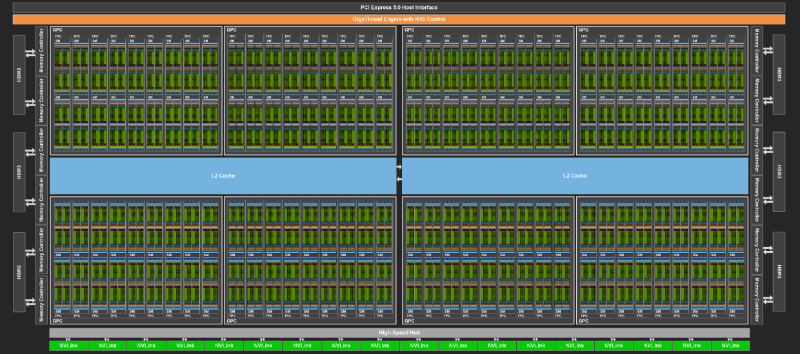
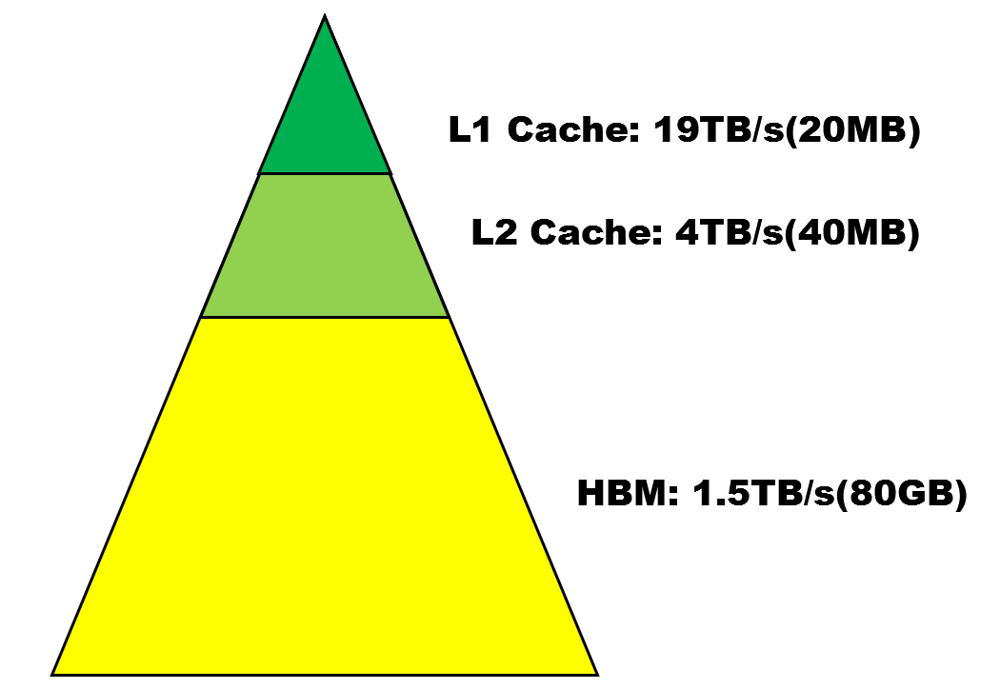
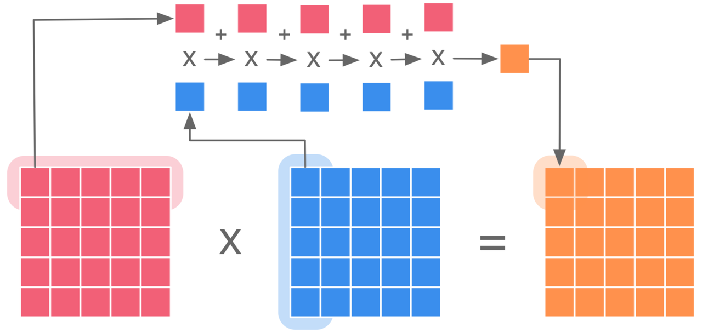
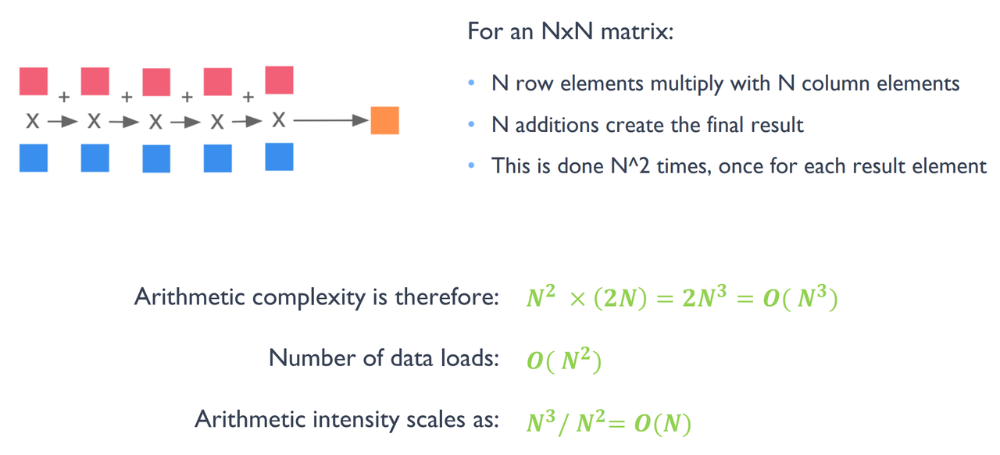
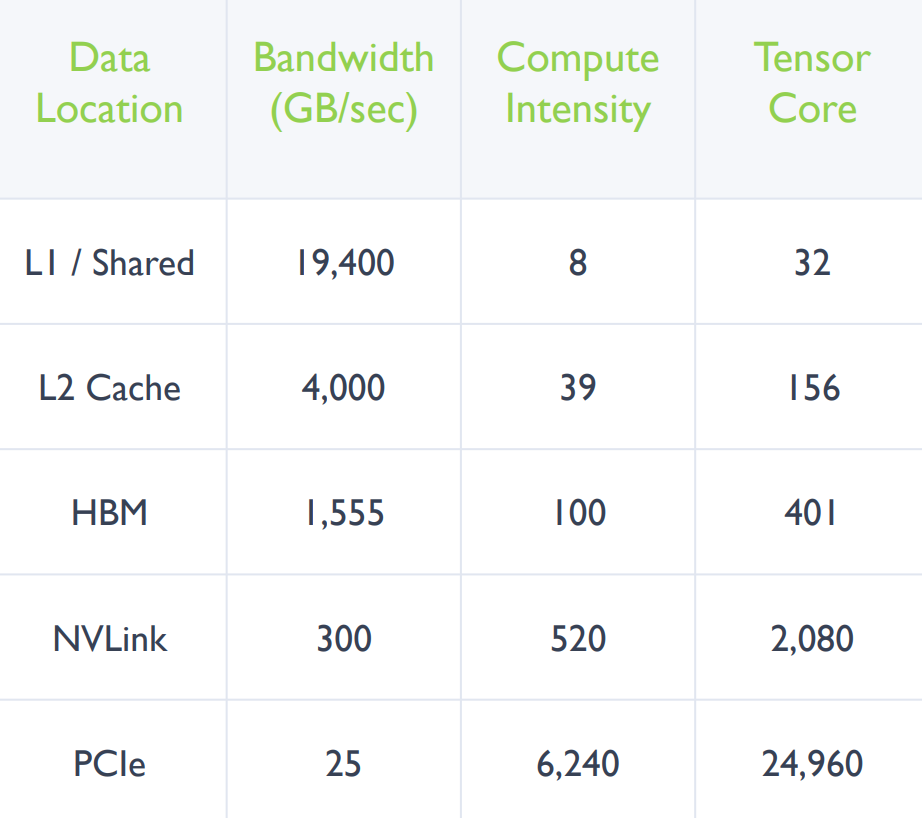
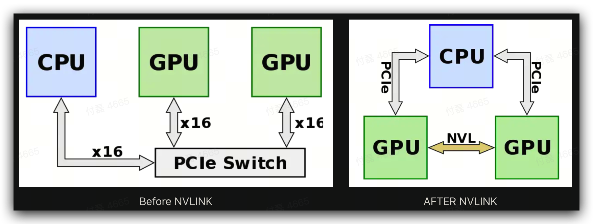
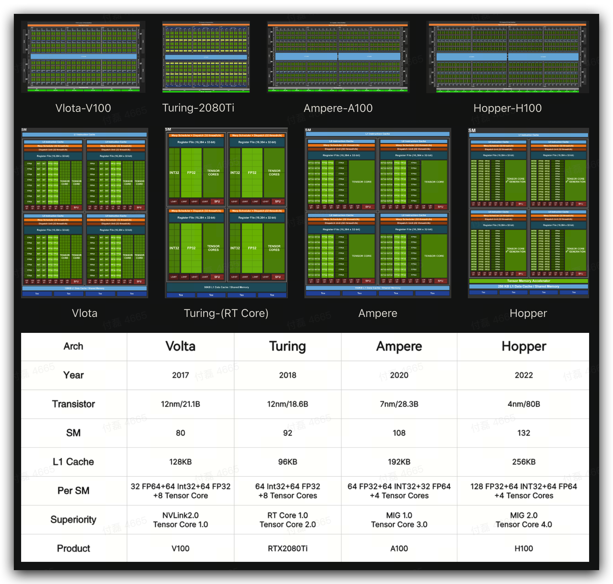
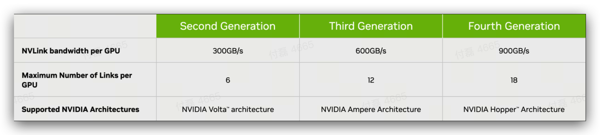
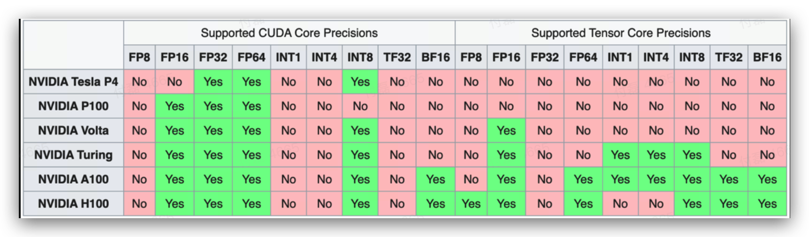
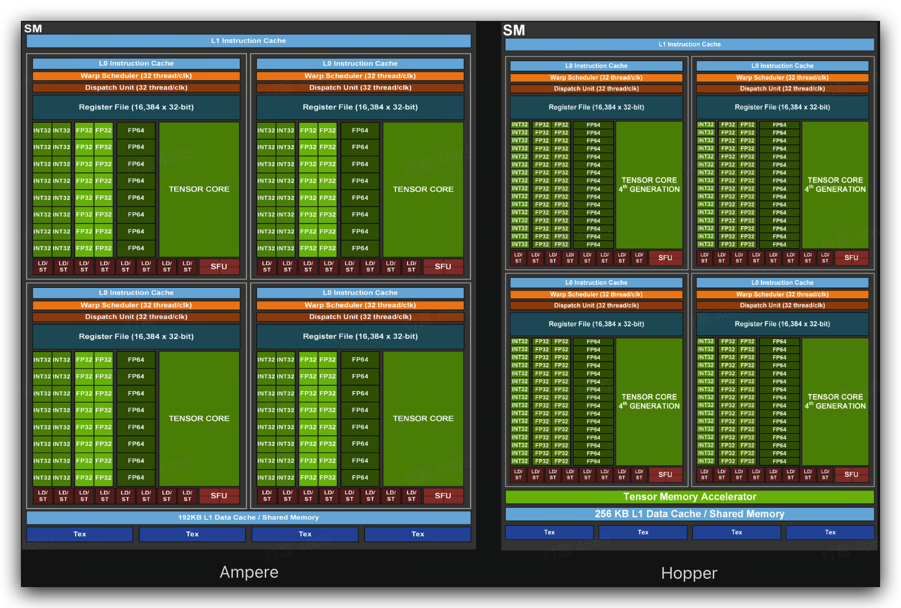

# Why not CPU?

GPU 很重要的一个特性是：Parallelism

GPU 主要由计算单元 ALU 组成。CPU 不仅被 Cache 占据了大量空间，而且还有有复杂的控制逻辑和诸多优化电路，相比之下，计算能力只是 CPU 很小的一部分。

.PNG)

# Insight into GPU

## Hopper-H100

1. **GPC(Graphics Processing Clusters)：**GPC 负责处理图形渲染和计算任务。每个 GPC 包含多个 TPC，以及与其相关的专用硬件单元和缓存。
2. **TPC(Texture Processing Clusters)：**TPC 负责执行纹理采样和滤波操作，以从纹理数据中获取采样值，并应用于图形渲染中的相应像素。在 CUDA 计算中，每个 TPC 有两个 SM 处理计算任务。
3. **HBM（High-Bandwidth Memory）**：HBM 是高带宽内存，也就是我们常说的显存。它通过将内存芯片直接堆叠在逻辑芯片上，提供了极高的带宽和更低的能耗，从而实现了高密度和高带宽的数据传输。
4. **L2 Cache**：L2 Cache 是 GPU 中更大容量的高速缓存层，它位于多个流多处理器（SM）之间共享。L2 Cache 还可以用于协调 SM 之间的数据共享和通信。

## Hopper-SM 单元

.PNG)

1. **SM(Streaming Multiprocessor)**：SM 是是 GPU 的主要计算单元，负责执行并行计算任务。每个 SM 都包含多个流多处理器（CUDA 核心），可以同时执行多个线程块中的指令。SM 通过分配线程、调度指令和管理内存等操作，实现高效的并行计算。
2. **WARP(Wavefront Parallelism)**：WARP 指的是一组同时执行的 Thread。一个 Warp 包含 32 个并行 Thread，这 32 个 Thread 执行于**SIMT**模式。也就是说所有 Thread 以锁步的方式执行同一条指令，但每个 Thread 会使用各自的 Data 执行指令分支。
3. **Dispatch Unit：**从指令队列中获取和解码指令，协调指令的执行和调度，将其分派给适当的执行单元，以实现高效的并行计算。
4. **L1 Cache/SMEM**：L1 Cache 包含指令缓存 (Instruction Cache) 和数据缓存（Data Cache），在 SM 内部存储最常用的指令和数据，每个 SM 独享一个 L1 Cache，提供低延迟和高带宽的访问。
5. **Register File**: 用于存储临时数据、计算中间结果和变量。离计算单元最近，访问速度非常快。
6. **SFU(Special Function Unit)**：SFU 在 GPU 中用于加速特定类型的计算操作。如三角函数等。

**TensorCore，Tensor Memory Accelerator**是主要用于加速 AI 计算负载中的矩阵乘法和累加 (Matrix Multiply-Accumulate, MMA)。

**SIMD**和**SIMT**有什么区别？

- TL;DR: SIMT 相对于 SIMD 在复杂计算的情况下，对开发人员和编译器的要求更低，更好优化。在数据的比特位小的时候，在 SIMT 中增加 SIMD 来增加 GPU 的计算能力，这就是为什么有些 GPU 的 16 位/8 位计算的算力会是 32 位计算的多倍的情况。[从现代 GPU 编程角度看 SIMD 与 SIMT](https://zhuanlan.zhihu.com/p/113360369)

为什么要有**Warp**？

- 逻辑上，所有 Thread 是并行；但是，从硬件的角度来说，并不是所有的 Thread 能够在同一时刻执行，这里就需要 Warp 的引入。如果在 Warp 中没有 32 个 Thread 需要工作，那么 Warp 虽然还是作为一个整体运行，但这部分 Thread 是处于非激活状态，便于编程优化，降低 GPU 计算资源浪费。

通过上面自顶向下的分析，我们知道，对于 GPU 中的存储部分访问速度由快到慢，计算部分从大到小排列为

$$\text{Mem Speed:(L1 Cache/SMEM)>L2 Cache>HBM} \\ \text{Compute Unit:GPC>TPC>SM>(TensorCore, SFU, INT32, FP32..)}$$

其中访存速度如下图所示 (以 A100 为例)

# LD/ST Mem Matters

接下来，我们引入一个计算强度 (Compute Intensity) 的概念来表示一段代码的计算时间复杂度与访存时间复杂度的比例。简单来讲，就是一个数据我访问一次需要做多少次运算。下面是一个计算强度的例子

对于 N 阶方阵的乘法操作，其计算时间复杂度为$$\text{O(}N^3\text{)}$$，访存时间复杂度为$$\text{O(}N^2\text{)}$$，其计算强度为$$\text{O(}N\text{)}$$.

根据计算强度的定义可知，对于计算能力固定的一个设备，如果想让计算单元达到更高的利用率，则对于越慢的内存，我们需要算法的计算强度就越大，即访问一次内存，多进行几次运算。

下图展示了当数据在 GPU 不同存储设备上时，计算单元达到最大利用率所需的计算强度。

我们可以通过并行提升整体计算强度以充分利用 GPU 能力。当我们的计算强度不够的时候就要想办法优化 IO 来降低端到端的延迟。

# NVLink

NVLink 是什么？为什么需要他？

- 大模型通常具有巨大的参数数量和复杂的结构，需要处理大量的数据。分布式训练将这些大型模型分割成多个部分，由多个 GPU 或计算节点并行处理，每个部分处理自己的数据子集。然后通过全局通信，参数同步等方式进行梯度传播，此时 GPU 之间的通信带宽就变的越来越重要。

- 在 NVLink 出现之前，GPU 与 GPU 之间的数据交互通过 PCIe（Peripheral Component Interconnect Express）总线进行。但 PCIe 存在两个问题，一是 PCIe 总线的带宽相对有限，其中 PCIe 4.0x16 的最大带宽也就 64GB/s，二是 PCIe 总线的延迟相对较高，在 GPU 之间传输数据时，每次数据传输都需要通过 CPU 和主机内存来完成。这种传输路径会导致额外的延迟，并降低数据传输的效率。然而，深度学习应用中需要更高的带宽和更低的延迟，PCIe 显然是无法满足当下的神经网络训练需求。

- NVLink 利用高带宽、低延迟的通信通道，直接将多个 GPU 连接在一起，实现快速、高效的数据传输和共享。通过 NVLink，GPU 之间的数据交互可以直接在 GPU 之间进行，而无需通过 CPU 和主机内存。这种直接内存访问（DMA）的方式大大减少了数据传输的复制和延迟，提高了数据共享的效率。此外，NVLink 还提供了一致的内存空间，使得多个 GPU 能够共享同一份内存，简化了程序设计和数据管理的复杂性。

- 主要思想就是 GPU 间采用 NVLINK 进行互联，实现 GPC 对卡间 HBM 的高速访问，和 PCIe 进行互补。

- NVLINK1.0 在 Pascal 架构中提出，从 Volta 开始成型，每条 NVLINK 提供 50GB/s 的通信带宽，在 Volta 架构每个 GPU 最多支持 6 条 NVLINK，提供 300GB/s 的 GPU 间通信带宽。
- 一定程度上可以说，GPU 的计算速度决定了训练的速度，GPU 间的通信带宽决定了在保证训练速度的情况下你可以训练多大的模型。
-  **美国政府颁布的出口管制规定**，出口至中国的芯片数据传输速率**不得超过每秒 600GB**就是限制的这一部分，可以在很大程度上限制国内大模型的训练发展。所以 Nvidia 就通过降低 NVLINK 的速度，把 A100 砍成 A800，最大互联带宽到 400GB/s 的方式来符合政府的出口禁令。

# TensorCore

**Tensor Core 有什么用，为什么需要它？**

- 深度学习和机器学习中的许多任务都涉及大规模的矩阵运算，例如矩阵乘法 (GEMM) 和卷积 (Conv) 操作。这些运算通常需要大量的计算，并且在传统的 GPU 架构中，这些矩阵运算需要编码成 FMA(Fused-Multiply-Add) 操作，再把结果从 ALU 到寄存器搬来搬去，每个浮点数计算都需要多个指令周期。这限制了 GPU 在处理这些任务时的效率，导致性能瓶颈。

- Tensor Core 通过引入特殊的硬件单元来解决这个问题。它每周期能执行 4x4x4 GEMM，即 64 个 FMA。即每个 Tensor Core 提供了相当于 64 个 ALU，同时能耗上还有优势。

# From Vlota To Hopper

## Volta

- Tensor Core1.0 虽然只支持 FP16 数据，但输出可以是 FP32，相当于 64 个 FP32 ALU 提供的算力。

## Turing

- 图灵架构相比于上代 Volta 架构，仍采取 NVLINK2.0，但条数增加到 8 条。

- Tensor Core2.0 相比于上代只支持 FP16 数据，新增 INT8，INT4，INT 精度模式，提供更快的运算速度，并且为 DLSS 技术赋能。

- 新增了 RT Core，主要用于图形渲染中的光线追踪功能。

## Ampere

- 安培架构相比于上代，升级到 NVLINK3.0，但条数增加到 12 条，提供 600GB/s 的 GPU 间互联带宽。
- Tensor Core3.0 相比于上代新增 FP64、TF32、BF16 精度模式。
- 新增稀疏矩阵加速运算技术，使标准操作的性能提高了一倍。
- 新增 MIG(Multi-Instance GPU) 技术，可以将单个 GPU 划分为多个 GPU 实例，每个实例的 SMs 在整个内存系统中都有独立的独立路径—片上交叉条端口、二级缓存库、内存控制器和 DRAM 地址总线都是唯一分配给单个实例的。利用这种能力，云服务提供商可以使用 MIG 来提高其 GPU 服务器的利用率，在不增加成本的情况下提供最多 7 倍的 GPU 实例。

## Hopper

- Hopper 架构升级到 NVLINK4.0，条数增加到 18 条，提供 900GB/s 的 GPU 间互联带宽。

- Tensor Core 在本代新增了 FP8 的运算能力，去除了 IN4 计算逻辑。

- 前三代 Tensor Core 基于 WARP Level 进行编程

  - 通过 SIMT 完成矩阵计算，将数据从全局内存加载到寄存器上，再通过 Warp Scheduler 调用 Tensor Core 完成矩阵乘法，最后将结果写出到寄存器。 
  - 但这样存在一些问题，Tensor Core 准备数据时，warp 内线程分别加载矩阵数据，每一个线程都会获取独立矩阵块地址。多级缓存 Cache 的存储空间限制，单个 warp 的矩阵计算规格有上限。

- 为了解决这些问题，Hopper Tensor Core 相比于 Ampere 有很大改进。

  - 新加入**TMA(Tensor Memory Accelerator)，**实现硬件异步数据加载，即全局内存中的数据可以被异步地加载到共享内存。采用单线程 schedule 模型，不需要所有线程都参与，同时使用 TMA 之前只需要一次性配置好首地址、偏移量等 Tensor 描述信息。
  - TMA 将 SM 组织成一个更大的计算和存储单元，完成数据从 global 到 shared memory 的异步加载，数据到寄存器的计算，最后通过硬件实现了矩阵乘法的流水线。

  

