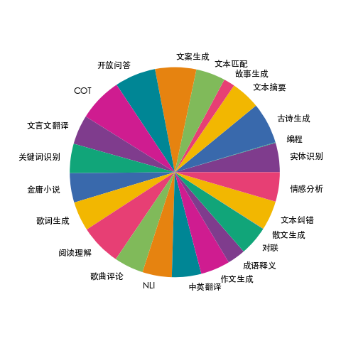

参考

https://github.com/InsaneLife/ChineseNLPCorpus https://huggingface.co/suolyer

https://github.com/ymcui/Chinese-LLaMA-Alpaca

摘要：

https://huggingface.co/datasets/GEM/xlsum

https://huggingface.co/datasets/GEM/wiki_lingua

https://huggingface.co/datasets/suolyer/cnki_summary

# 中文开放通用指令集

https://huggingface.co/datasets/BAAI/COIG

https://huggingface.co/datasets/BAAI/COIG

# 机器翻译

BBC 新闻和联合国决议文本，相对正式。BLOOMZ 并没有采用这两个机器翻译数据集。

https://huggingface.co/datasets/wmt19/

6.7 GB

```JSON
{"text":"英文：Last week, the broadcast of period drama “Beauty Private Kitchen” was temporarily halted, and accidentally triggered heated debate about faked ratings of locally produced dramas.\n中文：上周，古装剧《美人私房菜》临时停播，意外引发了关于国产剧收视率造假的热烈讨论。\n\n"}
{"text":"英文：Civil rights group issues travel warning for Missouri\n中文：民权团体针对密苏里州发出旅行警告\n\n"}
{"text":"英文：The National Association for the Advancement of Colored People has put out an alert for people of color traveling to Missouri because of the state's discriminatory policies and racist attacks.\n中文：由于密苏里州的歧视性政策和种族主义袭击，美国有色人种促进协会 (NAACP) 向准备前往密苏里州出游的有色人群发出旅行警告。\n\n"}
{"text":"英文：\"The NAACP Travel Advisory for the state of Missouri, effective through August 28th, 2017, calls for African American travelers, visitors and Missourians to pay special attention and exercise extreme caution when traveling throughout the state given the series of questionable, race-based incidents occurring statewide recently, and noted therein,\" the group's statement reads.\n中文：“2017 年 8 月 28 日生效的 NAACP 密苏里州旅行咨询中呼吁，因近期密苏里州发生了一系列可疑的种族性事件，所有非裔美籍旅行者、游客以及密苏里州人在密苏里州旅行时应特别注意并采取极其谨慎的态度，特此告知，”该团体的声明宣称。\n\n"}
{"text":"英文：A recent Missouri law making it harder for people to win discrimination lawsuits, as well as the state's law enforcement disproportionately targeting minorities prompted the group to issue the travel alert, the NAACP said.\n中文：NAACP 指出，最近通过的一项密苏里州法律使得人们更难赢得歧视诉讼，该州执法也一定程度上针对少数群体，这些现象促使该组织发布了旅行警告。\n\n"}
{"text":"英文：\"You have violations of civil rights that are happening to people.\n中文：侵犯公民权利的行为正发生在人们身上。\n\n"}
{"text":"英文：They're being pulled over because of their skin color, they're being beaten up or killed,\" the president of the Missouri NAACP, Rod Chapel, told The Kansas City Star.\n中文：他们因肤色被停车盘问，被殴打或被杀害，”密苏里州 NAACP 主席罗德·查培尔告诉堪萨斯城星报 (The Kansas City Star)。\n\n"}
{"text":"英文：\"We are hearing complaints at a rate we haven't heard before.\"\n中文：“我们收到了许多投诉，数量前所未有。”\n\n"}
{"text":"英文：It is the first such warning that the organization has issued for a state in the US.\n中文：这是该组织在美国针对某个州发布的第一个此类警告。\n\n"}
{"text":"英文：The group cited incidents such as racial slurs against black students at the University of Missouri and the death of Tory Sanders, 28, a black man from Tennessee.\n中文：该组织援引了密苏里大学对黑人学生的种族诽谤以及 28 岁田纳西州黑人男性托利·桑德斯的死亡事件。\n\n"}
```

https://huggingface.co/datasets/un_multi/viewer/en-zh/train

3.1 GB

```JSON
{"text":"英文：New York, 2-27 May 2005\n中文：2005年5月2日至27日，纽约\n\n"}
{"text":"英文：Statement by the delegation of Malaysia, on behalf of the Group of Non-Aligned States Parties to the Treaty on the Non-Proliferation of Nuclear Weapons, at the plenary of the 2005 Review Conference of the Parties to the Treaty on the Non-Proliferation of Nuclear Weapons, concerning the adoption of the agenda, New York, 11 May 2005\n中文：马来西亚代表团在不扩散核武器条约缔约国2005年审议大会全体会议上以不扩散核武器条约不结盟缔约国集团的名义就通过议程发表的声明\n\n"}
{"text":"英文：The Non-Aligned States Parties to the NPT welcome the adoption of the agenda of the 2005 Review Conference of the Parties to the NPT.\n中文：1. 不扩散条约不结盟缔约国欢迎通过了不扩散条约缔约国2005年审议大会的议程。\n\n"}
{"text":"英文：The agenda establishes the framework for conducting the review of the operation of the Treaty in accordance with article VIII, paragraph 3 of the Treaty, the decisions and the resolution of previous Conferences, in particular the 1995 Review and Extension Conference and the decision of the 2000 Review Conference to adopt by consensus its Final Document.\n中文：议程建立了一个框架，以便按照本条约第八条第3款、过去历次审议大会（特别是1995年审议大会和延长有效期会议）的决定和决议以及2000年审议大会关于以协商一致方式通过最后文件的决定，对本条约实施情况进行审查。\n\n"}
{"text":"英文：The Non-Aligned States Parties to the NPT reaffirm their commitment to implement — in good faith — their obligations under the Treaty as well as all the commitments agreed upon by consensus in the 1995 and 2000 Review Conferences.\n中文：2. 不扩散条约不结盟缔约国重申它们关于将本着诚意履行其根据本条约所承担义务的承诺，并重申在1995年和2000年审议大会上以协商一致方式商定的所有承诺。\n\n"}
{"text":"英文：The Non-Aligned States Parties to the NPT urge all States Parties to implement their obligations and commitments in the same spirit.\n中文：不扩散条约不结盟缔约国敦促所有缔约国本着同样的精神履行其义务和承诺。\n\n"}
{"text":"英文：The Non-Aligned States Parties to the NPT also reaffirm their commitment to ensure the successful outcome of this Review Conference.\n中文：3. 不扩散条约不结盟缔约国还重申，它们承诺将确保使这次审议大会取得圆满成功。\n\n"}
{"text":"英文：The Non-Aligned States Parties to the NPT request that this present statement be circulated as an official document of this Review Conference.\n中文：4. 不扩散条约不结盟缔约国请求将本声明作为本次审议大会的正式文件分发。\n\n"}
{"text":"英文：Report by the Secretary-General concerning the credentials of the deputy representative of the United States of America on the Security Council\n中文：秘书长关于美利坚合众国出席安全理事会副代表的全权证书的报告\n\n"}
{"text":"英文：Pursuant to rule 15 of the provisional rules of procedure of the Security Council, the Secretary-General wishes to report that he has received a note verbale dated 30 November 2005 from the United States Mission to the United Nations stating that Mr. Alejandro D. Wolff has been appointed deputy representative of the United States of America on the Security Council.\n中文：依照安全理事会暂行议事规则第15条的规定，秘书长兹特报告，他收到美国常驻联合国代表团2005年11月30日的普通照会，内称已任命亚历杭德罗·D·沃尔夫先生为美利坚合众国出席安全理事会的副代表。\n\n"}
```

https://huggingface.co/datasets/para_pat

自动对齐的谷歌专利数据集。

# 指令

https://github.com/Instruction-Tuning-with-GPT-4/GPT-4-LLM/tree/main/data

对于 52k alpaca 问题的 GPT-4 回答

https://huggingface.co/datasets/YeungNLP/firefly-train-1.1M

我们收集了 23 个常见的中文数据集，对于每个任务，由人工书写若干种指令模板，保证数据的高质量与丰富度，数据量为 115 万。数据分布如下图所示：



https://huggingface.co/datasets/wangrui6/Zhihu-KOL

知乎问答数据集

| INSTRUCTION (string)           | RESPONSE (string)                                            | SOURCE (string) | METADATA (string)                                            |
| ------------------------------ | ------------------------------------------------------------ | --------------- | ------------------------------------------------------------ |
| "怎样提高自己的形象思维能力？" | "这个作为一个学工科的有发言权。机械制图老师教过的，你就那各种零件模型去看，从正面侧面顶面，看多了，你就能够看懂平面图了。" | "Zhihu"         | "{"question_id": 388391158, "answer_id": 1161480308, "author_id": "https://www.zhihu.com/people/", "upvotes": "赞同 3", "answer_creation_time": "2020-04-17T22:49:51.000Z"}" |
| "怎样提高自己的形象思维能力？" | "我觉得最好的方法就是多和一些你认为思维敏捷的人沟通 近朱者赤近墨者黑哈，这句话还是很有道理的，你经常和什么样的人接触，慢慢的你也会变成什么样的人 再有就是多看一些形象设计方面的讲解教程，网络上一搜一大堆哈 然后付出实际行动的去塑造下自己，不能光看不练 平时多出去转转，看看那些所谓的你认为形象比较好的穿着打扮，然后反思下 美需要用欣赏的眼光去发现，慢慢的提高了审美 思考的同时也提高了思维能力，这样害怕提高不了形象思维能力吗 " | "Zhihu"         | "{"question_id": 388391158, "answer_id": 1163964225, "author_id": "https://www.zhihu.com/people/", "upvotes": "赞同 1", "answer_creation_time": "2020-04-19T02:07:11.000Z"}" |
| "怎样提高自己的形象思维能力？" | "学习，是对自己总体的提高"                                   | "Zhihu"         | "{"question_id": 388391158, "answer_id": 1161892395, "author_id": "https://www.zhihu.com/people/diu-liao-ying-tao-de-xiao-wan-zi-34", "upvotes": "赞同", "answer_creation_time": "2020-04-18T03:21:22.000Z"}" |
| "怎样提高自己的形象思维能力？" | "多画画，看一些有创意的视频。"                               | "Zhihu"         | "{"question_id": 388391158, "answer_id": 1159151362, "author_id": "https://www.zhihu.com/people/jie-mo-rong-shi-85", "upvotes": "赞同", "answer_creation_time": "2020-04-17T00:13:45.000Z"}" |
| "怎样提高自己的形象思维能力？" | "腹有诗书气自华"                                             | "Zhihu"         | "{"question_id": 388391158, "answer_id": 1161338493, "author_id": "https://www.zhihu.com/people/san-sheng-shi-yue", "upvotes": "赞同", "answer_creation_time": "2020-04-17T17:15:29.000Z"}" |

https://huggingface.co/datasets/BelleGroup/generated_train_1M_CN

Alpaca 中文版，区别在于使用了[纯中文种子](https://github.com/LianjiaTech/BELLE/blob/main/zh_seed_tasks.json)来 self-instruct，而不是英文 52k 指令集的中文翻译。

| id (string)                                   | input (string)                                               | target (string)                                              |
| --------------------------------------------- | ------------------------------------------------------------ | ------------------------------------------------------------ |
| "zh_seed_tasks_new_output_1679555173_713480"  | "给定两个句子，将它们合并为一个句子并保持语义连贯性\n \n - 鲍勃喜欢跑步。他每天早上都会去公园跑步。 - 这个苹果很甜。它是由我们的当地果园提供的。\n" | "鲍勃每天早上都喜欢去公园跑步，而这个甜苹果是由我们的当地果园提供的。" |
| "zh_seed_tasks_new_output_1679555180_779248"  | "将以下句子翻译成法语。\n "我喜欢在公园里散步"\n"            | "J'aime me promener dans le parc."                           |
| "zh_seed_tasks_new_output_1679555243_1400866" | "打开电子邮件并检查收到的最新邮件。如果有来自客户的邮件，请向他们发送感谢邮件。 " | "打开电子邮件并检查最新邮件。若有来自客户的邮件，请发送感谢邮件。" |
| "zh_seed_tasks_new_output_1679555162_606918"  | "给定一个电影的名称，提供电影的主要演员。\n \n电影名称：肖申克的救赎\n" | "电影《肖申克的救赎》的主要演员是蒂姆·罗宾斯（Tim Robbins）和摩根·弗里曼（Morgan Freeman）。" |
| "zh_seed_tasks_new_output_1679555131_296594"  | "给定一些简短的句子，将它们组成一篇文章。\n \n句子 1: "猫喜欢吃鱼。"\n句子 2: "狗喜欢玩球。"\n句子 3: "鸟儿喜欢在天空中飞翔。"\n" | "猫喜欢吃鱼，狗喜欢玩球，而鸟儿则乐于在天空中飞翔。"         |
| "zh_seed_tasks_new_output_1679555282_1794184" | "告诉我如何做一杯卡布奇诺。 "                                | "材料：浓缩咖啡、牛奶、糖、水。步骤：1. 准备浓缩咖啡，加入适量的糖调味，备用。2. 微泡牛奶：把一杯牛奶倒进不锈钢奶锅中，加入适量水，然后用中小火加热。在加热的过程中，用打奶泡器把牛奶打成微泡状。3. 准备杯子：将热水倒进杯子中，预热杯子，然后倒掉水。4. 倒入咖啡：将准备好的浓缩咖啡倒进杯子中。5. 倒入微泡牛奶：把倒好的微泡牛奶静置 2-3 秒钟，让牛奶脂肪和奶泡分离，然后小心地将牛奶倒进咖啡中。6. 制作拉花：用牛奶泡打器在杯子表面拉出喜欢的拉花图案。7. 卡布奇诺就制作好了，可以在表面撒上一点可可粉或肉桂粉进行装饰和调味。" |
| "zh_seed_tasks_new_output_1679555223_1208316" | "要求根据给出的文本，编辑并修正内容。\n \n文本：希望我们可以尽快讨论 \n" | "需要上下文才能判断是否需要编辑和修正内容。"                 |

https://huggingface.co/datasets/wbbbbb/pclue

中文自然语言理解榜单的 instruction 版本，哈工大讯飞的崔一鸣也用了它作为指令微调训练阶段的一部分数据。

```JSON
{"input": "哪个类别最好的描述了这篇新闻？扣篮王拉文：精彩暴扣表演！炸\n选项：故事，文化，娱乐，体育，财经，房产，汽车，教育，科技，军事，旅游，国际，股票，农业，游戏\n答案：", "target": "电竞", "answer_choices": ["故事", "文化", "娱乐", "体育", "财经", "房产", "汽车", "教育", "科技", "军事", "旅游", "国际", "股票", "农业", "游戏"], "type": "classify"}
{"input": "你会把这个描述推荐给哪方面的人？银行，社区，电商，支付，经营，卡牌，借贷，驾校，理财，职考，新闻，旅游，交通，魔幻，医疗，影像，动作，工具，体育，小说，运动，相机，工具，快递，教育，股票，菜谱，行车，仙侠，亲子，购物，射击，漫画，小学，同城，成人，求职，电子，艺术，赚钱，约会，经营，兼职，视频，音乐，英语，棋牌，摄影，养生，办公，政务，视频，论坛，彩票，直播，其他，休闲，策略，通讯，买车，违章，地图，民航，电台，语言，搞笑，婚恋，超市，养车，杂志，在线，家政，影视，装修，资讯，社交，餐饮，美颜，挂号，飞行，预定，票务，笔记，买房，外卖，母婴，打车，情侣，日程，租车，博客，百科，绘画，铁路，生活，租房，酒店，保险，问答，收款，竞技，唱歌，技术，减肥，工作，团购，记账，女性，公务，二手，美妆，汽车，行程，免费，教辅，两性，出国，婚庆，民宿快来施放属于你的寒冰魔法吧特殊效果雪花缓缓从上方飘落，手指触碰之处有冰魔法出现爱莎女王脱掉了封印魔法她的手套，在冰雪天地中建造了属于她一个人的辉煌宫殿。安娜中了冰魔法需要真爱之吻才能获救，最终姐妹二人齐心揭穿了异国王子的阴谋拯救了阿伦戴尔。解锁方法随意滑动屏幕一定距离后解锁要是觉得好玩，记得推荐给好朋友哦,,1.新增多张精美冰雪奇缘壁纸2.增加冰雪图钉，锁定当前壁纸功能3.内存，减小电量消耗\n答案：", "target": "休闲益智", "answer_choices": ["银行", "社区", "电商", "支付", "经营", "卡牌", "借贷", "驾校", "理财", "职考", "新闻", "旅游", "交通", "魔幻", "医疗", "影像", "动作", "工具", "体育", "小说", "运动", "相机", "工具", "快递", "教育", "股票", "菜谱", "行车", "仙侠", "亲子", "购物", "射击", "漫画", "小学", "同城", "成人", "求职", "电子", "艺术", "赚钱", "约会", "经营", "兼职", "视频", "音乐", "英语", "棋牌", "摄影", "养生", "办公", "政务", "视频", "论坛", "彩票", "直播", "其他", "休闲", "策略", "通讯", "买车", "违章", "地图", "民航", "电台", "语言", "搞笑", "婚恋", "超市", "养车", "杂志", "在线", "家政", "影视", "装修", "资讯", "社交", "餐饮", "美颜", "挂号", "飞行", "预定", "票务", "笔记", "买房", "外卖", "母婴", "打车", "情侣", "日程", "租车", "博客", "百科", "绘画", "铁路", "生活", "租房", "酒店", "保险", "问答", "收款", "竞技", "唱歌", "技术", "减肥", "工作", "团购", "记账", "女性", "公务", "二手", "美妆", "汽车", "行程", "免费", "教辅", "两性", "出国", "婚庆", "民宿"], "type": "classify"}
{"input": "阅读以下文章，并选择一个合适的成语。文章：\n赵宝刚导演表示，当看到温家宝总理在灾区安慰失去亲人__的孩子时，他再也控制不住自己的感情，不禁潸然泪下。他非常关心灾区的孤儿，目前正计划为孩子们做一些更有意义的事情。当记者问到是否会考虑日后拍一部地震题材的影片时，赵宝刚导演则明确表示自己更愿意为灾区做一些实事，目前正在积极了解灾区儿童的需要，为下一步援助工作做准备。\n 候选成语：忧心忡忡，提心吊胆，后顾之忧，土豪劣绅，叫苦不迭，用武之地，无计可施，明眸皓齿，孤立无援，步步为营。答案是：", "target": "孤立无援", "answer_choices": ["忧心忡忡", "提心吊胆", "后顾之忧", "土豪劣绅", "叫苦不迭", "用武之地", "无计可施", "明眸皓齿", "孤立无援", "步步为营"], "type": "mrc"}
{"input": "这是关于哪方面的新闻？黄埔军校老师有哪些？\n选项：故事，文化，娱乐，体育，财经，房产，汽车，教育，科技，军事，旅游，国际，股票，农业，游戏\n答案：", "target": "军事", "answer_choices": ["故事", "文化", "娱乐", "体育", "财经", "房产", "汽车", "教育", "科技", "军事", "旅游", "国际", "股票", "农业", "游戏"], "type": "classify"}
{"input": "这个是关于哪方面的App应用程序的描述？银行，社区，电商，支付，经营，卡牌，借贷，驾校，理财，职考，新闻，旅游，交通，魔幻，医疗，影像，动作，工具，体育，小说，运动，相机，工具，快递，教育，股票，菜谱，行车，仙侠，亲子，购物，射击，漫画，小学，同城，成人，求职，电子，艺术，赚钱，约会，经营，兼职，视频，音乐，英语，棋牌，摄影，养生，办公，政务，视频，论坛，彩票，直播，其他，休闲，策略，通讯，买车，违章，地图，民航，电台，语言，搞笑，婚恋，超市，养车，杂志，在线，家政，影视，装修，资讯，社交，餐饮，美颜，挂号，飞行，预定，票务，笔记，买房，外卖，母婴，打车，情侣，日程，租车，博客，百科，绘画，铁路，生活，租房，酒店，保险，问答，收款，竞技，唱歌，技术，减肥，工作，团购，记账，女性，公务，二手，美妆，汽车，行程，免费，教辅，两性，出国，婚庆，民宿“魅爱同城美女主动视频陪聊神器，女神绝密私照，一对一视频畅聊，保护你的私密。清纯的萌妹子、火辣的舞女郎，惊艳的时装秀，浪漫的午夜邂逅，伴你告别寂寞和美女主播视频聊天、交友、热舞零距离互动。让你随时随地享受偶遇的激情与惊喜与网红视频网红主播与你在线视频交友，浪漫邂逅。生活动态圈高颜值女神用短视频和照片与你分享生活中的点滴。\n答案：", "target": "约会社交", "answer_choices": ["银行", "社区", "电商", "支付", "经营", "卡牌", "借贷", "驾校", "理财", "职考", "新闻", "旅游", "交通", "魔幻", "医疗", "影像", "动作", "工具", "体育", "小说", "运动", "相机", "工具", "快递", "教育", "股票", "菜谱", "行车", "仙侠", "亲子", "购物", "射击", "漫画", "小学", "同城", "成人", "求职", "电子", "艺术", "赚钱", "约会", "经营", "兼职", "视频", "音乐", "英语", "棋牌", "摄影", "养生", "办公", "政务", "视频", "论坛", "彩票", "直播", "其他", "休闲", "策略", "通讯", "买车", "违章", "地图", "民航", "电台", "语言", "搞笑", "婚恋", "超市", "养车", "杂志", "在线", "家政", "影视", "装修", "资讯", "社交", "餐饮", "美颜", "挂号", "飞行", "预定", "票务", "笔记", "买房", "外卖", "母婴", "打车", "情侣", "日程", "租车", "博客", "百科", "绘画", "铁路", "生活", "租房", "酒店", "保险", "问答", "收款", "竞技", "唱歌", "技术", "减肥", "工作", "团购", "记账", "女性", "公务", "二手", "美妆", "汽车", "行程", "免费", "教辅", "两性", "出国", "婚庆", "民宿"], "type": "classify"}
{"input": "阅读理解：\n有一次，有人问马克·吐温是否记得他第一次是怎样挣到钱的。他想了很久，然后说：“对，我还记得很清楚，那是我在小学读书的时候。那时，小学生们都不尊重自己的老师，而且不爱惜学校的财产，经常弄坏桌椅。所以我们学校就定了一条规则，哪个学生用铅笔或小刀弄坏了桌椅，他就得在全校学生面前挨老师的打，或者交五元罚款。有一天，我弄坏了我的书桌，只好回家对父亲说，我违反了学校的规定，要么罚五元，要么在全校学生面前受到挨打的处分。父亲说当着全校学生的面挨打真是太丢脸了，他答应给我五块钱，让我交给学校。但是在给我这五块钱之前，他把我带到楼上，狠狠地打了我一顿。我想，既然我已经挨过一顿打了，那就干脆当着全校学生的面再挨一顿，这样就可以把那五块钱留下来。我真的这样做了，那就是我第一次挣到的钱。” \n问：父亲为什么给马克·吐温钱? 选项：喜欢他，奖励他，怕丢脸，感谢他\n答案：", "target": "怕丢脸", "type": "mrc", "answer_choices": ["喜欢他", "奖励他", "怕丢脸", "感谢他"]}
{"input": "“全面加强教师特别是农村教师培训,鼓励大学生、师范生到基层、农村任教”根据前面的段落，以下是否是真的“农村教师的培训需要特别重视”？是的,不是,或也许？\n答案：", "target": "是的", "answer_choices": ["是的", "不是", "也许"], "type": "nli"}
{"input": "给定“国民经济保持较快增长”我们应该假定“国民经济一个月内还会保持快速增长”是真的吗？是的,不是,或也许？\n答案：", "target": "也许", "answer_choices": ["是的", "不是", "也许"], "type": "nli"}
{"input": "这个是关于哪方面的App应用程序的描述？银行，社区，电商，支付，经营，卡牌，借贷，驾校，理财，职考，新闻，旅游，交通，魔幻，医疗，影像，动作，工具，体育，小说，运动，相机，工具，快递，教育，股票，菜谱，行车，仙侠，亲子，购物，射击，漫画，小学，同城，成人，求职，电子，艺术，赚钱，约会，经营，兼职，视频，音乐，英语，棋牌，摄影，养生，办公，政务，视频，论坛，彩票，直播，其他，休闲，策略，通讯，买车，违章，地图，民航，电台，语言，搞笑，婚恋，超市，养车，杂志，在线，家政，影视，装修，资讯，社交，餐饮，美颜，挂号，飞行，预定，票务，笔记，买房，外卖，母婴，打车，情侣，日程，租车，博客，百科，绘画，铁路，生活，租房，酒店，保险，问答，收款，竞技，唱歌，技术，减肥，工作，团购，记账，女性，公务，二手，美妆，汽车，行程，免费，教辅，两性，出国，婚庆，民宿移动吧是移动官方面向青海移动用户推出的移动智能终端网上营业厅。新版的移动吧为用户提供方便快捷的账单查询、业务办理、积分查询、通讯录等功能。随时随地尽享青海移动的贴心服务，方便触手可及。查询更丰富直观准确、消费透明充值更优惠专享优惠、充值赠费办理更便捷套餐流量、随时办理好友更亲密相互关注、贴心关怀活动更精彩活动不停、优惠不断更新内容1修复已知Bug；2优化客户端访问速度；3提升活动体验，丰富奖励资源。\n答案：", "target": "工具", "answer_choices": ["银行", "社区", "电商", "支付", "经营", "卡牌", "借贷", "驾校", "理财", "职考", "新闻", "旅游", "交通", "魔幻", "医疗", "影像", "动作", "工具", "体育", "小说", "运动", "相机", "工具", "快递", "教育", "股票", "菜谱", "行车", "仙侠", "亲子", "购物", "射击", "漫画", "小学", "同城", "成人", "求职", "电子", "艺术", "赚钱", "约会", "经营", "兼职", "视频", "音乐", "英语", "棋牌", "摄影", "养生", "办公", "政务", "视频", "论坛", "彩票", "直播", "其他", "休闲", "策略", "通讯", "买车", "违章", "地图", "民航", "电台", "语言", "搞笑", "婚恋", "超市", "养车", "杂志", "在线", "家政", "影视", "装修", "资讯", "社交", "餐饮", "美颜", "挂号", "飞行", "预定", "票务", "笔记", "买房", "外卖", "母婴", "打车", "情侣", "日程", "租车", "博客", "百科", "绘画", "铁路", "生活", "租房", "酒店", "保险", "问答", "收款", "竞技", "唱歌", "技术", "减肥", "工作", "团购", "记账", "女性", "公务", "二手", "美妆", "汽车", "行程", "免费", "教辅", "两性", "出国", "婚庆", "民宿"], "type": "classify"}
```

纯文本语料：

[ZhihuRec](https://cloud.tsinghua.edu.cn/d/d6c045c55aa14bb39ebc/)

https://huggingface.co/datasets/dirtycomputer/THUCNews

https://huggingface.co/datasets/dirtycomputer/wikipedia_zh

[wudao](https://www.scidb.cn/en/detail?dataSetId=c6a3fe684227415a9db8e21bac4a15ab)

https://huggingface.co/datasets/bigscience-data/roots_zh_wikibooks

[bigscience-data/roots_zh_du_reader · Datasets at Hugging Face](https://huggingface.co/datasets/bigscience-data/roots_zh_du_reader)

https://huggingface.co/datasets/bigscience-data/roots_zh_uncorpus

https://huggingface.co/datasets/bigscience-data/roots_zh-cn_wikipedia

https://huggingface.co/datasets/bigscience-data/roots_zh_wikivoyage

https://huggingface.co/datasets/bigscience-data/roots_zh_wikiquote

[bigscience-data/roots_zh_wikinews · Datasets at Hugging Face](https://huggingface.co/datasets/bigscience-data/roots_zh_wikinews)

https://huggingface.co/datasets/bigscience-data/roots_zh_wikiversity

[bigscience-data/roots_zh_ted_talks_iwslt · Datasets at Hugging Face](https://huggingface.co/datasets/bigscience-data/roots_zh_ted_talks_iwslt)

# OSCAR

https://huggingface.co/datasets/oscar-corpus/OSCAR-2301 

大规模多语言语料，是 BLOOM 训练预料 [ROOT](https://openreview.net/pdf?id=UoEw6KigkUn) 的网页爬虫部分。最新一版预语料中，仅中文就包含 1.4TB。然而赌博、色情、转载等垃圾语料太多了。。。

既然是 BLOOM 训练语料的一部分，那再拿他训练 BLOOM 就会有一点问题：可能存在大量重复。只能寄希望于新一版 OSCAR 包含了许多一年前还没爬到的新数据。拿他训练 codegen-nl 则没有问题，因为该模型之前没有见过中文。

| Language | # docs      | # words        | Content Length : |
| -------- | ----------- | -------------- | ---------------- |
| Chinese  | 138,478,270 | 44,378,380,161 | 1.4 TB           |

```JSON
{
   "content":"English sentence\nphrase en français\n????????????", // (1)
   "warc_headers":{ // (2)
      "warc-identified-content-language":"fra,eng",
      "warc-target-uri":"https://fr.wikipedia.org/wiki/...",
      "warc-record-id":"<urn:uuid:29eaa920-d299-4b1d-b687-c72bd8d68116>",
      "warc-type":"conversion",
      "content-length":"35298", // (3)
      "warc-refers-to":"<urn:uuid:39e42055-0d94-4e45-9c6c-9e7056635d64>",
      "warc-block-digest":"sha1:WFH2A5WHCS2H365GIAFYQPI7UOAMFGHB", // (3)
      "warc-date":"2022-11-26T09:45:47Z",
      "content-type":"text/plain"
   },
   "metadata":{
      "identification":{ // (4)
         "label":"fr",
         "prob":0.8938327
      },
      "harmful_pp":4063.1814, // (5)
      "tlsh":"tlsh:T125315FF2B6088901EEA097015DB39B4600B...", // (6)
      "quality_warnings":[ // (7)
         "short_sentences",
         "header",
         "footer"
      ],
      "categories":[ // (8)
         "examen_pix",
         "liste_bu"
      ],
      "sentence_identifications":[ // (9)
         {
            "label":"fr",
            "prob":0.99837273
         },
         {
            "label":"en",
            "prob":0.9992377
         },
         null
      ]
   }
}
```

**然而预计至少需要相当长时间（如一个月时间）下载、过滤。可以先取一小部分**

传统的文本数据清洗方法忽略了元数据，仅从文本本身下手，用去重、垃圾文本分类等方式。https://openi.pcl.ac.cn/zhangyh02/DataCollector https://arxiv.org/pdf/2303.03915.pdf

然而，新版 OSCAR 数据集 给出了域名等元数据，可以只选择部分域名，如站长之家 top 2k 网站，https://github.com/bike-py/chinaz_top/blob/master/top_url.txt，再加上国际组织域名 .int、教育网 .edu.cn、中科院 ac.cn。最后过滤出 10, 917 MB 文本，占总语料的 0.8%。单独拉出 1% 数据作为 Validation set。

筛选数据：

```JSON
{"text": "亲爱的游客，除您挑选的旅游体验外，驴妈妈精心为您提供包括贵州多个旅游热门景点和国内城市出发的多路线，同时旅行资讯一应俱全，包括贵州旅行景点图片、贵州旅行特惠价格、贵州旅行的相关游记，为您打造完美的贵州出游体验。\n热门城市推荐\n青岛旅游 泰国旅游 上海旅游 西安旅游 大连旅游 张家界旅游 日本旅游 桂林旅游 摩洛哥旅游 日照旅游 成都旅游 北京旅游 威海旅游 重庆旅游 舟山旅游 秦皇岛旅游 越南旅游 俄罗斯旅游 烟台旅游 杭州旅游 台湾旅游 济南旅游 连云港旅游 厦门旅游 珠海旅游 长白山旅游 贵阳旅游 柬埔寨旅游 土耳其旅游 绍兴旅游 南京旅游 庐山旅游\n贵州旅游报价\n大方旅游价格 凯里民族博物馆旅游价格 雷台公园旅游价格 民族博物馆旅游价格 青岩古镇旅游价格 康定县旅游价格 贵阳南江大峡谷旅游价格 博乐市旅游价格 木兰草原旅游价格 独秀峰旅游价格 焦作影视城旅游价格 黎平县旅游价格 黄果树漂流旅游价格 郊区旅游价格 黔南旅游价格 象鼻山旅游价格 韶山风景区旅游价格 贡山独龙族怒族自治县旅游价格 河南旅游价格 上饶旅游价格 日月双塔文化公园旅游价格 云台阁旅游价格 四川泸沽湖草海旅游价格 苏格兰旅游价格\n旅游行程推荐\n贵州2日游 贵州3日游 贵州5日游\n贵州相关推荐\n贵州自由行\n到贵州旅游路线\n重庆到贵州旅游 成都到贵州旅游 广州到贵州旅游 上海到贵州旅游 长沙到贵州旅游 合肥到贵州旅游 北京到贵州旅游 深圳到贵州旅游 南京到贵州旅游 东莞到贵州旅游 宁波到贵州旅游 西安到贵州旅游 桂林到贵州旅游 昆明到贵州旅游 天津到贵州旅游 珠海到贵州旅游 常州到贵州旅游 宜春到贵州旅游 乌鲁木齐到贵州旅游 苏州到贵州旅游", "meta": {"identification": {"label": "zh", "prob": 0.9464525}, "harmful_pp": 320847.06, "tlsh": "tlsh:T10C2C4A41ECCACA49462870591BE6B47FF011B46D1CCCE97854B494C318BB406444A2482ADF160FDD6B719A98B0FE2F110EFFAF95E7CC94C96EF850A7AA9D254DE6D3B880F2", "quality_warnings": ["short_sentences"], "categories": null, "sentence_identifications": [{"label": "zh", "prob": 0.989576}, {"label": "zh", "prob": 0.8936285}, {"label": "zh", "prob": 0.9892647}, {"label": "zh", "prob": 0.9724039}, {"label": "zh", "prob": 0.99808353}, {"label": "zh", "prob": 0.9248563}, {"label": "zh", "prob": 0.9906324}, null, {"label": "zh", "prob": 0.999989}, {"label": "zh", "prob": 0.84677947}, {"label": "zh", "prob": 0.84117657}], "warc_headers": {"warc-record-id": "<urn:uuid:0ff0a78c-eb94-427a-9b6b-c1fe22c00da9>", "warc-refers-to": "<urn:uuid:eca45d8d-1e49-4cb2-8617-b39c5b66d5ea>", "warc-date": "2022-12-07T13:23:25Z", "warc-target-uri": "http://dujia.lvmama.com/tour/guizhou300/route-D256", "content-type": "text/plain", "warc-block-digest": "sha1:AO5B7XVBLDUP7WW7WUEZ66B2LNZV7JSR", "content-length": "1975", "warc-type": "conversion", "warc-identified-content-language": "zho"}}}
{"text": "近年来，枣庄市福彩中心十分关心关注儿童的健康成长，先后开展了“爱润童心 助力成长”六一节慰问活动、“小善大爱 情暖校园”慰问活动等公益活动，积极参与“希望小屋”儿童关爱项目建设，以实际行动践行福利彩票发行宗旨，传递公益福彩正能量，彰显福利彩票的社会责任。", "meta": {"identification": {"label": "zh", "prob": 0.93962675}, "harmful_pp": 25839.232, "tlsh": "tlsh:T103308EE0F833203852A09A80AAAC8C04E8C271460C3820CF1CA0BD82A050B052A8C892AC3D3B321EA24B028B4A8E04488D138EA0822D71908D40A2748E1EA091CE8BB6CA21", "quality_warnings": ["tiny"], "categories": null, "sentence_identifications": [{"label": "zh", "prob": 0.93962675}], "warc_headers": {"content-type": "text/plain", "warc-refers-to": "<urn:uuid:f76c4d00-eca5-4c15-8451-a193f1a448ed>", "warc-type": "conversion", "warc-block-digest": "sha1:ZBF5BKQ73NRYKMQZG6I3ORFTTO6TTQFO", "warc-identified-content-language": "zho", "content-length": "377", "warc-date": "2022-12-07T13:11:09Z", "warc-record-id": "<urn:uuid:6dd21b7e-5918-426c-92eb-8fe895f7ad14>", "warc-target-uri": "http://dyfc.sdcp.cn/cpzx/ygfc/202205/t20220527_255695.htm"}}}
{"text": "为纪念中国共产党建立 99 周年和攀枝花市开发建设 55 周年，深入开展 “守纪律、提效能、强执行、做表率”活动， 7 月 24日，市发展改革委机关党委组织机关三个党支部集中开展主题党日活动——赴攀西科技城参观《不负国家使命》主题展和攀枝花市规划馆。\n市发展改革委三个党支部40余名党员同志，沿着时间轴线，从“建设中的攀枝花”“改革开放中的攀枝花”到“走向新时代 的攀枝花”，通过听讲解、看资料，回顾了攀枝花开发建设 55 年来走过的光辉历程。在参观攀枝花城市展示中心—规划馆中，广大党员同志身临其境感受了攀枝花城市规划发展的历史变迁。通过现代高科技手段形象生动的展示了省委对攀枝花的定位、我市融入成渝经济圈五大定位和全市发展思路，让大家看到了一幅幅城市未来发展的美好蓝图，对攀枝花市高质量发展充满信心。\n通过参观活动，大家进一步了解攀枝花建市、发展的艰辛历史，增强了爱党、爱国、爱攀枝花的情感，加深了对“艰苦创业、无私奉献、开拓进取、团结协作、科学求实”攀枝花精神的实质和内涵的领悟，激发了干事创业的精气神。大家一致表示，要始终做到不忘初心，牢记发展使命，做好本职工作，履职尽责，传承好攀枝花精神，为推动融入成渝地区双城经济圈，推动攀枝花高质量发展，决胜小康社会和脱贫攻坚，不懈奋斗，做出发改人的贡献。\n相关链接\n国家发展改革委 国家发展改革委\n四川省发展改革委 四川省发展改革委\n各市州发展改革委 巴中市发展和改革委员会 乐山市发展和改革委员会 泸州市发展和改革委员会 资阳市发展和改革委员会 宜宾市发展和改革委员会 南充市发展和改革委员会 内江市发展和改革委员会 绵阳市发展和改革委员会 成都市发展和改革委员会\n市级各部门 攀枝花市退役军人事务局 攀枝花市档案局 攀枝花市钒钛高新技术产业开发园区 攀枝花市文化广播电视和旅游局 攀枝花市政务服务管理局 攀枝花市医疗保障局 攀枝花市林业局 攀枝花市经济合作局 攀枝花市金融工作局 攀枝花市人防办 攀枝花市乡村振兴局 攀枝花市统计局 攀枝花市市场监督管理局 攀枝花国资委 攀枝花市城市管理行政执法局 攀枝花市审计局 攀枝花市应急管理局 攀枝花市卫生健康委员会 攀枝花市农业农村局 攀枝花市水利局 攀枝花市交通运输局 攀枝花市住房和城乡建设局 攀枝花市生态环境局 攀枝花市自然资源和规划局 攀枝花市人力资源和社会保障局 攀枝花市财政局 攀枝花市司法局 攀枝花市民政局 攀枝花市民族宗教事务委员会 攀枝花市公安局 攀枝花市科学技术局 攀枝花市教育和体育局 攀枝花市经济和信息化局", "meta": {"identification": {"label": "zh", "prob": 0.97109234}, "harmful_pp": 240643.36, "tlsh": "tlsh:T1795348511F5BE650F9151B06FB30C403F8F15E5983A6858A9100BBCD314642A1E8E5B09EEA7A5E2776DC2C602C6CCF30E00C5E293374BAAB72F5D66266EE02FD9F32444E93", "quality_warnings": null, "categories": null, "sentence_identifications": [{"label": "zh", "prob": 0.986627}, {"label": "zh", "prob": 0.9748187}, {"label": "zh", "prob": 0.9170205}, {"label": "zh", "prob": 0.99986607}, {"label": "zh", "prob": 0.9994508}, {"label": "zh", "prob": 0.99983054}, {"label": "zh", "prob": 1.0000007}, {"label": "zh", "prob": 0.9830747}], "warc_headers": {"warc-type": "conversion", "warc-date": "2022-12-07T13:09:53Z", "warc-target-uri": "http://fgw.panzhihua.gov.cn/zwgk/ddjs/1657610.shtml", "warc-record-id": "<urn:uuid:10db4b0d-0129-4d6e-89df-c88b88268a11>", "warc-identified-content-language": "zho", "warc-refers-to": "<urn:uuid:3ec25fb2-1fb1-4520-918b-c1bc10e5a10e>", "content-length": "3043", "content-type": "text/plain", "warc-block-digest": "sha1:VHTTNB2B46MYZANCT5DW73PGLTHJXA7W"}}}
{"text": "全国人大网站 人大新闻网 中国人大网 省内人大网站 江西人大新闻网 县（市、区）人大网站 吉安市人大新闻网 永新县人大新闻网 安福县人大网 万安县人大网 泰和县人大网 吉水人大网 峡江县人大网 永丰县人大网 新干县人大网 吉安县人大网 井冈山市人大新闻网 青原区人大网 吉州区人大网 南昌人大新闻网 其它网站 遂川新闻网 遂川县人民政府网", "meta": {"identification": {"label": "zh", "prob": 0.99962306}, "harmful_pp": 233291.52, "tlsh": "tlsh:T16A9665F0391CCF4CB01166C1C03C1EB55CCF9F69153900EAA47A12849E33939C257280F041BF03C0BA9EDE600316D150BACF29F5559DFA22800E3D4C7AB6C061E0093501A4", "quality_warnings": ["tiny"], "categories": null, "sentence_identifications": [{"label": "zh", "prob": 0.99962306}], "warc_headers": {"content-length": "463", "warc-target-uri": "http://jxscrd.gov.cn/contents/49/398.html", "content-type": "text/plain", "warc-type": "conversion", "warc-refers-to": "<urn:uuid:be4f7969-cb12-452c-abb4-e392bb380546>", "warc-identified-content-language": "zho", "warc-record-id": "<urn:uuid:a6f8d5e9-07d8-4729-8791-cad1db763010>", "warc-date": "2022-12-07T13:59:52Z", "warc-block-digest": "sha1:74I7POTEMPAOVU2A22A7NMAOKKNJQ5Z5"}}}
{"text": "陕果集团将在我市投资建设万亩苹果和万亩猕猴桃生产基地。经积极对接，陕果集团拟在我市扶风县建1万亩猕猴桃基地、300亩左右的综合园区和200亩左右的产销服务中心。在麟游、陇县各建1万亩优质苹果示范基地，并配套建设有机肥厂、农资配送等产销服务体系。目前麟游县分公司经理已明确，正在进行分公司注册等事宜。扶风县将遴选的分公司经理人选已上报陕果集团待考察。陇县分公司人选已确定，近期研究后将上报陕果集团。三个县区都已确定项目建设地点，正在宣传动员，进行土地流转。这三个项目有望今年冬季开工建设。\n海升集团扩大投资3亿元，建设高端苗木繁育基地。经多次对接，海升集团将扩大在我市投资，拟投资3-5亿元在岐山县建设12万平方米的高端温室大棚和5000亩自根砧苗木繁育基地，在陇县建设2000亩高标准矮砧苹果示范园。目前已与岐山县签订协议，一期投资5000万元，建设1300亩矮砧苹果苗木繁育基地，目前正在流转土地。在岐山县建设高端温室大棚、在陇县建设矮砧苹果示范园项目正在进一步洽谈之中。\n冰葡萄基地项目落户太白。经市果菜局与西安市葡萄研究所和太白县对接，双方拟在太白县建全国最大的冰葡萄生产基地和葡萄特色小镇。项目总投资4.3亿元，在太白县建设1万亩冰葡萄酒生产基地和年产200吨的葡萄酒庄，其中一期种植葡萄500亩。目前，已经签订了户太冰葡萄种植加工项目投资框架协议，正在流转土地。\n齐峰果业变更投资计划，在我市扩大投资。齐峰果业原计划在陕南投资建设猕猴桃示范园区，经协调变更投资计划，拟在扶风县、岐山县分别建设5000亩、3000亩高标准猕猴桃示范园。目前已在两县确定了建设地点，在扶风县的猕猴桃园区建设项目有望近期签订协议，与岐山县还在协调洽谈之中。这两个项目都计划今年冬季开工建设。\n汇源果汁合作范围不断扩大。经与汇源果汁对接，拟在我市投资建设矮砧苹果示范园、果品深加工、生态养生、休闲观光等项目。目前已与千阳县达成协议，建设2000亩矮砧苹果示范园，正在进行土地流转。经过协调麟游县主要领导、陇县相关部门领导已与汇源果汁进行了对接，具体项目投资事宜还在洽谈之中。\n南北联合，加快高山蔬菜产业发展。组织太白县秦绿、黄菜花等10多个蔬菜企业召开了座谈会，经过协调拟在麟游县建设1万亩高山有机蔬菜基地，计划于9月份赴麟游县进行实地考察对接洽谈。\n战略合作，延伸果菜产业链条。徐州是我国重要设施蔬菜和农产品深加工基地。目前市果菜局正在对接全国最大的大蒜加工出口企业黎明食品公司，拟在我市建设大蒜生产基地及深加工项目，计划近期组织相关县区赴徐州进行对接洽谈，并在猕猴桃产业发展大会期间邀请徐州市农委和重点农业产业化龙头企业来宝考察，签订徐州市农委与宝鸡市农业局战略合作协议，延伸果菜产业链条。", "meta": {"identification": {"label": "zh", "prob": 0.9532887}, "harmful_pp": 96750.22, "tlsh": "tlsh:T10FE860618542433E47085E6AB00D98516A27B96BAEA93E031F01FBC2118AF772CE9A75459726373E1F5E795357BF099EB3326E04AF8BCC33238CFAE2D95FC5504709355228", "quality_warnings": null, "categories": null, "sentence_identifications": [{"label": "zh", "prob": 0.9632855}, {"label": "zh", "prob": 0.96630895}, {"label": "zh", "prob": 0.9731508}, {"label": "zh", "prob": 0.96043783}, {"label": "zh", "prob": 0.8829717}, {"label": "zh", "prob": 0.9705645}, {"label": "zh", "prob": 0.951221}], "warc_headers": {"warc-refers-to": "<urn:uuid:5ab600d8-fefb-46e8-8a59-d854696b291a>", "content-length": "3296", "warc-block-digest": "sha1:24GQYAO5MXTH6V5LSN7PPNGSJGYLZU56", "warc-identified-content-language": "zho", "content-type": "text/plain", "warc-date": "2022-12-07T12:46:11Z", "warc-record-id": "<urn:uuid:a5f55d2a-0365-46e2-8649-271b59ecda4b>", "warc-type": "conversion", "warc-target-uri": "http://nyncj.baoji.gov.cn/art/2017/9/1/art_4195_393095.html"}}}
{"text": "2020年下半年，中国人民大学哲学院先后举办了三季“哲学的殿堂——中国人民大学哲学名家讲座系列”，堪称当年中国哲学界与文化界的一个重要事件。15位哲学名家轮番登场，或纵论古今、或横说中外、或概言大义、或详察典籍，为大众献上了一场哲学盛宴，也获得了社会各界的广泛关注与好评。如今，15篇讲稿汇集成书，就有了这本《哲学的殿堂：哲学元理与思维变革》。从这本文集中，我们可以读到前辈学者对许多重要哲学问题的深入思考，以及他们对现实与未来的深切关怀。从某种意义上讲，这本文集是我国改革开放40年来取得的哲学成果的一个缩影，从中可以感受到时代精神的鲜活脉动。\n该书名为“哲学的殿堂”，至少可以有两层意思。首先，正如系列讲座的宣传海报上所写的：“哲学本身就是一座宏伟壮丽的殿堂，在这座殿堂里有很多恒久而常新的话题，与时代深沉的思绪相应和，给人以精神的启迪。”2000余年的中西哲学史就是一座思想宝库，其巍巍乎如大厦、其皇皇乎如庙堂，但又绝不是冰冷的历史遗迹，而是一个充满生机的、活着的精神场所。个人的物质生命易逝，但人类的精神生命永存。历史上的哲学巨匠早已离我们远去，但正如该书主编臧峰宇在“编后记”中所说：“面对今天生活中复杂而深刻的现实问题，我们仍然需要走进‘哲学的殿堂’，需要静心反思，明晰心之所系的根本问题，找到适合自己的思维方式，消解现实生活中的困惑，形成符合时代精神的价值选择。”其次，15位作者是改革开放40年来我国哲学事业发展的亲历者与参与者，他们的思想观点是时代精神的代表，为具有中国特色、中国风格、中国气派的哲学学科“三大体系”建设奠定了坚实的基础，他们提出的问题也为年轻学者继往开来、建设新时代的哲学殿堂的使命指明了方向。\n《哲学的殿堂》收录的15篇论文有着各自不同的主题、涉及不同的领域、使用不同的方法，表面上看起来是各不相干的。但事实上，它们都有着一个共同的特点，即表现出了一种强烈的时代意识。庞元正教授在《时代问题与发展哲学》中指出，时代主题决定哲学研究的内容。因此，当代哲学研究的时代主题就是“发展”，即对新时代社会主义现代化建设过程中发生的个人与自我、个人与他人、个人与社会的矛盾以及民族与民族、国家与国家之间的矛盾提供哲学上的反思。同时，时代主题也决定了哲学研究的态度，即不以旁观者的姿态面对中西哲学史上的思想资源，不把哲学研究仅仅当作某种高级趣味来享用，而是要着眼于当代中国社会的现实需求与现实问题，以“不忘本来”“吸收外来”和“面向未来”态度，开创出合乎时代要求、反映时代精神的哲学体系。\n当然，任何时代的哲学创作都不能作“无源之水”和“无本之木”。郭湛教授在《哲学创作与阐释的历史变奏》中指出，哲学的发展表现为一场“创造-阐释-创造”或者“阐释-创造-阐释”的变奏，中西哲学史皆是如此。哲学一经产生就需要阐释，阐释的积累引发新的创造，创造之后又需要阐释。因此，引领潮流的哲学不仅要有鲜明的时代主题，还要坚持阐释经典，将时代问题的思考融入到阐释中。从《哲学的殿堂》中，可以找到对中西哲学经典的深入阐释，其也非常重视中华传统文化的当代阐释。\n《哲学的殿堂》还有一个重要主题，那就是“思维变革”。哲学创新以思维变革为先导，思维变革或由自身文明的积累所引起，或因外来文明的碰撞所触发。由此可见，思维变革对于哲学创新来说是必不可少的一个环节。李德顺教授在《变革时代的思维变革》中指出，当今世界最突出的问题就是价值体系和价值观念的大裂变、大冲突，亟需价值思维的大变革，以建构符合社会主义本质、适合我国国情的价值体系与合理可行的现代化政治形态。同时，当今世界科技发展日新月异，对人类社会的生产、生活的影响越来越大，不断地改变着我们对自身、他人与世界的认知。但是，科技发展需要科学的认识论、方法论与价值观的引导，否则极易走上歧途，给人类社会带来难以预料的与不可挽回的负面后果。因此，哲学反思在科技发展中发挥着极大的作用。\n对于年轻一辈的哲学人来说，《哲学的殿堂》不仅是学术研究的榜样，更是投身于时代洪流的招唤。《哲学的殿堂》解决了一些问题，但也提出一些问题。如果我们能够抓住这些问题，沿着它们所指引的方向继续向前探索，或许就能在时代的洪流中涌起浪花。", "meta": {"identification": {"label": "zh", "prob": 0.98929226}, "harmful_pp": 80120.25, "tlsh": "tlsh:T1E3B95DB1B677A0B14FB9450DE74EC4173ED6F6A2D9C24FC7168E935012DB41138221E0287E7B927E6D9D144D21FF4F40918080BDABE6C0BB87989ABFC868D9B2DB18128F4E", "quality_warnings": null, "categories": null, "sentence_identifications": [{"label": "zh", "prob": 0.99049723}, {"label": "zh", "prob": 0.9937308}, {"label": "zh", "prob": 0.99690086}, {"label": "zh", "prob": 0.9657849}, {"label": "zh", "prob": 0.9894119}, {"label": "zh", "prob": 0.99220145}], "warc_headers": {"warc-refers-to": "<urn:uuid:2ce56ecb-e3c8-4747-ac69-f31c275fbf5c>", "warc-type": "conversion", "warc-record-id": "<urn:uuid:b6d44e63-7a31-4ce6-b203-83a6b116ade0>", "warc-date": "2022-12-07T12:49:28Z", "content-length": "5132", "warc-target-uri": "http://phi.ruc.edu.cn/xwtz/xwzx/d5ce15aa9ffb4fca9ccfdde3f96e0f38.htm", "content-type": "text/plain", "warc-identified-content-language": "zho", "warc-block-digest": "sha1:XHBWJE324O5GPRYBMFCFPLLZF2ZBG442"}}}
{"text": "全网搜索 爱布谷 新闻台 经济台 农家乐台 体育台 综艺台 少儿台 电影台 电视剧台 探索台 纪录片台 爱西柚 美食台 健康台 汽车台 博客 台海台 时尚台 访谈 游戏台 爱公益 红色家园 美术台 动画台 粤语台", "meta": {"identification": {"label": "zh", "prob": 0.999721}, "harmful_pp": 244991.28, "tlsh": "tlsh:T1C67409D02BB050948A457E55563B8A00F63F1302643240F98401DD8430B4D822D16BB37317B9569CF180174074902DE619D6C0C33033028842952E002D0C054CBCC0EA4D93", "quality_warnings": ["tiny"], "categories": null, "sentence_identifications": [{"label": "zh", "prob": 0.99972105}], "warc_headers": {"warc-record-id": "<urn:uuid:ede39a71-03ff-4c5b-bbe9-0a9418bb4f62>", "warc-type": "conversion", "content-type": "text/plain", "warc-date": "2022-12-07T12:43:15Z", "warc-target-uri": "http://sports.cntv.cn/20111106/105296.shtml", "warc-refers-to": "<urn:uuid:fecfd689-9c54-49b5-b63f-747ba3c8a234>", "warc-block-digest": "sha1:KA3JOSHMZAVVTCG4QMNWTS5DMFWCE652", "content-length": "268", "warc-identified-content-language": "zho"}}}
{"text": "康跃科技(300391)(300391)股东盛世丰华，向芜湖远澈琅墨股权投资合伙企业（有限合伙）解除质押，解除股数为404.0477万股。截至2022年1月6日，盛世丰华所持股份累计被质押的情况如下：2020年12月23日，公司披露《关于控股股东部分股份质押及部分股份解除质押的公告》，盛世丰华将其所持有的公司1594.75万股股份办理了质押手续，具体内容详见巨潮资讯网。2021年12月22日，公司披露《关于控股股东部分股份解除质押的公告》，盛世丰华将上述质押股份中的1190.7023万股股份办理了解除质押的手续，具体内容详见巨潮资讯网近日，盛世丰华将上述质押股份中剩余的404.0477万股股份办理了解除质押的手续，具体情况如下。\n公司背景：\n康跃科技股份有限公司(康跃科技 300391)属于通用设备制造业，主要从事前置经营许可项目：无。一般经营项目：生产、销售：涡轮增压器、内燃机及零部件；涡轮增压器领域的新产品、新技术、新工艺的研究和开发，进出口业务（以上范围涉及资格证书的，按资格证书核准的经营范围执行）业务。 公司办公址是山东省潍坊市寿光市开发区（原北洛镇政府驻地），公司网址是www.chinakangyue.com，公司实际控制人是吴敏文;宁新江，持有公司股份10475万股, 比例为29.9 %，为一致行动人。 公司最近公布一期定期报告为2021半年度报告，实现每股收益为0.2398元，营业收入12.97亿元，同比增长251.954%，净利润15858.87万元 ，每股净资产2.4595元，产生每股经营现金流量0.109元，每股未分配利润-0.8504元。 300391 康跃科技 股票最近交易日为2021年09月03日，当日收盘价格为20.15元，最高成交价20.66元，最低成交价19.58元，共成交757.72万股，日换手率 2.198% ，静态市盈率为278.7倍，总市值70.59亿元，流通市值69.47亿元。", "meta": {"identification": {"label": "zh", "prob": 0.97519237}, "harmful_pp": 179153.7, "tlsh": "tlsh:T17CEB6D41B68F07F0437BA14D0E3ED8D9FF4C659CC8C68AD1371027C417D953A269C0F9A91D3A7766B45D1E3315CC56E525A77B0EA6829135C2C8539DCF479643AD1E810718", "quality_warnings": ["tiny"], "categories": null, "sentence_identifications": [{"label": "zh", "prob": 0.9862145}, {"label": "zh", "prob": 1.00006}, {"label": "zh", "prob": 0.96728617}], "warc_headers": {"warc-type": "conversion", "warc-record-id": "<urn:uuid:69998515-99fd-42cf-bcdb-d453cc13761c>", "warc-target-uri": "http://stock.hexun.com/2022-01-07/205082531.html", "warc-refers-to": "<urn:uuid:1c9abbd0-3bf6-410a-b83f-259fe2303571>", "warc-block-digest": "sha1:A56SUHGX4EQPLDSG34JHWFUJ6SX7B5GL", "content-length": "2013", "warc-date": "2022-12-07T13:08:49Z", "warc-identified-content-language": "zho", "content-type": "text/plain"}}}
{"text": "格隆汇8月24日丨合锻智能(603011)(603011.SH)公布，中信投资控股拟在减持计划公告之日起15个交易日后的180天内，通过集中竞价的方式减持不超过988.8288万股公司股份，即减持不超过公司总股本的2%。", "meta": {"identification": {"label": "zh", "prob": 0.9630422}, "harmful_pp": 1843.0394, "tlsh": "tlsh:T1C556BFD02B0FD53C16E51112198A69923442021801F44F51446D35BB03B53698AB9DB02CB726698E7C2C5B975985BB4158A7384150409614056ADEFBA1B3402C01A0416884", "quality_warnings": ["tiny"], "categories": null, "sentence_identifications": [{"label": "zh", "prob": 0.9630422}], "warc_headers": {"warc-type": "conversion", "warc-date": "2022-12-07T13:35:10Z", "warc-record-id": "<urn:uuid:723e0680-ba83-4dd1-85cc-8aeaacb27c9f>", "content-type": "text/plain", "warc-identified-content-language": "zho", "content-length": "256", "warc-target-uri": "http://stock.hexun.com/2022-08-25/206634626.html", "warc-block-digest": "sha1:VNLTTKBLB5IKPUZHUX4SW5KMLE7HHYM3", "warc-refers-to": "<urn:uuid:221b8ad0-2ec2-4999-90d8-28156f062053>"}}}
{"text": "成都到重庆北 成都到广州东 成都到上海 成都到上海虹桥 成都到呼和浩特东 成都到杭州 成都到沈阳北 成都到武汉 成都到郑州 成都到东莞东 成都到江油 成都到齐齐哈尔 成都到烟台 成都到巴中 成都到普雄 成都到离堆公园\n热门到达北京的路线\n长春到北京 福州到北京 哈尔滨西到北京 兰州到北京 石家庄到北京 太原到北京 大连北到北京 大连到北京 佳木斯到北京 临沂到北京 齐齐哈尔到北京 图们到北京 威海到北京 烟台到北京 张家界到北京 秦皇岛到北京", "meta": {"identification": {"label": "zh", "prob": 0.99632615}, "harmful_pp": 265528.62, "tlsh": "tlsh:T1A3ABCEF0442F5B8D4E3D311E75001343D42A4F7E919384661490A7CFF5C3A7D06CD187163AA8233D0F801309740F9F12B47A60643DAA7618C18EC979CBEA9015E3F029B01F", "quality_warnings": ["tiny"], "categories": null, "sentence_identifications": [{"label": "zh", "prob": 0.9946104}, {"label": "zh", "prob": 0.98600554}, {"label": "zh", "prob": 0.99910307}], "warc_headers": {"warc-target-uri": "http://tool.qyer.com/huoche/zz-24-3.html", "warc-refers-to": "<urn:uuid:1d35cffb-3dfc-4cee-9156-bf10d8b3c15d>", "content-length": "605", "warc-date": "2022-12-07T12:25:47Z", "warc-record-id": "<urn:uuid:237072fb-5b12-45f5-8484-2d63156c4d88>", "content-type": "text/plain", "warc-type": "conversion", "warc-block-digest": "sha1:HXEBR6QPRNZGS2S6PKRVAXW3EZTD7TYO", "warc-identified-content-language": "zho,eng"}}}
```

原始数据：

| 2    | "一、《规划》出台的背景是什么？“十三五”时期，我国广告产业迅速发展，新模式、新业态、新技术不断涌现，广告产业在服务国家创新发展、促进消费和扩大内需、推动社会主义精神文明建设中进一步发挥作用。广告产业发展环境持续优化，发展态势稳中向好，数字化转型持续加速，综合效益不断凸显，市场秩序平稳规范。 “十四五”时期是我国全面建成小康社会、实现第一个百年奋斗目标之后，乘势而上开启全面建设社会主义现代化国家新征程、向第二个百年奋斗目标进军的第一个五年，广告产业面临新的政策机遇、市场机遇和技术机遇，面临更广阔的发展空间和更大的责任担当，也面临诸多发展压力。市场监管总局承担“指导广告业发展，监督管理广告活动”职责，原工商总局于 2012 年、2016 年制定发布的《广告产业发展“十二五”规划》和《广告产业发展“十三五”规划》，推动了广告产业专业化、集约化发展。为促进“十四五”时期广告业高质量发展，市场监管总局坚持开门问策，深入调研，注重提高规划工作的科学性、前瞻性和可操作性，组织编制了《“十四五”广告产业发展规划》。二、《规划》的总体编制思路是怎么样的？ 《规划》立足新发展阶段，充分考虑广告产业属性特征，深入分析广告产业发展水平、发展特征、发展机遇和面临挑战；贯彻新发展理念，鼓励技术创新、模式创新、业态创新，推动区域协调发展和产业链上下游协同发展，倡导绿色消费理念，鼓励使用绿色广告材料，推动数据信息等资源共享，着力提高全产业国际竞争力；着眼服务构建“以国内大循环为主体、国内国际双循环相互促进”的新发展格局，引导广告产业更好发挥经济发展润滑剂、助推器的积极作用。 《规划》重点聚焦对广告产业发展方向的引领，从落实国家发展规划在广告领域战略任务的角度确定重点任务，未过多涉及应当由市场充分发挥决定性作用的相关内容。在持续优化广告产业发展环境的基础上，明确广告产业的社会价值和经济价值，引导广告产业向专业化和价值链高端延伸、服务构建新发展格局、服务弘扬社会主义核心价值观、营造良好广告市场秩序。三、《规划》对“十四五”时期广告产业发展有哪些新的要求？ 《规划》明确了“十四五”时期广告产业发展的指导思想：以习近平新时代中国特色社会主义思想为指导，全面贯彻党的十九大和十九届历次全会精神，立足新发展阶段，完整、准确、全面贯彻新发展理念，积极服务构建新发展格局，以推动广告产业高质量发展为主题，坚持正确导向，弘扬社会主义核心价值观，坚持创新驱动发展，提升自主品牌影响力和竞争力，进一步提高广告产业服务能力，优化广告产业发展结构和区域布局，提升广告作品文化内涵和创意水平，高标准规范广告市场，为实现经济行稳致远、社会安定和谐、全面建设社会主义现代化国家作出新的更大贡献。 《规划》明确了“十四五”时期广告产业发展应当坚持的基本原则，即：坚持正确导向、坚持服务大局、坚持新发展理念、坚持规范发展、坚持更好满足美好生活需要。 《规划》确定了“十四五”时期我国广告产业的发展目标：广告产业向专业化和价值链高端延伸，促进消费、提升商品和服务附加值、传播社会文明、吸纳就业的作用进一步凸显。产业发展环境进一步优化，发展质量效益明显提升，规模增速适应经济社会发展需求，产业结构更加科学合理，各类市场主体活力进一步激发。产业创新能力和服务能力不断提高，产业资源配置更趋合理，有利于服务区域经济社会协调发展的广告产业发展体系逐渐完善。广告法制体系进一步完善，广告监管智慧化水平有效提升，广告市场秩序持续向好。广告作品质量进一步提升，彰显文化自信和社会主义核心价值观的广告主流文化全面建立，广告产业对于提高国家文化软实力的支撑作用进一步增强。四、《规划》的总体框架和内容是怎样的？ 《规划》共分为 4 个部分。第一部分“发展环境”，从产业基础、发展机遇和面临挑战等方面简要分析“十四五”时期广告产业发展所处的宏观环境。第二部分“指导思想、基本原则和发展目标”，立足政府引导，把握“社会效益放在首位、社会效益和经济效益相统一”的发展方向。“基本原则”是《中华人民共和国国民经济和社会发展第十四个五年规划和 2035 年远景目标纲要》基本原则在广告领域的体现，强调广告产业发展应当通过服务经济社会发展大局实现其社会价值和经济价值。“发展目标”主要规划了广告产业高质量发展的定性指标，未设定量化指标。第三部分“重点任务”。明确了 10 项重点任务，在重点任务项下设计了 7 个专栏。重点任务围绕实现发展目标的内在逻辑设定。专栏聚焦需要推动的重点工作包括：公益广告振兴行动、广告领域“放管服”改革、广告产业高质量发展引领工程、广告产业服务能力提升行动、广告法律法规体系的健全完善、广告监管能力提升行动、广告人才培养行动等。第四部分“组织实施”。主要从争取各级党委、政府支持，加强与相关部门沟通协调，强化评估考核等方面，强调《规划》的落实。五、对下一步推动《规划》实施有哪些打算？一是加强《规划》解读、宣传。通过召开座谈会、组织培训、刊发解读文章、组织研讨等多种方式，向各级市场监管部门、相关部门、行业协会、相关领域专家学者、广告产业市场主体等广泛宣传、介绍《规划》，引导各方同向发力，积极推动广告产业高质量发展。各地市场监管部门可以结合本地资源禀赋和发展特征，制定区域广告产业发展规划，完善相关配套政策。二是积极争取各级党委、政府支持，加强与相关部门沟通协调。加强与宣传、发展改革、科技、工业和信息化、财政、商务、文化和旅游、税务、统计等有关部门的沟通协调，积极推动相关工作深度合作。指导各级市场监管部门主动向当地党委、政府报告《规划》要求和实施进展，积极争取各相关单位工作支持。" | { "warc_headers": { "warc-record-id": "<urn:uuid:db96ea52-7bd0-4c2e-9d13-30c8d8fdaf4b>", "warc-date": "2022-12-06T10:05:17Z", "content-type": "text/plain", "content-length": 6901, "warc-type": "conversion", "warc-identified-content-language": "zho", "warc-refers-to": "<urn:uuid:cf39eda1-3c2a-4f09-982e-ecb5691add95>", "warc-target-uri": "http://pc.cmrnn.com.cn/shtml/zggsb/20220427/342251.shtml", "warc-block-digest": "sha1:XJUDXINFHQ5S56235MV4OUS2LFWTGEL2" }, "identification": { "label": "zh", "prob": 0.9775801 }, "harmful_pp": 213636.14, "tlsh": "tlsh:T141B0A6E1C793F421FC3A5E779A1EC821B4D80F0BB1898D4ED4B4F7AF22B2C114B5E1D4A72FF7A17C46DD448219F8966C52E0650DBBAD867C83BE5BE09FD6F0889140862C26", "quality_warnings": null, "categories": null, "sentence_identifications": [ { "label": "zh", "prob": 0.98349196 }, { "label": "zh", "prob": 0.9901591 }, { "label": "zh", "prob": 0.9848904 }, { "label": "zh", "prob": 0.9950648 }, { "label": "zh", "prob": 0.95380944 }, { "label": "zh", "prob": 0.98193747 }, { "label": "zh", "prob": 0.9982695 }, { "label": "zh", "prob": 0.9817173 }, { "label": "zh", "prob": 0.9841251 }, { "label": "zh", "prob": 0.97633773 }, { "label": "zh", "prob": 0.9991063 }, { "label": "zh", "prob": 0.9970974 }, { "label": "zh", "prob": 0.9969909 }, { "label": "zh", "prob": 0.98588765 }, { "label": "zh", "prob": 0.9844375 }, { "label": "zh", "prob": 0.9949843 }, { "label": "zh", "prob": 0.94496304 }, { "label": "zh", "prob": 0.9423639 }, { "label": "zh", "prob": 0.97395074 } ] } |
| ---- | ------------------------------------------------------------ | ------------------------------------------------------------ |
| 3    | "如果你正在寻找德国的在线**赌场**，可以考虑加入 Merkur 游戏网站。这个游戏巨头位于德国，提供从体育博彩到老虎机到宾果的一切服务。他们多样化的产品系列使他们成为那些喜欢赌博但不想处理外语或时差的人的完美选择。要了解 Merkur 的博彩产品，没有比亲自去看看更好的方法了。SBet 实博是一家德国巨型赌博公司 SBet 实博成立于 1969 年，是德国 Gauselmann 集团的一部分，是一家专注于赌场游戏的公司。拥有超过 50 年的历史，SBet 实博继续创造高品质的游戏，利用最先进的图形和动画。玩家喜欢 SBet 实博的游戏，因为它们提供巨大的赢钱潜力和高波动性。该公司开始在酒馆和拱廊制作这些游戏，后来扩展到赌场大厅。他们的几个游戏已经变得非常流行，他们已经与世界上最知名的运营商合作，创造这些游戏。SBet 实博的游戏以闹鬼的豪宅为主题，他们的老虎机游戏以幽灵和鬼屋为特色。该公司使用经过战斗考验的 HTML5 和 Flash 技术来创建其游戏，因此玩家可以在移动和桌面设备上玩他们的游戏。这些游戏还被设计成具有美学吸引力，并在多个平台上发挥作用。SBet 实博的老虎机在全球玩家中很受欢迎。它提供的老虎机 sbet 实博黄金版 无论你是喜欢经典的卷轴游戏还是最新的视频老虎机游戏，Merkur 在线娱乐场都可能有这些游戏。由 Evolution 公司提供的 Merkur 老虎机在竞争中更胜一筹。玩家可以选择几十个高质量的现场赌桌，包括闪电轮盘、快速轮盘和无限轮盘。这些游戏是英国最好的现场经销商轮盘赌桌之一。虽然这家赌场的游戏种类可能有限，但它们以一些最高质量的游戏来弥补。该公司对创新的承诺使 Merkur 在线赌场成为任何想要入门的玩家的最佳选择。他们的老虎机以提供广泛的玩法选择和慷慨的累积奖金而闻名。玩家可以选择从侦探惊悚片到有趣的太空冒险等主题的老虎机，他们甚至可以通过翻牌或使用阶梯式递增器来赌赢钱。你还可以在 Merkur 在线赌场享受免费旋转和其他奖励功能。它提供体育博彩 一个有信誉的在线赌场将拥有马耳他博彩局的正式许可证。来自马耳他博彩局的许可证意味着该赌场为其客户提供最高级别的保护。如果你想玩体育博彩，Merkur 可以是一个不错的选择。它有多种存款方式，包括万事达卡和 VISA 卡。如果你喜欢使用信用卡，Merkur 也会接受通过银行转账存款。新的博彩条约还为老虎机设定了 1 欧元的最大赌注，并要求运营商支付其营业额的 5.3% 作为税收。虽然直到条约生效近一年后才有在线老虎机运营商上市，但 Mernov--Merkur 和 Novotmatic 的合资公司--是第一个获得许可的。Mernov 网站还有一个德语版本，其他语言也可使用。它提供宾果" | { "warc_headers": { "warc-record-id": "<urn:uuid:973d591d-2ef1-453b-95f0-8323eb1182eb>", "warc-date": "2022-12-06T09:41:56Z", "content-type": "text/plain", "content-length": 3007, |

只有validation/test，或者训练集很小：

https://huggingface.co/datasets/suolyer/zhihu

https://huggingface.co/datasets/suolyer/wudao

https://huggingface.co/datasets/suolyer/wiki_zh

https://huggingface.co/datasets/suolyer/book_zlib_part

https://huggingface.co/datasets/suolyer/webqa

https://huggingface.co/datasets/suolyer/medical_data

BLOOM 训练语料中文部分：

共计 261,019,433,892 Bytes

https://huggingface.co/spaces/bigscience-data/corpus-map


https://huggingface.co/spaces/bigscience-data/bigscience-corpus?source=wudaocorpora

> wudaocorpora
>
> uncorpus
>
> multi_un_2
>
> du_reader
>
> open_subtitles
>
> wikipedia
>
> project_gutenberg
>
> pseudocrawl-filtered_503_www_zaobao_com_sg
>
> wikibooks_filtered
>
> ted_talks_iwslt
>
> wikivoyage_filtered
>
> wikinews_filtered
>
> wikiversity_filtered
>
> pseudocrawl-filtered_674_ai_baidu_com
>
> wikiquote_filtered
>
> qedcorpus