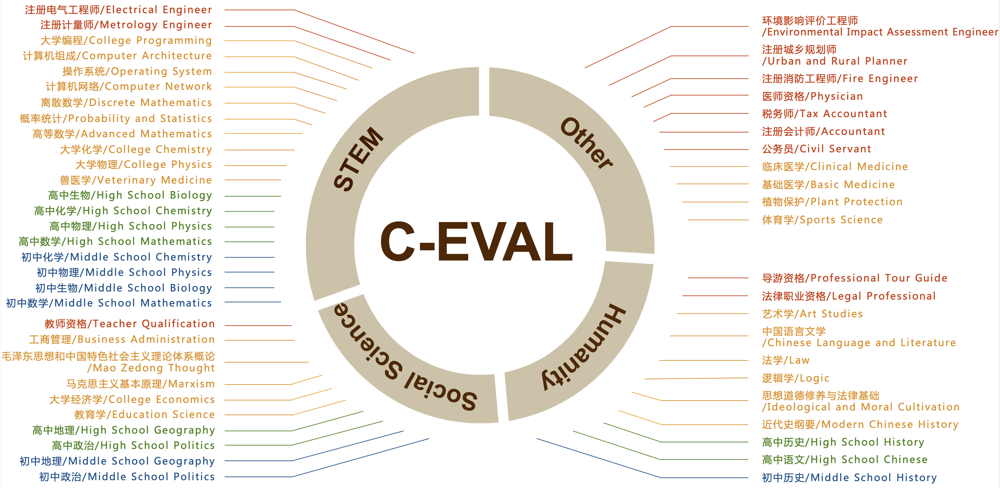
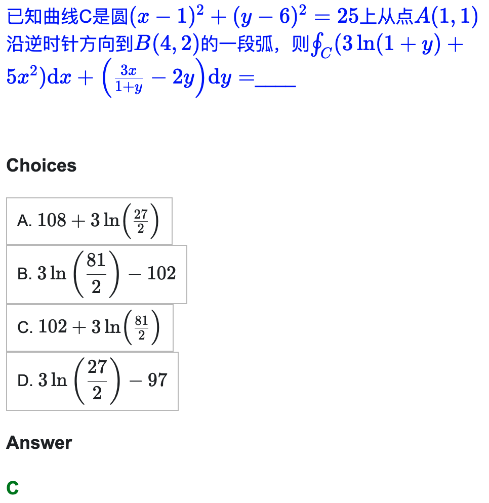

[符尧](https://franxyao.github.io/)，[何俊贤](https://jxhe.github.io/)

本项目由上海交通大学，清华大学，爱丁堡大学共同完成，立项于 2023 年 2 月 28 日，从 2023 年 4 月开始 Alpha - Beta 测试，发布于 2023 年 5 月 22 日。

网站: [https://cevalbenchmark.com/](https://cevalbenchmark.com/)

Github: [https://github.com/SJTU-LIT/ceval](https://github.com/SJTU-LIT/ceval)

论文: [https://arxiv.org/abs/2305.08322](https://arxiv.org/abs/2305.08322)

原文地址: https://yaofu.notion.site/C-Eval-6b79edd91b454e3d8ea41c59ea2af873

**目录**

- [1 - 模型强弱的核心指标](#1---%E6%A8%A1%E5%9E%8B%E5%BC%BA%E5%BC%B1%E7%9A%84%E6%A0%B8%E5%BF%83%E6%8C%87%E6%A0%87)
  
    - [1.1 - 知识](#11---%E7%9F%A5%E8%AF%86)
      
    - [1.2 - 推理](#12---%E6%8E%A8%E7%90%86)
    
- [2 - C-Eval 的目标](#2---c-eval-%E7%9A%84%E7%9B%AE%E6%A0%87)
  
    - [2.1 - 目标是辅助模型开发](#21---%E7%9B%AE%E6%A0%87%E6%98%AF%E8%BE%85%E5%8A%A9%E6%A8%A1%E5%9E%8B%E5%BC%80%E5%8F%91)
      
    - [2.2 - 打榜不是目标](#22---%E6%89%93%E6%A6%9C%E4%B8%8D%E6%98%AF%E7%9B%AE%E6%A0%87)
      
    - [2.3 - 从开发者反馈中持续迭代](#23---%E4%BB%8E%E5%BC%80%E5%8F%91%E8%80%85%E5%8F%8D%E9%A6%88%E4%B8%AD%E6%8C%81%E7%BB%AD%E8%BF%AD%E4%BB%A3)
    
- [3 - 如何保证质量](#3---%E5%A6%82%E4%BD%95%E4%BF%9D%E8%AF%81%E8%B4%A8%E9%87%8F)
  
    - [3.1 - 手工制作](#31---%E6%89%8B%E5%B7%A5%E5%88%B6%E4%BD%9C)
      
    - [3.2 - 防止混入训练集](#32---%E9%98%B2%E6%AD%A2%E6%B7%B7%E5%85%A5%E8%AE%AD%E7%BB%83%E9%9B%86)
    
- [4 - 提升排名的方法](#4---%E6%8F%90%E5%8D%87%E6%8E%92%E5%90%8D%E7%9A%84%E6%96%B9%E6%B3%95)
  
    - [4.1 - 有哪些捷径可以走？](#41---%E6%9C%89%E5%93%AA%E4%BA%9B%E6%8D%B7%E5%BE%84%E5%8F%AF%E4%BB%A5%E8%B5%B0)
      
    - [4.2 - 困难但正确的路](#42---%E5%9B%B0%E9%9A%BE%E4%BD%86%E6%AD%A3%E7%A1%AE%E7%9A%84%E8%B7%AF)
      
    - [4.3 - 不着急](#43---%E4%B8%8D%E7%9D%80%E6%80%A5)
    
- [5 - 结论](#5---%E7%BB%93%E8%AE%BA)
  
- [附录1：C-Eval 包含的科目](#%E9%99%84%E5%BD%951c-eval-%E5%8C%85%E5%90%AB%E7%9A%84%E7%A7%91%E7%9B%AE)
  

ChatGPT 的出现，使中文社区意识到与国际领先水平的差距。近期，中文大模型研发如火如荼，但中文评价基准却很少。在 OpenAI GPT 系列 / Google PaLM 系列 / DeepMind Chinchilla 系列 / Anthropic Claude 系列的研发过程中，MMLU / MATH / BBH 这三个数据集发挥了至关重要的作用，因为它们比较全面地覆盖了模型各个维度的能力。最值得注意的是 MMLU 这个数据集，它考虑了 57 个学科，从人文到社科到理工多个大类的综合知识能力。DeepMind 的 Gopher 和 Chinchilla 这两个模型甚至只看 MMLU 的分数，因此我们想要构造一个中文的，有足够区分度的，多学科的基准榜单，来辅助开发者们研发中文大模型。我们花了大概三个月的时间，构造了一个覆盖人文，社科，理工，其他专业四个大方向，52 个学科（微积分，线代 …），从中学到大学研究生以及职业考试，一共 13948 道题目的中文知识和推理型测试集，我们管它叫 C-Eval，来帮助中文社区研发大模型。

这篇文章是把我们构造 C-Eval 的过程记下来，与开发者们分享我们的思考和我们视角下的研发重点。我们的最重要目标是**辅助模型开发，而不是打榜**。一味地追求榜单排名高会带来诸多不利后果，但如果能够科学地使用 C-Eval 帮助模型迭代的话，则可以最大化地利用 C-Eval。因此我们推荐从模型研发的视角来对待 C-Eval 数据集和榜单。

# 1 - 模型强弱的核心指标

首先，把一个模型调成一个对话机器人这件事情并不难，开源界已经有了类似于 Alpaca, Vicuna, RWKV 这样的对话机器人，跟它们随便聊聊感觉都还不错；但要真正希望这些模型成为生产力，随便聊聊是不够的。所以构造评价基准的第一个问题是要找到区分度，弄明白什么样的能力才是区分模型强弱的核心指标。我们考虑**知识**和**推理**这两项核心。

## 1.1 - 知识

为什么说知识性的能力是核心能力？有以下几点论点：

- 我们希望模型可以通用，可以在不同领域都贡献生产力，这自然需要模型知道各个领域的知识。
  
- 我们同时希望模型不要胡说八道，不知为不知，这也需要扩大模型的知识，让它可以在更少的时候说它不知道。
  
- 斯坦福的 HELM 英文评价榜单中，一个重要的结论是，模型大小与知识密集型任务的效果显著正相关，这是因为模型的参数量可以被用来储存知识。
  
- 上文已经提到，已有的重要模型，比如 DeepMind 的 Gopher / Chinchilla，在评价的时候几乎只看 MMLU，**MMLU 的核心就是测模型的知识覆盖面**。
  
- GPT-4 的发布博客中，首先就是列出模型在各个学科考试上的效果，作为模型能力的衡量标准。
  

因此，知识型能力可以很好地衡量底座模型的潜力。

## 1.2 - 推理

推理能力是在知识的基础上进一步上升的能力，它代表着模型是否能做很困难，很复杂的事情。一个模型要强，首先需要广泛的知识，然后在知识的基础上做推理。

推理很重要的论点是：

- GPT-4 的发布博客中，OpenAI 明确写道 “The difference comes out when **the complexity of the task reaches a sufficient threshold**” (GPT-3.5 和 GPT-4 的区别只在任务复杂到一定程度之后才会显现)。这说明推理是很显著的强的模型有，弱一点的模型不大有的能力。
  
- 在 PaLM-2 的 Tech Report 中，BBH 和 MATH 这两个推理数据集被专门列出来讨论划重点。
  
- 如果希望模型成为新一代的计算平台，并在上面孕育出全新的应用生态的话，就需要让模型能够做足够强的完成复杂任务的能力。
  

这里我们还需要厘清推理和知识的关系：

- 知识型的能力是模型能力的基础，推理能力是进一步的升华 — 模型要推理也是基于现有的知识图里。
  
- 知识性任务的榜单上，模型大小和模型分数一般是连续变化的，不大会因为模型小就出现断崖式下跌 — 从这个角度来说知识型的任务更有区分度一点。
  
- 推理型任务的榜单上，模型大小和模型分数可能存在相变，**只有当模型大到一定程度之后（大概是 50B 往上，也就是 LLaMA 65B 这个量级），模型推理能力才会上来。**
  
- 对于知识性的任务，Chain-of-thought (CoT) prompting 和 Answer-only (AO) prompting 的效果是差不多的；对于推理型任务，_**CoT 显著好于 AO**_.
  
- 所以这边需要记住一下，_**CoT 只加推理效果不加知识效果**_。在 C-Eval 数据集中，我们也观察到了这个现象。
  

# 2 - C-Eval 的目标

有了上述对于知识和推理的阐述，我们决定从知识型的任务出发，构造数据集测试模型的知识能力，相当于对标一下 MMLU 这个数据集；同时，我们也希望带一点推理相关的内容，进一步衡量模型的高阶能力，所以我们把 C-Eval 中需要强推理的学科（微积分，线性代数，概率 …）专门抽出来，命名为 C-Eval Hard 子集，用来衡量模型的推理能力，相当于对标一下 MATH 这个数据集。在 C-Eval Hard 上面，模型首先需要有数学相关知识，然后需要有逐步解题的思路，然后需要在解题过程中调用 Wolfram Alpha/ Mathematica/ Matlab 进行数值和符号 / 微分和积分计算的能力，并把计算过程和结果以 Latex 的格式表示出来，这部分的题目非常难。

C-Eval 希望可以在整体上对标 MMLU (这个数据集被用于 GPT-3.5, GPT-4, PaLM, PaLM-2, Gopher, Chinchilla 的研发)，希望在 Hard 的部分对标 MATH (这个数据集被用于 GPT-4, PaLM-2, Minerva, Galactica 的研发)。

这里需要注意的是，我们的最重要目标是**辅助模型开发，而不是打榜**。一味地追求榜单排名高会带来诸多不利后果，这个我们马上会阐述；但如果能够科学地使用 C-Eval 帮助模型迭代的话，则会得到巨大收益。我们推荐从模型研发地视角来对待 C-Eval 数据集和榜单。

## 2.1 - 目标是辅助模型开发

在实际研发的过程中，很多时候我们需要知道某种方案的好坏或者某种模型的好坏，这个时候我们需要一个数据集帮助我们测试。以下是两个经典场景：

- 场景 1 ，辅助超参数搜索：我们有多种预训练数据混合方案，不确定哪种更好，于是我们在 C-Eval 上相互比较一下，来确定最优预训练数据混合方案。
  
- 场景 2 ，比较模型的训练阶段：我有一个预训练的 checkpoint ，也有一个 instruction-tuned checkpoint，然后我想要衡量我的 instruction-tuning 的效果如何，这样可以把两个 checkpoint 在 C-Eval 上相互比较，来衡量预训练和 instruction-tuning 的相对质量。
  

## 2.2 - 打榜不是目标

我们需要强调一下为什么不应该以榜单排名作为目标：

- 如果把打榜作为目标，则容易**为了高分而过拟合榜单，反而丢失通用性 — 这是 GPT-3.5 之前 NLP 学术界在 finetune Bert 上学到的一个重要教训。**
  
- 榜单本身只测模型潜力，不测真实用户感受 — 要模型真的被用户喜好，还是需要大量的人工评价的
  
- 如果目标是排名，则容易为了高分想走捷径，失去了踏实科研的品质与精神。
  

因此，如果把 C-Eval 作为辅助开发的工具，那么可以最大程度上的发挥它的积极作用；但是如果把它作为一个榜单排名，则存在极大的误用 C-Eval 的风险，最终也大概率不会有很好的结果。

所以再一次，我们推荐从模型研发地视角来对待 C-Eval 数据集和榜单。

## 2.3 - 从开发者反馈中持续迭代

因为我们希望模型可以最大程度的支持开发者，所以我们选择直接跟开发者交流，从开发者的反馈中持续学习迭代 — 这也让我们学到了很多东西；就像大模型是 Reinforcement Learning from Human Feedback 一样，C-Eval 的开发团队是 Continue Learning from Developers’ Feedback.

具体来说，我们在研发的过程中，邀请了字节跳动，商汤，深言等企业将 C-Eval 接入到他们自己的工作流中做测试，然后相互沟通测试过程中存在哪些比较有挑战的点。这个过程让我们学习到很多开始时没想到的内容：

- 很多测试团队，即使是在同一个公司，也无法知道被测试模型的任何相关信息（黑盒测试），甚至不知道这个模型有没有经过 instruction-tuning ，所以我们需要同时支持 in-context learning 和 zero-shot prompting.
  
- 因为有些模型是黑盒测试，没办法拿到 logits，但是小模型没有 logits 就比较难确定答案，所以我们需要确定一套小模型定答案的方案。
  
- 模型的测试模型有多种，比如in-context learning 和 zero-shot prompting；prompt 的格式有多种，比如 answer-only 和 chain-of-thought；模型本身有多种类型，比如 pretrained checkpoint 和 instruction-finetuned checkpoint，因此我们**需要明确这些因素各自的影响以及相互作用。**
  
- **模型的对于 prompt 的敏感度很高**，是否需要做 prompt engineering，以及 prompt engineering 是否有碍公平。
  
- GPT-3.5 / GPT-4 / Claude / PaLM 的 prompt engineering 应该怎么做，然后如果从中学习到他们的经验。
  

以上的这些问题都是我们在跟开发者的交互过程中，从开发者反馈里发现的。在现在 C-Eval 的公开版本的文档和 github 代码中，这些问题都有解决。

上面的这些过程也证明了，从模型研发的视角来对待 C-Eval 数据集和榜单，可以非常好地帮助大家开发中文大模型。

我们欢迎所有的开发者们给我们的 GitHub 提 issue 和 pull request，让我们知道如何更好地帮助你，我们希望可以更好地帮助你 :)

# 3 - 如何保证质量

这个章节我们讨论在制作的过程中，我们用了哪些方法来保证数据集的质量。这里我们最重要的参考是 MMLU 和 MATH 这两个数据集，因为 OpenAI, Google, DeepMind, Anthropic 这四个最重要的大模型团队都重点参考了 MMLU 和 MATH，所以我们希望可以向这两个数据集看齐。在我们初步的调研和一系列的讨论之后，我们做了两个重要的决策，一个是从头开始手工制做数据集，另一个是在此过程中重点防止题目被爬虫爬到训练集里。

## 3.1 - 手工制作

GPT 的开发过程的一个重要启发是，人工智能这行，有多少人工就有多少智能，这个在我们建立 C-Eval 的过程中也有很好地体现，具体来说，从题目来源看：

- C-Eval里面的题目大多是来源于pdf和word格式的文件，这类题目需要额外的处理和（人工）清洗才能使用。这是因为网上各种题目太多了，直接是网页文本形式存在的题目很可能已经被用于模型的预训练中
  

然后是处理题目：

- 收集到题目之后，先把pdf文件做 OCR 来电子化，然后把格式统一成 Markdown，其中数理的部分统一用 Latex 格式来表示
  
- 公式的处理是一件麻烦的事情：首先 OCR 不一定能识别对，然后 OCR 也不能直接识别成 Latex；这里我们的做法是能自动转 Latex 就自动转，不能自动转就同学自己手动敲
  
- 最终的结果是，13000多 道题目里面所有跟符号相关的内容（包括数学公式和化学式，H2O 这种）都是被我们项目组的同学一一验证过的，我们大概有十来位同学花了将近两周的时间做这个事情
  
- 所以现在我们的题目可以非常漂亮地用 markdown 的形式呈现，这里我们给一个微积分的例子，这个例子可以直接在我们的网站中，explore 的部分看到：
  

- 接下来的难点就是如何构造官方的 chain-of-thought prompt ，这个地方的重点在于，我们需要保证我们的 CoT 是对的。我们一开始的做法是对于每个 in-context example ，我们让 GPT-4 生成一个 Chain-of-thought，但后来发现这个不大行，一来是生成的太长了 (超过 2048 个 token)，有些模型的输入长度不一定支持；另一个是错误率太高了，一个个检查不如自己做一遍
  
- 所以我们的同学们就基于GPT-4生成的CoT，把微积分，线代，概率，离散这些 prompt 的题目（每个科目5道题作为in-context examples），真的自己做了一遍，以下是一个例子：
  

左边是同学自己做的，然后写成了 Markdown - Latex 格式；右边是渲染出来的效果

大家也能感受到为什么题目很难，chain-of-thought prompt 很长，为什么模型需要有能力做微积分的符号和数值计算

## 3.2 - 防止混入训练集

为了评测的科学性，我们考虑了一系列机制来防止我们的题目被混入训练集

- 首先，我们的测试集只公开题目不公开答案，大家可以拿自己的模型在本地把答案跑出来然后在网站提交，然后后台会给出分数
  
- 然后，C-Eval的所有题目都是模拟题，从中学到考研到职业考试我们都没有用过任何真题，这是因为全国性考试的真题广泛存在于网上，非常容易被爬取到模型训练集里
  

当然，尽管我们做出了这些努力，但可能也会不可避免的发生某个网页里能搜到题库里的题目，但我们相信这种情况应该不多。且从我们已有的结果看，C-Eval 的题目还是有足够区分度的，特别是 Hard 的部分。

# 4 - 提升排名的方法

接下来我们分析有哪些方法可以提升模型的排名。我们先把捷径给大家列出来，包括使用不能商用的 LLaMA 和使用 GPT 产生的数据，以及这些方法的坏处；然后我们讨论什么是**困难但正确的路**。

## 4.1 - 有哪些捷径可以走？

以下是可以走的捷径：

- 使用 LLaMA 作为基座模型：在我们另一个相关的英文模型评测项目 Chain-of-thought Hub 中，我们指出了 65B 的 LLaMA 模型是一个稍弱于 GPT-3.5 的基础模型，它有着很大的潜力，如果把它用中文的数据训练，其强大的英文能力可以自动迁移到中文。
  
- 但这样做的坏处，一来是研发能力的上限被 LLaMA 65B 锁死，不可能超过 GPT-3.5，更何况 GPT-4 了，另一方面是 LLaMA 不可商用，使用它商业化会直接违反条例
  
- 使用 GPT-4 生成的数据：特别是 C-Eval Hard 的部分，直接让 GPT-4 做一遍，然后 GPT-4 的答案喂给自己的模型就可以了
  
- 但这样做的坏处，一来是赤裸裸作弊，得到的结果并不能泛化，不能代表模型真实能力；二来是如果商业化，就直接违反了 OpenAI 的使用条例；三来是从 GPT-4 做蒸馏会加剧模型胡说八道的现象，这是因为 RLHF 在微调模型拒绝能力的时候，是鼓励模型知之为知之，不知为不知；但是直接抄 GPT-4 的话，GPT-4 知道的东西，其他的模型不一定知道，这样反而鼓励模型胡说八道。这个现象在 John Schulman 近期在伯克利的一个演讲中被重点讨论了。
  

很多时候，看似是捷径的道路，其实在暗中标好了价格。

## 4.2 - 困难但正确的路

**最好的方法是自立自强，从头研发。这件事情很难，需要时间，需要耐心，但这是正确的路。**

具体来说，需要重点关注以下机构的论文

- OpenAI - **这个毋庸置疑，所有文章都要全文背诵**
  
- Anthropic - **OpenAI 不告诉你的东西，Anthropic 会告诉你**
  
- Google DeepMind - Google 比较冤大头，什么技术都老实告诉你，不像 OpenAI 藏着掖着
  

如果读者在里经验不足，那么可以先不要看其他的地方的文章。先培养判断力，再去读其他地方的文章，这样才能分清好坏。在学术上，要分清好坏，而不是不加判断一味接受。

**在研发的过程中，建议关注以下内容：**

- **如何组 pretraining 的数据，比如 DoReMi 这个方法**
  
- **如何增加 pretraining 的稳定性，比如 BLOOM 的方法**
  
- **如何组 instruction tuning 的数据，比如 The Flan Collection**
  
- **如何做 instruction tuning ，比如 Self-instruct**
  
- **如何做 RL，比如 Constitutional AI**
  
- **如何增加 reasoning 的能力，比如我们先前的博客**
  
- **如何增加 coding 能力，比如 StarCoder**
  
- **如何增加工具使用的能力 (C-Eval Hard 需要模型能调用工具做科学计算)，比如 toolformer**
  

## 4.3 - 不着急

大模型就是一件花时间的事情，它是对人工智能工业能力的全方位大考：

- OpenAI 的 GPT 系列从 GPT-3 走到 GPT-4，从 2019 到 2023，一共花了四年的时间。
  
- Anthropic 原班人马从 OpenAI 剥离之后，即使有 GPT-3 的经验，重新做一遍 Claude 也花了一年的时间。
  
- LLaMA 的团队，即使有 OPT 和 BLOOM 的教训，也花了六个月的时间。
  
- GLM-130B 从立项到发布，花了两年的时间。
  
- MOSS 的 alignment 的部分，在 RL 之前的内容，也花了将近半年的时间，这还是没算 RL 的。
  

因此，不用着急打榜，不用明天就看结果，不用后天上线 — 慢慢来，一步一步来。很多时候，困难但正确的路，反而是最快的路。

# 5 - 结论

在这篇文章中，我们介绍了 C-Eval 的开发目标，过程，和重点考量的因素。我们的目标是帮助开发者更好地开发中文大模型，促进学术界和产业界科学地使用 C-Eval 帮助模型迭代。我们不着急看结果，因为大模型本身就是一件非常困难的事情。我们知道有哪些捷径可以走，但也知道困难但正确的路反而是最快的路。我们希望这份工作可以促进中文大模型的研发生态，让人们早一点体验到这项技术带来的便利。

# 附录1：C-Eval 包含的科目

|理科||人文|社科|其他|困难子集|
|---|---|---|---|---|---|
|计算机网络|高中数学|大学中国史|大学经济学|公务员|大学物理|
|操作系统|高中物理|思想道德修养与法律基础|工商管理|体育学|大学化学|
|计算机组成|高中化学|逻辑学|马克思主义基本原理|植物保护|高等数学|
|大学编程|高中生物|法学|毛泽东思想和中国特色社会主义理论体系概论|基础医学|概率统计|
|大学物理|初中数学|中国语言文学|教育学|临床医学|离散数学|
|大学化学|初中生物|艺术学|教师资格|注册城乡规划师|高中数学|
|高等数学|初中物理|导游资格|高中政治|注册会计师|高中物理|
|概率统计|初中化学|法律职业资格|高中地理|注册消防工程师|高中化学|
|离散数学|兽医学|高中语文|初中政治|环境影响评价工程师||
|注册电气工程师||高中历史|初中地理|税务师||
|注册计量师||初中历史||医师资格||