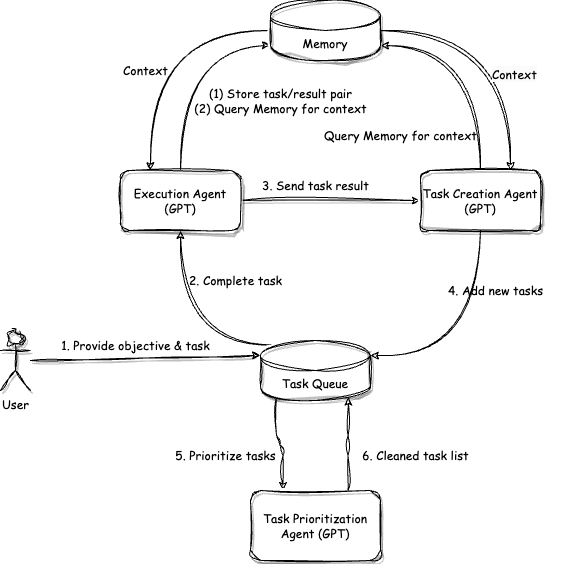

# Awesome LLMs
- [Awesome LLMs](#awesome-llms)
  - [LLMs](#llms)
    - [ChatGPT](#chatgpt)
    - [Vicuna](#vicuna)
    - [GPT4ALL](#gpt4all)
  - [框架](#框架)
    - [DeepSpeed](#deepspeed)
    - [LMFlow](#lmflow)
  - [数据](#数据)
    - [LLMs 中文开源语料](#llms-中文开源语料)
  - [论文](#论文)
    - [self-instruct](#self-instruct)
    - [RRHF](#rrhf)
    - [LLMs 综述](#llms-综述)
  - [技术解读](#技术解读)
  - [LLM 项目](#llm-项目)
    - [AgentGPT](#agentgpt)
    - [Auto-GPT](#auto-gpt)

## LLMs

> Large Language Model

### ChatGPT
> 目前未开源，一般认为技术方案和 instructGPT 保持一致

### Vicuna
> 和 Stanford Alpaca 一致，基于 LLAMA 微调
> GitHub 地址：https://github.com/lm-sys/FastChat

### GPT4ALL
> 基于 LLAMA 的模型
> GItHub 地址：https://github.com/nomic-ai/gpt4all

## 框架

### DeepSpeed
> 微软开源框架：深度学习的训练和推理的加速和模型缩减
> GitHub 地址：https://github.com/microsoft/DeepSpeed
> 博客：https://mp.weixin.qq.com/s/6y5e9MvSXXLCj-q7FI08Kw

### LMFlow
> GitHub 地址：https://github.com/OptimalScale/LMFlow

## 数据
### [LLMs 中文开源语料](LLMs%20%E4%B8%AD%E6%96%87%E5%BC%80%E6%BA%90%E8%AF%AD%E6%96%99.md)

## 论文
### self-instruct
> 论文：https://arxiv.org/pdf/2212.10560.pdf

### RRHF
> 论文：https://paperswithcode.com/paper/rrhf-rank-responses-to-align-language-models
> GitHub: https://github.com/ofirpress/attention_with_linear_biases

### LLMs 综述
>论文：https://arxiv.org/pdf/2303.18223.pdf
>机器之心解读：https://mp.weixin.qq.com/s/7HRr55Md2Wl6EHQMGioumw

## 技术解读
- 关于 ChatGPT 的知识：https://github.com/dalinvip/Awesome-ChatGPT
- 关于 ChatGPT 的资源：https://github.com/NicholasCao/Awesome-Chinese-ChatGPT

## LLM 项目
### [AgentGPT](awesome_llm_projects/agentgpt.md)
> GPT 自我 Prompt
> GitHub 地址：https://github.com/reworkd/AgentGPT
> Web 地址：https://agentgpt.reworkd.ai/

- 通过向量数据库实现长期记忆 🧠
- 通过 LangChain 实现网页浏览功能 🌐
- 与网站和人交互 👨‍👩‍👦
- 通过文档 API 实现书写功能 📄
- 保存代理运行 💾
- 用户和认证 🔐
- Stripe 集成实现收费下限版本 (所以我们不用再担心基础设施成本) 💵

基本原理：
AgentGPT 不是简单地要求 ChatGPT 创建代码，而是将 OpenAI 的 GPT 模型的多个实例链接在一起，让多个 GPT 代理协同工作，使其能够在没有帮助的情况下完成任务、编写和调试代码以及纠正自己的编写错误等事情。
AgentGPT 实现：行动 -> 分析行动结果 -> 思考 -> 决定下一步行动的自我循环

### Auto-GPT
>GPT 自我 Prompt 
>GitHub 地址：https://github.com/Significant-Gravitas/Auto-GPT
特性：
- 🌐用于搜索和信息收集的 Internet 访问
- 💾长期和短期内存管理
- 🧠用于文本生成的 GPT-4 实例
- 🔗访问流行的网站和平台
- 🗃️使用 GPT-3.5 进行文件存储和汇总

