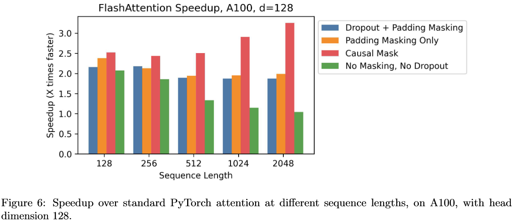

# FlashAttention: 更快训练更长上下文的 GPT


**FlashAttention: Fast and Memory-Efficient Exact Attention with IO-Awareness Paper:** **https://arxiv.org/abs/2205.14135**

Transformer 作为 GPT 类模型的基础架构提供了强大的特征处理能力，但是处理更长上下文仍然是一个挑战，因为核心的自注意力模块在序列长度上具有 O(N^2) 的时间和内存复杂度。 😓

这篇 Flash Attention 的工作深入硬件，新提出了一种具有**IO 感知的**，**快速的**⚡️，**节省内存的**🧠，**精确的**🎯注意力算法。目前，Flash Attention 已经**集成至 torch2.0**，并且社区也提供了多种实现，接下来我们以**Triton 实现**为例简单介绍一下这篇工作，

# 核心要点

- ⚡️**为什么加快了计算？Fast**
  - 降低了耗时的 HBM（显存）访问次数。采用 Tiling 技术分块从 HBM 加载数据到 SRAM（静态内存）进行融合计算。
- **🧠为什么节省了内存？Memory-Efficient**
  - 不再对中间矩阵 S，P 进行存储。在反向的时候通过 Recomputation 重新计算来计算梯度。
- **🎯为什么是精准注意力？Exact Attention**
  - 算法流程只是分块计算，无近似操作。

<video src="./assets/file_v2_5c3ab493-affa-4387-accf-1bf1fdb153cg_d1c3afbf-b5f5-4b67-b59c-dceb4e66f395.MP4"></video>

# 提出问题

Transformer 结构已成为自然语言处理和图像分类等应用中最常用的架构。尽管 Transformer 在规模上不断增大和加深，但处理更长上下文仍然是一个挑战，因为核心的自注意力模块在序列长度上具有二次方的时间和内存复杂度。这导致在处理长序列时速度变慢且内存需求巨大。因此，我们需要一些优化算法来提高注意力模块的计算速度和内存利用率。

# 解决方案

<center class="half">         </center>

Bili 视频演示：[⏱️78s 看懂 FlashAttention【有点意思·1】_哔哩哔哩_bilibili](https://www.bilibili.com/video/BV1Zz4y1q7FX/)

ManimCode: https://github.com/cauyxy/bilivideos/blob/master/flash-attn/video_code.py

## Forward

### Standard Attention Implementation

在注意力的一般实现中，对$$\mathbf{Q}, \mathbf{K}, \mathbf{V} \in \mathbb{R}^{N \times d}$$三个输入执行以下算法得到输出$$\mathbf{O}$$，其中 softmax 行级别执行。

$$\begin{equation} \mathbf{S}=\mathbf{Q K}^{\top} \in \mathbb{R}^{N \times N}, \quad \mathbf{P}=\operatorname{softmax}(\mathbf{S}) \in \mathbb{R}^{N \times N}, \quad \mathbf{O}=\mathbf{P} \mathbf{V} \in \mathbb{R}^{N \times d}, \end{equation}$$

在这个算法中，$S,P$ 矩阵都是很大，需要在 HBM 中实例化来进行存储，这样就会带来很多 HBM 的访问次数，最终体现到算法时间端到端较长的延迟。

-20230613002038511.(null))

### FlashAttention Implementation(Tiling)

#### 理论基础

在传统算法中，一种方式是将 Mask 和 SoftMax 部分融合，以减少访存次数。然而，FlashAttention 则更加激进，它将从输入$$\mathbf{Q}, \mathbf{K}, \mathbf{V},\mathbf{O}$$到输出$$\mathbf{O}$$的整个过程进行融合，以避免$$\mathbf{S}, \mathbf{P}$$矩阵的存储开销，实现端到端的延迟缩减。然而，由于输入的长度$$N$$通常很长，无法完全将完整的$$\mathbf{Q}, \mathbf{K}, \mathbf{V},\mathbf{O}$$及中间计算结果存储在 SRAM 中。因此，需要依赖 HBM 进行访存操作，与原始计算延迟相比没有太大差异，甚至会变慢（没具体测）。

为了让计算过程的结果完全在 SRAM 中，摆脱对 HBM 的依赖，可以采用**分片操作**，每次进行部分计算，确保这些计算结果能在 SRAM 内进行交互，待得到对应的结果后再进行输出。

这个过程中，有一点需要注意的是，***之前对于 softmax 的计算是以行为单位的***，如下所示：

$$\begin{equation} m(x):=\max _i x_i, \quad f(x):=\left[\begin{array}{lll} e^{x_1-m(x)} & \ldots & e^{x_B-m(x)} \end{array}\right], \quad \ell(x):=\sum_i f(x)_i, \quad \operatorname{softmax}(x):=\frac{f(x)}{\ell(x)} \end{equation}$$

当我们将输入进行分片后，无法对完整的行数据执行 Softmax 操作。这是因为 Softmax 函数在计算时需要考虑整个行的数据。然而，***我们可以通过分块来获得与完整行 Softmax 相同的结果***，而无需使用近似操作。

$$\begin{equation} \begin{aligned} & m(x)=m\left(\left[x^{(1)} x^{(2)}\right]\right)=\max \left(m\left(x^{(1)}\right), m\left(x^{(2)}\right)\right), \quad f(x)=\left[\begin{array}{ll} e^{m\left(x^{(1)}\right)-m(x)} f\left(x^{(1)}\right) & e^{m\left(x^{(2)}\right)-m(x)} f\left(x^{(2)}\right) \end{array}\right], \\ & \ell(x)=\ell\left(\left[x^{(1)} x^{(2)}\right]\right)=e^{m\left(x^{(1)}\right)-m(x)} \ell\left(x^{(1)}\right)+e^{m\left(x^{(2)}\right)-m(x)} \ell\left(x^{(2)}\right), \quad \operatorname{softmax}(x)=\frac{f(x)}{\ell(x)} . \end{aligned} \end{equation} $$

具体的分块 softmax 代码演示：https://github.com/cauyxy/bilivideos/blob/master/flash-attn/softmax.ipynb

#### 代码实现

https://github.com/openai/triton/blob/main/python/tutorials/06-fused-attention.py#L17

```Python
@triton.jit
def _fwd_kernel(
    Q, K, V, sm_scale,
    L, M,
    Out,
    stride_qz, stride_qh, stride_qm, stride_qk,
    stride_kz, stride_kh, stride_kn, stride_kk,
    stride_vz, stride_vh, stride_vk, stride_vn,
    stride_oz, stride_oh, stride_om, stride_on,
    Z, H, N_CTX,
    BLOCK_M: tl.constexpr, BLOCK_DMODEL: tl.constexpr,
    BLOCK_N: tl.constexpr,
):
    start_m = tl.program_id(0)
    off_hz = tl.program_id(1)
    # initialize offsets
    offs_m = start_m * BLOCK_M + tl.arange(0, BLOCK_M)
    offs_n = tl.arange(0, BLOCK_N)
    offs_d = tl.arange(0, BLOCK_DMODEL)
    off_q = off_hz * stride_qh + offs_m[:, None] * stride_qm + offs_d[None, :] * stride_qk
    off_k = off_hz * stride_qh + offs_n[None, :] * stride_kn + offs_d[:, None] * stride_kk
    off_v = off_hz * stride_qh + offs_n[:, None] * stride_qm + offs_d[None, :] * stride_qk
    # Initialize pointers to Q, K, V
    q_ptrs = Q + off_q
    k_ptrs = K + off_k
    v_ptrs = V + off_v
    # initialize pointer to m and l
    m_prev = tl.zeros([BLOCK_M], dtype=tl.float32) - float("inf")
    l_prev = tl.zeros([BLOCK_M], dtype=tl.float32)
    acc = tl.zeros([BLOCK_M, BLOCK_DMODEL], dtype=tl.float32)
    # load q: it will stay in SRAM throughout
    q = tl.load(q_ptrs)
    # loop over k, v and update accumulator
    for start_n in range(0, (start_m + 1) * BLOCK_M, BLOCK_N):
        # -- compute qk ----
        k = tl.load(k_ptrs)
        qk = tl.zeros([BLOCK_M, BLOCK_N], dtype=tl.float32)
        qk += tl.dot(q, k)
        qk *= sm_scale
        qk = tl.where(offs_m[:, None] >= (start_n + offs_n[None, :]), qk, float("-inf"))
        # compute new m
        m_curr = tl.maximum(tl.max(qk, 1), m_prev)
        # correct old l
        l_prev *= tl.exp(m_prev - m_curr)
        # attention weights
        p = tl.exp(qk - m_curr[:, None])
        l_curr = tl.sum(p, 1) + l_prev
        # rescale operands of matmuls
        l_rcp = 1. / l_curr
        p *= l_rcp[:, None]
        acc *= (l_prev * l_rcp)[:, None]
        # update acc
        p = p.to(Q.dtype.element_ty)
        v = tl.load(v_ptrs)
        acc += tl.dot(p, v)
        # update m_i and l_i
        l_prev = l_curr
        m_prev = m_curr
        # update pointers
        k_ptrs += BLOCK_N * stride_kn
        v_ptrs += BLOCK_N * stride_vk
    # rematerialize offsets to save registers
    start_m = tl.program_id(0)
    offs_m = start_m * BLOCK_M + tl.arange(0, BLOCK_M)
    # write back l and m
    l_ptrs = L + off_hz * N_CTX + offs_m
    m_ptrs = M + off_hz * N_CTX + offs_m
    tl.store(l_ptrs, l_prev)
    tl.store(m_ptrs, m_prev)
    # initialize pointers to output
    offs_n = tl.arange(0, BLOCK_DMODEL)
    off_o = off_hz * stride_oh + offs_m[:, None] * stride_om + offs_n[None, :] * stride_on
    out_ptrs = Out + off_o
    tl.store(out_ptrs, acc)
```

### IO Complexity Analysis

#### Standard Attention

对于标准注意力实现，初期我们需要把输入$$\mathbf{Q}, \mathbf{K}, \mathbf{V}$$从 HBM 中读取，并计算完毕后把输出$$\mathbf{O}$$写入到 HBM 中。

第一步把$$\mathbf{Q}, \mathbf{K}$$读取出来计算出$$\mathbf{S}=\mathbf{Q K}^{\top}$$，然后把$$\mathbf{S}$$存回去，内存访问复杂度$$\Theta\left(N d+N^2\right)$$。

第二步把$$\mathbf{S}$$读取出来计算出$$\mathbf{P}=\operatorname{softmax}(\mathbf{S})$$，然后把$$\mathbf{P}$$存回去，内存访问复杂度$$\Theta\left(N^2\right)$$。

第三步把$$\mathbf{V}, \mathbf{P}$$读取出来计算出$$\mathbf{O}=\mathbf{P} \mathbf{V}$$，然后计算出结果$$\mathbf{O}$$，内存访问复杂度$$\Theta\left(N d+N^2\right)$$。

综上所述，整体的内存访问复杂度为$$\Theta\left(N d+N^2\right)$$。

#### FlashAttention

对于 FlashAttention，我们设置一个分块大小$$B_c$$来把$$\mathbf{K}, \mathbf{V}$$分成$$T_c$$块，对于$$\mathbf{Q}, \mathbf{O}$$的每一块都要把$$\mathbf{K}, \mathbf{V }$$部分的全部元素 Load 一遍，这样则有 FlashAttention 的内存访问复杂度为$$\Theta\left(N d+N d T_c\right)$$=$$\Theta\left(N d T_c\right)$$.

在这里，我们需要两个分块大小，$$\mathbf{Q}, \mathbf{O}$$的分块大小$$B_r$$，$$\mathbf{K}, \mathbf{V}$$的分块大小$$B_c$$，我们设定 SRAM 的大小为$$M$$，为了能把分块后的$$\mathbf{K}, \mathbf{V} \in \mathbb{R}^{B_c \times d}$$放进 SRAM，那么则有一下限制：$$\begin{equation} B_c d=O(M) \Leftrightarrow B_c=O\left(\frac{M}{d}\right) \end{equation}$$

相应的，$$\mathbf{Q}, \mathbf{O} \in \mathbb{R}^{B_r \times d}$$有如下限制：$$\begin{equation} B_r d=O(M) \Leftrightarrow B_r=O\left(\frac{M}{d}\right) \end{equation}$$

最终，还有一个中间态$$\mathbf{S}=\mathbf{Q K}^{\top} \in \mathbb{R}^{B_r \times B_c}$$需要存储，则有如下限制：$$\begin{equation} B_r B_c=O(M) \end{equation}$$

综上，限制如下

$$\begin{equation} B_c=\Theta\left(\frac{M}{d}\right), \quad B_r=\Theta\left(\min \left(\frac{M}{d}, \frac{M}{B_c}\right)\right)=\Theta\left(\min \left(\frac{M}{d}, d\right)\right) \end{equation}$$

进而推出

$$\begin{equation} T_c=\frac{N}{B_c}=\Theta\left(\frac{N d}{M}\right) \end{equation}$$

那么在$$M = \Theta (Nd$$的前提下，则有 FlashAttention 的 HBM 内存访问复杂度为：

$$\begin{equation} \Theta\left(N d T_c\right)=\Theta\left(\frac{N^2 d^2}{M}\right) = \Theta\left({N d}\right) \end{equation}$$

在语言建模中，通常有$$d \lll N$$，则有$$\Theta_{stand} \left(N d+N^2\right) > \Theta_{flash} \left(N d\right)$$。这样，在前向的过程中，我们采用分块计算的方式，避免了$$\mathbf{S}, \mathbf{P}$$矩阵的存储开销，整体的运算都在 SRAM 内进行，降低了 HBM 访问次数，大大提升了计算的速度，减少了对存储的消耗。

## Backward

### 理论基础

在上面前向的时候我们为了减少 HBM 访存次数，降低内存消耗量，我们并没有对$$\mathbf{S}, \mathbf{P}$$矩阵进行存储，而这个在反向传播计算梯度的时候确实需要的一个信息。之前有通过**Gradient checkpointing**的方式来实现梯度实现在前向的时候更加节省内存。

我们这里则采用***<u>重新计算的方式来计算对应的梯度</u>***。在上面前向计算的时候我们不会存储$$\mathbf{S}, \mathbf{P}$$矩阵，但是我们会***存储对应的指数项之和$$L$$来进行梯度的计算***。

我们在反向的过程中最重要的事情就是就是 Loss 函数$$\theta$$对$$\mathbf{Q}, \mathbf{K}, \mathbf{V}, \mathbf{O}$$对应的梯度。

$$\mathbf{O}$$对应的梯度最好计算$$\mathbf{dO} = \frac{\partial \phi}{\partial \mathbf{O}}$$，其中$$\mathbf{O}$$是现成的。

$$\mathbf{V}$$对应的梯度也很好计算，由于$$\mathbf{O} = \mathbf{P}\mathbf{V} $$，根据链式求导法则和矩阵求导法则则有$$\mathbf{d V}=\mathbf{P}^T \mathbf{d} \mathbf{O}$$，更详细如下所示：

$$\begin{equation} d v_j=\sum_i P_{i j} d o_i=\sum_i \frac{e^{q_i^T k_j}}{L_i} d o_i \end{equation}$$

$$\mathbf{Q}, \mathbf{K}$$对应的梯度算起来就比较复杂一点。这两个经过的计算逻辑步骤更多，我们可以一步一步的来进行计算。我们可以先计算$$\mathbf{dP}, \mathbf{dS}$$。由于$$\mathbf{O} = \mathbf{P}\mathbf{V} $$，则有$$\mathbf{dP}$$如下表示

$$\begin{equation} d P_{i j}=d o_i^T v_j \end{equation}$$

Fact: $$y=\operatorname{softmax}\left(x\right)$$的雅各比矩阵为$$\operatorname{diag}(y)-y y^T$$，具体推导见 [Derivative of the Softmax Function and the Categorical Cross-Entropy Loss](https://towardsdatascience.com/derivative-of-the-softmax-function-and-the-categorical-cross-entropy-loss-ffceefc081d1)

由于$$P_{i:}=\operatorname{softmax}\left(S_{i:}\right)$$，根据上述定理则有：

$$\begin{equation} d S_{i:}=\left(\operatorname{diag}\left(P_{i:}\right)-P_{i:} P_{i:}^T\right) d P_{i:}=P_{i:} \circ d P_{i:}-\left(P_{i:}^T d P_{i:}\right) P_{i:} \end{equation}$$

接下来我们定义如下表示：

$$\begin{equation} D_i=P_{i:}^T d P_{i:}=\sum \frac{e^{q_i \kappa_j}}{L_i} d o_i^T v_j=d o_i^T \sum \frac{e^{q_i \kappa_j}}{L_i} v_j=d o_i^T o_i \end{equation}$$

根据上述定义简化 12 式则有如下表示：

$$\begin{equation} d S_{i:}=P_{i:} \circ d P_{i:}-D_i P_{i:} \end{equation}$$

相应的$$\mathbf{dS}$$可表示为如下形式：

$$\begin{equation} d S_{i j}=P_{i j} d P_{i j}-D_i P_{i j}=P_{i j}\left(d P_{i j}-D_i\right) \end{equation}$$

又因为$$S_{i j}=q_i^T k_j$$，结合上述推导利用链式求导法则$$\mathbf{Q}, \mathbf{K}$$对应的梯度有如下表示：

$$\begin{equation} d q_i=\sum_j d S_{i j} k_j=\sum_j P_{i j}\left(d P_{i j}-D_i\right) k_j=\sum_j \frac{e^{q_i^T k_j}}{L_i}\left(d o_i^T v_j-D_i\right) k_j \end{equation}$$

$$\begin{equation} d k_j=\sum_i d S_{i j} q_i=\sum_i P_{i j}\left(d P_{i j}-D_i\right) q_i=\sum_i \frac{e^{q_i^T k_j}}{L_i}\left(d o_i^T v_j-D_i\right) q_i \end{equation}$$

至此，我们得到了一个完整的包含前向和反向的，降低了 HBM 访问次数的，新的 Attention 算子。

### 代码实现

https://github.com/openai/triton/blob/main/python/tutorials/06-fused-attention.py#L113

```Python
@triton.jit
def _bwd_kernel(
    Q, K, V, sm_scale, Out, DO,
    DQ, DK, DV,
    L, M,
    D,
    stride_qz, stride_qh, stride_qm, stride_qk,
    stride_kz, stride_kh, stride_kn, stride_kk,
    stride_vz, stride_vh, stride_vk, stride_vn,
    Z, H, N_CTX,
    num_block,
    BLOCK_M: tl.constexpr, BLOCK_DMODEL: tl.constexpr,
    BLOCK_N: tl.constexpr,
):
    off_hz = tl.program_id(0)
    off_z = off_hz // H
    off_h = off_hz % H
    # offset pointers for batch/head
    Q += off_z * stride_qz + off_h * stride_qh
    K += off_z * stride_qz + off_h * stride_qh
    V += off_z * stride_qz + off_h * stride_qh
    DO += off_z * stride_qz + off_h * stride_qh
    DQ += off_z * stride_qz + off_h * stride_qh
    DK += off_z * stride_qz + off_h * stride_qh
    DV += off_z * stride_qz + off_h * stride_qh
    for start_n in range(0, num_block):
        lo = start_n * BLOCK_M
        # initialize row/col offsets
        offs_qm = lo + tl.arange(0, BLOCK_M)
        offs_n = start_n * BLOCK_M + tl.arange(0, BLOCK_M)
        offs_m = tl.arange(0, BLOCK_N)
        offs_k = tl.arange(0, BLOCK_DMODEL)
        # initialize pointers to value-like data
        q_ptrs = Q + (offs_qm[:, None] * stride_qm + offs_k[None, :] * stride_qk)
        k_ptrs = K + (offs_n[:, None] * stride_kn + offs_k[None, :] * stride_kk)
        v_ptrs = V + (offs_n[:, None] * stride_qm + offs_k[None, :] * stride_qk)
        do_ptrs = DO + (offs_qm[:, None] * stride_qm + offs_k[None, :] * stride_qk)
        dq_ptrs = DQ + (offs_qm[:, None] * stride_qm + offs_k[None, :] * stride_qk)
        # pointer to row-wise quantities in value-like data
        D_ptrs = D + off_hz * N_CTX
        m_ptrs = M + off_hz * N_CTX
        # initialize dv amd dk
        dv = tl.zeros([BLOCK_M, BLOCK_DMODEL], dtype=tl.float32)
        dk = tl.zeros([BLOCK_M, BLOCK_DMODEL], dtype=tl.float32)
        # k and v stay in SRAM throughout
        k = tl.load(k_ptrs)
        v = tl.load(v_ptrs)
        # loop over rows
        for start_m in range(lo, num_block * BLOCK_M, BLOCK_M):
            offs_m_curr = start_m + offs_m
            # load q, k, v, do on-chip
            q = tl.load(q_ptrs)
            # recompute p = softmax(qk, dim=-1).T
            # NOTE: `do` is pre-divided by `l`; no normalization here
            qk = tl.dot(q, tl.trans(k))
            qk = tl.where(offs_m_curr[:, None] >= (offs_n[None, :]), qk, float("-inf"))
            m = tl.load(m_ptrs + offs_m_curr)
            p = tl.exp(qk * sm_scale - m[:, None])
            # compute dv
            do = tl.load(do_ptrs)
            dv += tl.dot(tl.trans(p.to(Q.dtype.element_ty)), do)
            # compute dp = dot(v, do)
            Di = tl.load(D_ptrs + offs_m_curr)
            dp = tl.zeros([BLOCK_M, BLOCK_N], dtype=tl.float32) - Di[:, None]
            dp += tl.dot(do, tl.trans(v))
            # compute ds = p * (dp - delta[:, None])
            ds = p * dp * sm_scale
            # compute dk = dot(ds.T, q)
            dk += tl.dot(tl.trans(ds.to(Q.dtype.element_ty)), q)
            # compute dq
            dq = tl.load(dq_ptrs)
            dq += tl.dot(ds.to(Q.dtype.element_ty), k)
            tl.store(dq_ptrs, dq)
            # increment pointers
            dq_ptrs += BLOCK_M * stride_qm
            q_ptrs += BLOCK_M * stride_qm
            do_ptrs += BLOCK_M * stride_qm
        # write-back
        dv_ptrs = DV + (offs_n[:, None] * stride_qm + offs_k[None, :] * stride_qk)
        dk_ptrs = DK + (offs_n[:, None] * stride_kn + offs_k[None, :] * stride_kk)
        tl.store(dv_ptrs, dv)
        tl.store(dk_ptrs, dk)
```

## Block-Sparse

相比于上面的全量计算，块稀疏的 FlashAttention 需要额外提供一个 Mask 矩阵$$\tilde{\mathbf{M}} \in\{0,1\}^{N \times N}$$用于将一些元素置零来保证块稀疏加速计算。本文对于块稀疏的一个计算只是一个简单的尝试，没有进行太深入的探索，所以这里我们先一笔带过，后面我们可以讲一篇对 FlashAttention 进行块稀疏优化的工作 SCFA.

$$\begin{equation} \mathbf{S}=\mathbf{Q} \mathbf{K}^{\top} \in \mathbb{R}^{N \times N}, \quad \mathbf{P}=\operatorname{softmax}\left(\mathbf{S} \odot \mathbb{1}_{\tilde{\mathbf{M}}}\right) \in \mathbb{R}^{N \times N}, \quad \mathbf{O}=\mathbf{P V} \in \mathbb{R}^{N \times d} \end{equation}$$

# 实验验证




通过实验验证发现，FlashAttention 在速度和内存占用方面都表现出明显的优势，并取得了良好的效果。目前，FlashAttention 已经经过广泛验证，torch2.0 中已提供 flashattention 的实现。正如标题《Fast and Memory-Efficient Exact Attention with IO-Awareness》所示，FlashAttention 的优点在于充分考虑了在计算任务中 IO 的重要性，并通过分块计算的方式开发了一种快速、节省显存、精确无近似的注意力实现方法。这使得我们更便于训练具有更长上下文的 Transformer 模型，并且为后续注意力算法的优化提供了一个基准。

6.1 EPFL 在 FlashAttention 的基础上优化了基于 Hash 的稀疏矩阵的计算。在不牺牲 ppl 的情况下把 8k,16k 模型的训练速度提升了 2 到 3 倍。我们下期论文解读可以研究一下这篇工作。