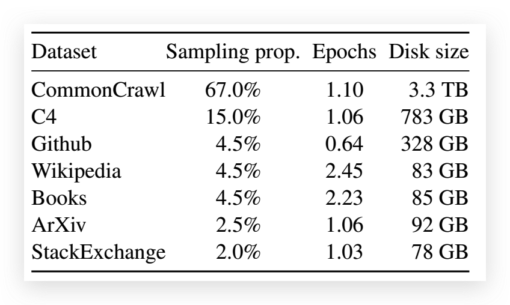

# LLaMA

> 论文：[LLaMA](assents/LLaMA.pdf)
> GitHub 地址：https://github.com/facebookresearch/llama

## 简介

- 大模型

大规模语言模型（LLM）使用大量文本数据进行训练，展示了根据文本指导或少量示例执行新任务的能力。

当将模型扩展到足够大的规模时，这些 few-shot 特性首次出现。

- LLAMA 初衷 - 更小的模型、更多的数据、更好的性能

这些工作都是基于这样的假设：更多的参数会带来更好的性能。然而 [Training Compute-Optimal Large Language Models](Training Compute-Optimal Large Language Models.md) 最近的工作发现，在给定的计算预算下，最好的性能不是由最大的模型实现的，而是由在更多数据上训练的较小的模型实现的。

给定一个目标性能水平，**首选的模型不是训练速度最快的，而是推理速度最快的**，尽管训练一个大的模型以达到一定的性能水平可能会更简单，但训练时间较长的小模型最终会在推理中更快。

[Training Compute-Optimal Large Language Models](Training%20Compute-Optimal%20Large%20Language%20Models.md) 曾建议在 200B 的 token 上训练一个 10B 的模型，但作者发现 7B 的模型的性能甚至在 1T 的 token 之后还能继续提高。

本文的重点是训练一系列语言模型，在各种推理预算下实现最佳性能，通过训练更多的标记来实现。产生的模型称为 LLaMA，参数范围从 7B 到 65B。

- 模型性能

**尽管 LLaMA-13B 比 GPT-3 小 10 倍，但在大多数基准测试中都超过了 GPT-3**；65B 参数模型也可以与最好的大型语言模型（如 Chinchilla 或 PaLM-540B）竞争。

- 训练数据开源

与 Chinchilla、PaLM 或 GPT-3 不同的是，该工作只使用公开可用的数据，这使得工作符合开源原则，而大多数现有模型所依赖的数据要么没有公开可用，要么没有记录（例如 "书籍 -2TB "或 "社交媒体对话"）。

## 预训练数据处理

### 开源数据

1. **英语 CommonCrawl**，占比 67%

由于 CommonCraw（网页爬虫数据：包含原始网页数据、元数据提取和文本提取）数据较为杂乱，该工作采用 CCNet pipleline 的方式（Wenzek 等人，2020）预处理了从 2017 年到 2020 年的 CommonCrawl 网页。

具体的工作：

- 首先，在行的层面上对数据进行了去重，用 fastText 线性分类器进行语言识别，以去除非英语页面，并用 n-gram 语言模型过滤低质量内容。

- 其次，训练了一个线性模型来对维基百科中用作参考的页面与随机抽样的页面进行分类，并丢弃了未被归类为参考的页面。

2. **C4** ，占比 15%

在探索性实验中观察到，使用不同的预处理 Com-monCrawl 数据集可以提高性能。

因此，该工作将公开的 C4 数据集（Raffel 等人，2020）也纳入我们的数据。

C4 的预处理也包含重复数据删除和语言识别步骤，**其与 CCNet 的主要区别在于质量过滤，主要依赖于一些启发式方法，比如网页中是否存在标点符号、单词和句子的数量等。**

3. **GitHub**，占比 4.5%

在代码方面，该工作使用了谷歌 BigQuery 上的 GitHub 公共数据集，并只保留在 Apache、BSD 和 MIT 许可下发布的项目。

此外，为了提高数据质量，还用**基于行长或字母数字字符比例**的启发式方法过滤了**低质量的文件**，并用**规范的表达式删除了如标题在内的模板化内容**。

最后在文件层面上对结果数据集进行去重，并进行精确匹配。

4. **维基百科**，占比 4.5%

该工作添加了 2022 年 6 月至 8 月期间的维基百科转储数据，涵盖 20 种语言，这些语言使用拉丁字母或西里尔字母，具体是：BG、CA、CS、DA、DE、EN、ES、FR、HR、HU、IT、NL、PL、UP、RO、RU、SL、SR、SV、UK。

此外，该工作对数据进行处理，以**删除超链接、评论和其他格式化的模板**。

5. **GutenbergProject 和 Books3**，占比 4.5%

书籍也是重要的语料来源，该工作的训练数据集包括两个书籍语料库：古腾堡计划（GutenbergProject）和 ThePile（Gao 等人，2020）的 Books3 部分，后者是一个可用于训练大型语言模型的公开数据集。

**在数据处理上，该工作在书的层面上进行了去重处理，删除了内容重叠度超过 90% 的书。**

6. **ArXiv**，占比 2.5%

科研文献对于提升专业性也有重要作用，该工作对 arXiv 的 Latex 文件进行处理，将科学数据添加到预训练数据集中。

**按照 Lewkowycz 等人（2022 年）的做法，该工作删除了第一节之前的所有内容以及书目。**

**此外，还删除了.tex 文件中的评论，以及用户写的内联扩展定义和宏，以增加论文之间的一致性。**

7. **Stack Exchange**，占比 2%

QA 数据对于提升垂直的专业问题也有帮助。

该工作还使用了 Stack Exchange 的开放数据，Stack Exchange 是一个高质量的问题和答案的网站，涵盖了从计算机科学到化学的不同领域。

具体的，该工作保留了 28 个最大的网站的数据，从文本中去除 HTML 标签，并按分数（从高到低）对答案进行排序。

### Tokenizer

使用 bytepair coding（BPE）算法（Sennrich 等人，2015）对数据进行标记化，使用 SentencePiece（Kudo 和 Richardson，2018）的实现。

值得注意的是，**对于数字，将它们拆分成单独的数字，对于未知的 UTF-8 字符，则使用字节来进行分解**。

另外，**在数据采样方面，对于大多数训练数据，每个 token 在训练过程中只采样一次，但维基百科和图书领域除外，对这些领域进行了大约两个 epochs。**

## 模型

### 模型结构

> 基于 Transformer Decoder 架构，根据其他优化工作对架构进行优化

#### Pre-normalization[GPT3]

> [Pre-Norm 和 Post-Norm 的理解](../Optimizer/Pre-Norm%20和%20Post-Norm.md)

LLaMA normalization 是指的 Layer norm（一般 NLP 任务都是 LN）

- 为了提高训练稳定性，对每个变换器子层的输入进行 normalizing，而不是对输出 normalizing
- 使用 RMSNorm 作为 norm func

