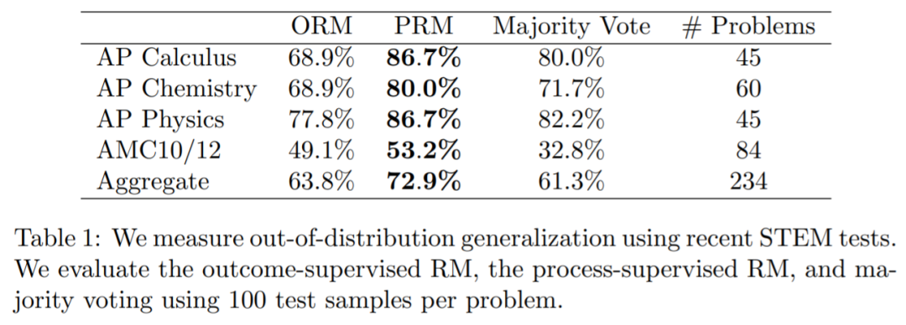

> blog: https://mp.weixin.qq.com/s/rzm5jdwgc4mMzTZhirHOxQ

OpenAI 训练了一个模型，通过奖励每一个正确的推理步骤（“过程监督”），而不仅仅是奖励正确的最终结果（“结果监督”），在数学问题解决方面达到了新的最高水平。

除了在性能上有提升，“过程监督”还在对齐（Alignment）方面有很大价值：它直接训练模型产生了一个能被人类认可的思考链条。

另外一个方面是能改进 GPT 的“幻觉”问题！

现在大语言模型（LLM）在复杂推理方面有了显著的提升，但是即使像最先进的模型例如 GPT-4 都会产生逻辑错误或者胡说八道，这通常被称为幻觉。减轻幻觉是构建对齐的 AGI 的关键步骤。

使用“结果监督”和“过程监督”都可以检测幻觉，“结果监督”根据最终结果提供反馈，“过程监督”则可以对思考链条中的每一个单独步骤提供反馈。

OpenAI 使用 MATH 数据集作为测试平台，对这两种方法进行了详细的比较，他们发现，过程监督有更好的性能。并且 OpenAI 发布了全套过程监督数据集。

另外还有一个值得一提的是，在某些情况下，为了对 AI 系统进行对齐让其更安全，这可能会导致性能下降，这种成本被称为对齐税。这就是为什么 GPT-4 的微软内部测试版本（Sparks of Artificial General Intelligence: Early experiments with GPT-4）比大众用的 GPT-4 要强很多。但是“过程监督”实际上在数学领域的测试过程中产生了一个负的对齐税（a negative alignment tax)，按我的理解就是没有因为对齐造成较大性能损耗。

目前这些测试是针对数学领域的，还不知道其他领域是不是也是类似的结果。如果其他领域借助“过程监督”也可以得到更好的结果，这就意味着未来可以得到一个比现在用的“结果监督”更好的性能和更好的对齐的方法。

