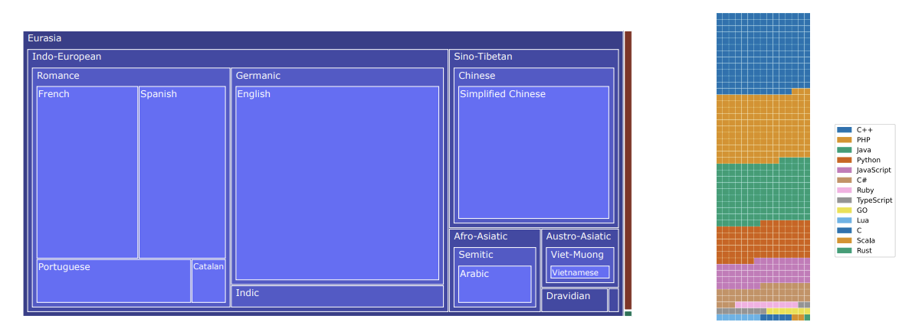
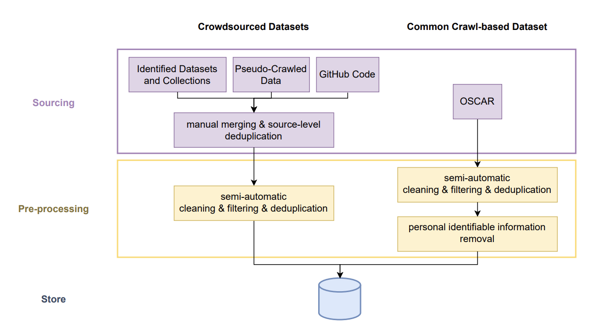
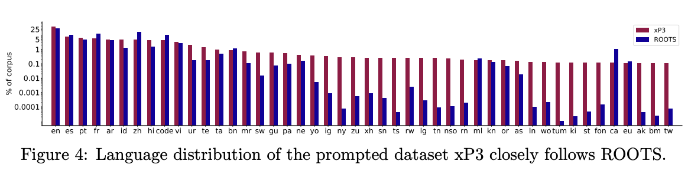
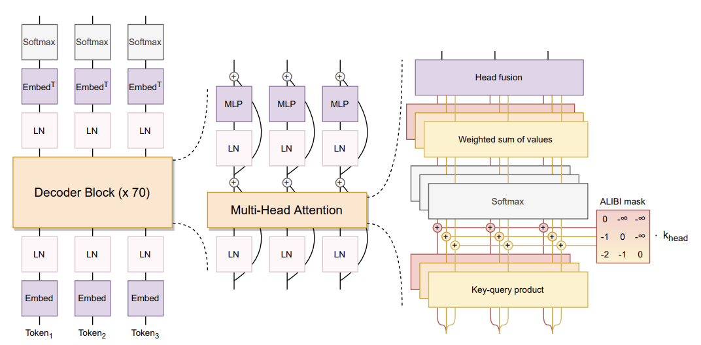

# Bloom

## 训练数据

由 498 个 Hugging Face 数据集组成的语料。共计 1.61TB 的文本，包含 46 种自然语言和 13 种编程语言。

### 数据处理

- **质量过滤**
  在获得文本后，我们发现大多数源中包含了大量的非自然语言，例如预处理错误、SEO 页面或者垃圾。为了过滤非自然语言，我们定义了一组质量指标，其中高质量文本被定义为“由人类为人类编写的”，不区分内容或者语法的先验判断。重要的是，这些指标以两种主要的方法来适应每个源的需求。首先，它们的参数，例如阈值和支持项列表是由每个语言的流利使用者单独选择的。第二、我们首先检测每个独立的源来确定哪些指标最有可能确定出非自然语言。这两个过程都是由工具进行支持来可视化影响。
- **去重和隐私编辑**
  最终，我们使用两种重复步骤来移除几乎重复的文档，并编辑了从 OSCAR 语料中确定出的个人身份信息。因为其被认为是最高隐私风险的来源，这促使我们使用基于正则表达式的编辑，即使表达式有一些假阳性的问题。

### Prompte 数据集

多任务提示微调 (也称为 instruction tuning) 涉及到对预训练语言模型的微调，微调的数据集由通过自然语言提示构成的大量不同任务组成。T0 证明了在多任务混合的 prompted 数据集上微调的模型具有强大的 zero-shot 泛化能力。此外，T0 优于那些数量级大但是没有经过这种微调的语言模型。

对 BLOOM 预训练之后，我们应用相同的大规模多任务微调，使 BLOOM 具有多语言 zero-shot 任务泛化能力。我们称得到的模型为 BLOOMZ。为了训练 BLOOMZ，我们扩展了 P3 来包含非英语中新数据集和新任务，例如翻译。这产生了 xP3，它是 83 个数据集的提升集合，覆盖 46 种语言和 16 中任务。正如上图 4 所述，xP3 反映了 ROOTS 的语言分布。xP3 中的任务包含跨语言和单语言。我们使用 PromptSource 来收集这些 prompts，为 prompt 添加额外的元数据，例如输入和目标语言。为了研究多语言 prompt 的重要性，我们还将 xP3 中的英语提示用机器翻译为相应的数据集语言，来生成一个称为 xP3mt 的集合。

## 模型结构

针对模型的组件和超参数进行了消融实验，寻求最大限度的利用我们最终的计算预算。

- 消融实验设计
  LLM 的主要吸引力是其以"zero/few-shot"的方式执行任务的能力：足够大的模型可以简单的从 in-context 指令和例子执行新的任务，不需要在监督样本上训练。由于对 100B+模型微调很麻烦，我们评估架构决策专注在 zero-shot 泛化能力上，并且不考虑迁移学习。具体来说，我们衡量了不同任务集合的 zero-shot 表现：29 个任务来自于 EleutherAI Language Model Evaluation Harness(EAI-Eval)，9 个任务来自 T0 的验证集 (T0-Eval)。两者之间有很大的重叠：T0-Eval 中仅有一个任务是不在 EAI-Eval，尽管两者的所有 prompt 都不同。
  此外，也使用更小的模型进行了消融实验。使用 6.7B 模型对预训练目标进行消融实验，使用 1.3B 模型对位置嵌入、激活函数和 layer normalization 进行消融实验。近期，Dettmers 在大于 6.7B 的模型上发现了相变，观察到了"异常特征"出现。那么在 1.3B 规模上是否能够外推自最终模型尺寸上？
- 超出范围的架构
  我们没有考虑 mixture-of-experts(MoE)，**因为缺乏适合大规模训练它的广泛使用的基于 GPU 的代码库**。类似地，**我们也没有考虑 state-space 模型**。在设计 BLOOM 时，它们在自然语言任务中一种表现不佳。这两种方法都很有前景，现在证明了在大规模 MoE 上有竞争力的结果，并在较小规模上使用具有 H3 的 state-space 模型。

### 架构和预训练目标

虽然大多数现代语言模型都是基于 Transformer 架构，但是架构实现之间存在着显著的不同。显然，原始的 Transformer 是基于 encoder-decoder 架构的，许多流行的模型仅选择 encoder-only 或者 decoder-only 方法。当前，所有超过 100B 参数的 state-of-the-art 模型都是 decoder-only 模型。这与 Raffel 等人的发现相反，在迁移学习方面 encoder-decoder 模型显著优于 decoder-only 模型。

文献缺乏不同架构和预训练目标的系统性评估 zero-shot 泛化能力。我们在`Wang et al.(2022a)`等人的工作中探索了这个问题，其探索了 encoder-decoder 和 decoder-only 架构以及与 causal、prefix 和 masked language modeling 预训练模型的相互作用。我们的结果显示，经过预训练之后，causal decoder-only 模型的表现最好，验证了 state-of-the-art LLM 的选择。

### 建模细节

在 causal decoder-only 模型上。我们在 BLOOM 中采用了两种变化：

- ALiBi 位置嵌入
  相比于在 embedding 层添加位置信息，ALiBi 直接基于 keys 和 queries 的距离来衰减注意力分数。虽然 ALiBi 的最初动机是它能够外推至更长的序列，我们发现其在原始序列长度上也能够带来更平衡的训练以及更好的下游表现，超越了可学习 embeddings 和 rotary embeddings。
- Embedding LayerNorm
  在训练 104B 参数模型的初步试验中，在 embedding 层之后立即添加额外的归一化层（`layer norm` 层），来源于 bitsandbytes 库及其 StableEmbedding 层。我们发现这可以显著的改善训练稳定性。尽管我们在`Le Scao et al.`工作中发现其对 zero-shot 泛化有惩罚，但我们还是在 BLOOM 的第一个 embedding 层后添加了额外的 layer normalization 层来**避免训练不稳定性**。注意初步的 104B 实验中使用 float16，而最终的训练上使用 bfloat16。因为 float16 一直被认为是训练 LLM 时观察的许多不稳定的原因。bfloat16 有可能缓解对 embedding LayerNorm 的需要。

### **Tokenization**

tokenizer 的设计选择通常被忽略，倾向于"默认"设置。举例来说，OPT 和 GPT-3 都使用 GPT-2 的 tokenizer，训练用于 English。由于 BLOOM 训练数据的多样性本质，需要谨慎的设计选择来确保 tokenizer 以无损的方式来编码句子。

