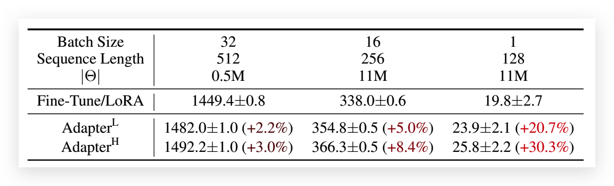
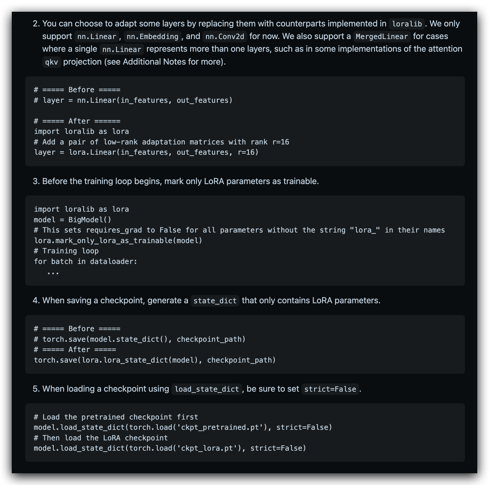
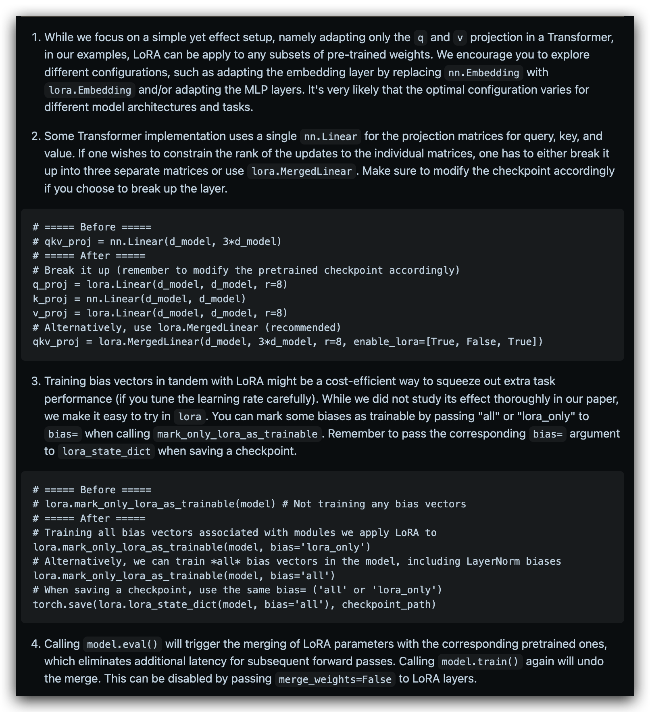

# LoRA: Low-Rank Adaptation of Large Language Models

> GitHub 地址：https://github.com/microsoft/LoRA
>
> ChatDoc 地址：https://chatdoc.com/chatdoc/#/chat/a9e54481-3601-4318-93e3-4acd6ecc96f6
>
> 

## 大致介绍

为了使微调更高效，LoRA 的做法是通过低秩分解用两个更小的矩阵（称为更新矩阵）来表示权重更新。可以训练这些新矩阵以适应新数据，同时保持较低的总体变化次数。原始权重矩阵保持冻结状态，不会接受任何进一步的调整。为了产生最终结果，将原始权重和调整后的权重组合在一起。

优点：

- LoRA 通过大幅减少可训练参数的数量，使微调工作更加有效。
- 原始的预训练权重被保持冻结，这意味着你可以有多个轻量级和可移植的 LoRA 模型，用于在其上建立各种下游任务。
- LoRA 与许多其他参数效率高的方法是正交的，可以与许多方法结合。
- 使用 LoRA 微调的模型的性能与完全微调的模型的性能相当。
- LoRA 不增加任何推理延迟，因为适配器权重可以与基础模型合并。

原则上，LoRA 可以应用于神经网络中的任何权重矩阵子集，以减少可训练参数的数量。

然而，为了简化和进一步提高参数效率，在 Transformer 模型中，**LoRA 通常只应用于注意力块**。LoRA 模型中**可训练参数的数量取决于低秩更新矩阵的大小，这主要由秩 r 和原始权重矩阵的形状确定。**

## 已有方案的问题

### Adapter 引入**推理延迟**

使用 Adapter 增加模型层数会增加推理的时长

### 直接优化 Prompt 比较困难

Prefix-Tuning 难于训练，模型性能也并非总是稳步提升。相比之下，LoRA 的优势是容易训练。

预留一些 sequence 做 adaption 会让处理下游任务的可用 sequence 长度变少，一定程度上会影响模型性能。

## LoRA

学习过度参数化模型实际上存在低固有维度。

我们假设模型适应期间权重的变化也具有低“固有秩”，从而提出了我们的低秩适应（LoRA）方法。

LoRA 允许我们通过优化 dense layers 变化的秩分解矩阵间接训练神经网络中的一些 dense layers，同时保持预训练权重不变。

### low-rank-parametrized update metrics

LoRA 的思想也很简单，在原始 PLM 旁边增加一个旁路，做一个降维再升维的操作，来模拟所谓的 `intrinsic rank` 。训练的时候固定 PLM 的参数，只训练降维矩阵 A 与升维矩阵 B。而模型的输入输出维度不变，输出时将 BA 与 PLM 的参数叠加。用随机高斯分布初始化 A，用 0 矩阵初始化 B，保证训练的开始此旁路矩阵依然是 0 矩阵。

假设预训练的矩阵为 $W_0 \in \mathbb{R}^{d \times k}$，它的更新可表示为：

$$W_0 + \Delta W = W_0 + BA, B \in \mathbb{R}^{d \times r}, A \in \mathbb{R}^{r \times k}$$

其中秩$r << min(d,k)$。

对于 $ℎ=W_0$，它的前向计算变为：

$$h=W_0x + \Delta Wx = W_0x + BAx = (W_0 + BA)x$$

这种思想有点类似于残差连接，同时使用这个旁路的更新来模拟 full finetuning 的过程。并且，full finetuning 可以被看做是 LoRA 的特例（当 r 等于 k 时）。

通过将 LoRA 等级 r 设置为预训练的权重矩阵的等级，大致可以恢复完全微调的表现力。

在生产环境部署时，LoRA 可以不引入推理延迟，只需要将预训练模型参数 $W_0$ 与 LoRA 参数进行合并（也就是所谓的模型合并）即可得到微调后的模型参数： $W = W_0 + BA$ ，在生产环境中像以前一样进行推理，即微调前计算 $h=W_0x$ ，现在计算$h=Wx$ ，没有额外延迟。现在不少模型仅发布 LoRA 权重，需要本地与基模型进行模型合并才能使用的原理就在于此。

### LoRA 简单使用

### LoRA 与 attention 结合

LoRA 与 Transformer 的结合也很简单，仅在 Q 和 V attention 的计算中增加一个旁路，而不动 MLP 模块：

总结，基于大模型的内在低秩特性，增加旁路矩阵来模拟全模型参数微调，LoRA 通过简单有效的方案来达成轻量微调的目的。它的应用自不必提，可以将现在的各种大模型通过轻量微调变成各个不同领域的专业模型。

此外，考虑 OpenAI 对 GPT 模型的认知，GPT 的本质是对训练数据的有效压缩，从而发现数据内部的逻辑与联系，LoRA 的思想与之有相通之处，原模型虽大，但起核心作用的参数是低秩的，通过增加旁路，达到四两拨千斤的效果。

