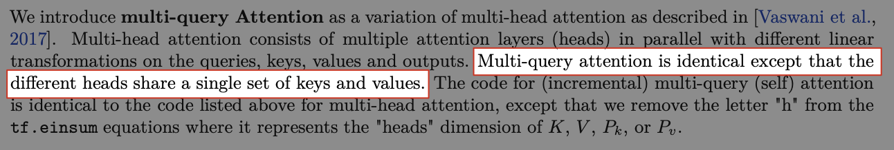
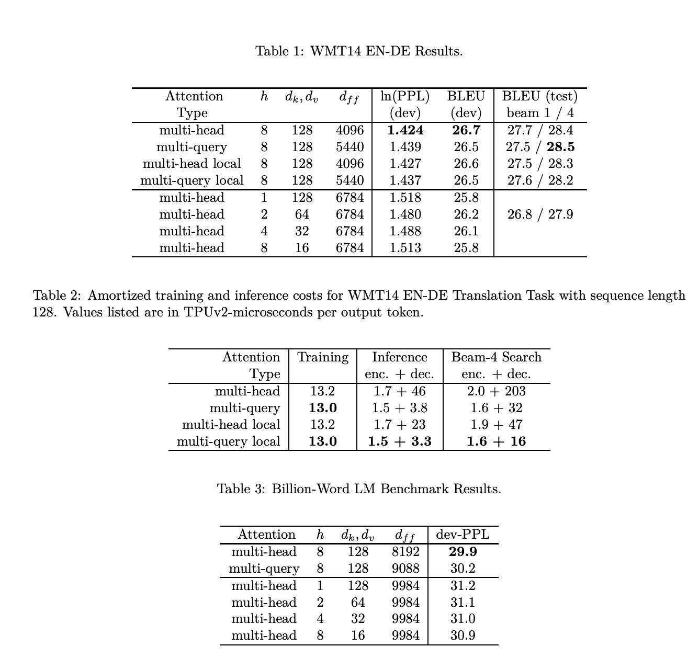

# Multi-Quary-Attention

> 论文：https://arxiv.org/pdf/1911.02150.pdf

## MQA 和 MHA 的区别



MQA 和 MHA 唯一的区别在于不同的 heads 之间共享了同一份 key、value 矩阵。

每个头只单独保留了一份 Query 参数，从而大大减少 Key 和 Value 矩阵的参数量。

代码示例：https://github.com/mosaicml/llm-foundry/blob/main/llmfoundry/models/layers/attention.py

```python
class MultiheadAttention(nn.Module):

    def __init__(
            self,
            d_model: int,
            n_heads: int,
            device: str
        ):
        """
        Multi Head init func.

        Args:
            d_model (int): 模型的最大长度 (seq_len), e.g. 512
            n_heads (int): 设定的注意力头数，e.g. 8
            device (str): _description_
        """
        super().__init__()

        self.d_model = d_model
        self.n_heads = n_heads
    
        self.Wqkv = nn.Linear(                       # 【关键】Multi-Head Attention 的创建方法
            self.d_model, 
            3 * self.d_model,                        # 有 query, key, value 3 个矩阵，所以是 3 * d_model
            device=device
        )                                            # (d_model, 3 * d_model)
        self.attn_fn = scaled_multihead_dot_product_attention
        self.out_proj = nn.Linear(
            self.d_model, 
            self.d_model, 
            device=device
        )

    def forward(
        self,
        x
    ):
        """
        forward func.

        Args:
            x (tensor): (batch, hidden_state, d_model) e.g. -> (1, 768, 512)

        Returns:
            _type_: _description_
        """
        qkv = self.Wqkv(x)                            # (1, 768, 3 * 768)

        query, key, value = qkv.chunk(                # 【关键】每个 tensor 都是 (1, 768, 512)
            3, 
            dim=2
        )     

        context, attn_weights, past_key_value = self.attn_fn(
            query,
            key,
            value,
            self.n_heads
        )                                             # (1, 768, 512)

        return self.out_proj(context), attn_weights, past_key_value


class MultiQueryAttention(nn.Module):
    """Multi-Query self attention.

    Using torch or triton attention implemetation enables user to also use
    additive bias.
    """

    def __init__(
        self,
        d_model: int,
        n_heads: int,
        device: Optional[str] = None,
    ):
        super().__init__()

        self.d_model = d_model
        self.n_heads = n_heads
        self.head_dim = d_model // n_heads

        self.Wqkv = nn.Linear(                           # 【关键】Multi-Query Attention 的创建方法
            d_model,
            d_model + 2 * self.head_dim,                 # 只创建 query 的 head 向量，所以只有 1 个 d_model
            device=device,                               # 而 key 和 value 则只共享各自的一个 head_dim 的向量
        )

        self.attn_fn = scaled_multihead_dot_product_attention
        self.out_proj = nn.Linear(
            self.d_model, 
            self.d_model, 
            device=device
        )
        self.out_proj._is_residual = True  # type: ignore

    def forward(
        self,
        x,
    ):
        qkv = self.Wqkv(x)                                           # (1, 768, 640)

        query, key, value = qkv.split(                               # query -> (1, 768, 512)
            [self.d_model, self.head_dim, self.head_dim],            # key   -> (1, 768, 64)
            dim=2                                                    # value -> (1, 768, 64)
        )

        context, attn_weights, past_key_value = self.attn_fn(
            query,
            key,
            value,
            self.n_heads,
            multiquery=True,
        )

        return self.out_proj(context), attn_weights, past_key_value
```

MHA 和 MQA 之间的区别只在于建立 Wqkv Layer 上：

```python
# Multi Head Attention
self.Wqkv = nn.Linear(                        # 【关键】Multi-Head Attention 的创建方法
    self.d_model, 
    3 * self.d_model,                        # 有 query, key, value 3 个矩阵，所以是 3 * d_model
    device=device
)

query, key, value = qkv.chunk(               # 【关键】每个 tensor 都是 (1, 768, 512)
    3, 
    dim=2
)


# Multi Query Attention
self.Wqkv = nn.Linear(                                # 【关键】Multi-Query Attention 的创建方法
    d_model,
    d_model + 2 * self.head_dim,                      # 只创建 query 的 head 向量，所以只有 1 个 d_model
    device=device,                                    # 而 key 和 value 不再具备单独的头向量
)

query, key, value = qkv.split(                        # query -> (1, 768, 512)
    [self.d_model, self.head_dim, self.head_dim],     # key   -> (1, 768, 64)
    dim=2                                             # value -> (1, 768, 64)
)
```

在 MHA 中，query, key, value 每个向量均有 512 维度，

而在 MQA 中，只有 query 是 512 维，而 key 和 value 均只剩下 64 维了，恰好是 1 个 head_dim 的维度。

**在 MQA 中，除了 query 向量还保存着 8 个头，key 和 value 向量都只剩 1 个「公共头」了。**

将这 1 份参数同时让 8 个头都使用，使用矩阵乘法 matmul 来广播，使得每个头都乘以这同一个 tensor，以此来实现参数共享：

```python
def scaled_multihead_dot_product_attention(
        query,
        key,
        value,
        n_heads,
        multiquery=False,
    ):
    q = rearrange(query, 'b s (h d) -> b h s d', h=n_heads)         # (1, 768, 512) -> (1, 8, 768, 64)
    kv_n_heads = 1 if multiquery else n_heads                       # 如果使用 MQA 则只保留一个头，否则拆成 8 个头
    k = rearrange(key, 'b s (h d) -> b h d s', h=kv_n_heads)        # (1, 768, 512) -> (1, 8, 64, 768) if not multiquery 
                                                                    # (1, 768, 64) -> (1, 1, 64, 768)  if multiquery
    v = rearrange(value, 'b s (h d) -> b h s d', h=kv_n_heads)      # (1, 768, 512) -> (1, 8, 768, 64) if not multiquery 
                                                                    # (1, 768, 64) -> (1, 1, 768, 64)  if multiquery
    
    attn_weight = q.matmul(k)                                       # (1, 8, 768, 768)
    attn_weight = torch.softmax(attn_weight, dim=-1)                # (1, 8, 768, 768)

    out = attn_weight.matmul(v)                                     # (1, 8, 768, 768) * (1, 8, 768, 64) = (1, 8, 768, 64)
    out = rearrange(out, 'b h s d -> b s (h d)')                    # (1, 768, 512)

    return out, attn_weight, past_key_value
```

## 实验效果

Multi-Query-Attention 在 decoder 上加速效果明显



