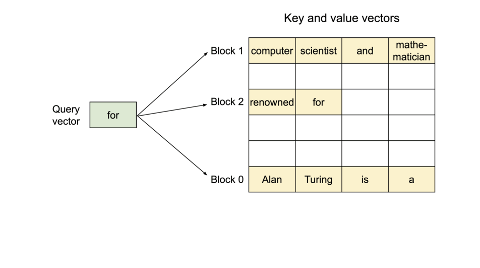

# PagedAttention

> Blog: https://vllm.ai/
>
> GitHub 地址：https://github.com/vllm-project/vllm

## 核心要点

- ⚡️**为什么切换简单？Easy**
  - 本质是推理过程中底层内存逻辑，CUDA Op 的改变，与模型架构关联小，所以可以无痛切换。
- **🧠为什么节省了**内存？Memory-Efficient
  - 序列存储的时候物理上分块按需存储，尽量降低了物理空间的浪费，并且原生支持共享内存。
- **🎯为什么更推理的吞吐增加了？Fast**
  - 通过共享内存，分块内存的方式，降低了单 Seq 的内存占用，增加 BatchSize，提升 GPU 利用率。

## KV Cache

KV Cache 是大模型推理优化的一个常用技术，该技术以空间换时间的思想，通过使用上次推理的 KV 缓存，可以在不影响任何计算精度的前提下，提高推理性能，降低端到端的时延。

以 GPT 为代表的 Decoder-Only 自回归语言模型在生成每一个新的 token 时，接受所有之前生成的 tokens 作为输入。然而，对于这些先前生成的 tokens，每次生成新的 token 时都需要重新计算他们的表示，这个过程造成了大量的计算浪费。KV Cache 的引入就是为了解决这个问题。

KV Cache 实质上是存储了之前计算过的 key-value 对用于下一个 Token 的生成。在 Transformer 结构中，self-attention 中的 k_proj, v_proj 会将输入的每个 token 转化为一个 key 和一个 value，然后使用这些 key-value 以及当前的 query 对来计算下一个 token。引入 KV Cache，我们就可以将之前生成的 tokens 对应的 key-value 对存储起来，当生成新的 token 时，直接从 KV Cache 中取出这些已经计算好的 key-value 对，再把当前 token 的 key-value 做一个连结在进行计算，这样就避免了 KV 的重复计算，大大提高了计算效率。

整体来说，使用 KV Cache 包含以下两个步骤：

预填充阶段：在计算第一个输出 token 过程中，此时 Cache 是空的，计算时需要为每个 transformer layer 计算并保存 key cache 和 value cache，在输出 token 时 Cache 完成填充；FLOPs 同 KV Cache 关闭一致，存在大量 gemm 操作，推理速度慢，这时属于 Compute-bound 类型计算。

KV Cache 阶段：在计算第二个输出 token 至最后一个 token 过程中，此时 Cache 是有值的，每轮推理只需读取 Cache，同时将当前轮计算出的新的 Key、Value 追加写入至 Cache；FLOPs 降低，gemm 变为 gemv 操作，推理速度相对第一阶段变快，这时属于 Memory-bound 类型计算。

## **PagedAttention**

通过 KV Cache 的技术，我们已经可以极大地提升 LLM 地推理速度，但是现有的 Cache 仍存在一些问题

- ***Large***：对于 LLaMA-13B 中的单个序列，它占用高达 1.7GB 的内存。
- ***Dynamic***：它的大小取决于序列长度，而序列长度具有高度可变和不可预测的特点。

因此，高效地管理 KV Cache 是一个重大挑战。现有系统（HuggingFace 默认实现是 pytorch 的内存分配策略）由于内存碎片化和过度预留而浪费了 60% 至 80% 的内存。

为了解决这个问题，我们引入了 PagedAttention，这是一种受**传统操作系统****虚拟内存****和分页概念**启发的注意力算法。与传统的注意力算法不同，PagedAttention 允许将连续的键和值存储在非连续的内存空间中。具体而言，PagedAttention 将每个序列的 KV 缓存分成多个块，每个块包含固定数量的标记的键和值。在注意力计算过程中，PagedAttention Kernel 高效地识别和获取这些块，采用并行的方式加速计算。（和[ByteTransformer](https://arxiv.org/abs/2210.03052)的思想有点像）

### 内存布局 - 提供 GPU 利用率

由于块在内存中不需要连续存储，我们可以像操作系统的虚拟内存那样以更加灵活的方式管理键和值的缓存：可以将块看作页，标记看作字节，序列看作进程。序列的连续逻辑块通过块表映射到非连续的物理块。随着生成新的标记，序列的边长，物理块**按需进行分配**。

在 PagedAttention 中，内存浪费仅发生在序列的最后一个块中。这样就使得我们的方案接近最优的内存使用率，仅有不到 4% 的浪费。通过内存效率的提升，我们能够显著提升 BatchSize，同时进行多个序列的推理，**提高 GPU 利用率，从而显著提高吞吐量。**

### 内存共享 - 降低显存使用量

在并行采样中，从相同的提示生成多个输出序列。在这种情况下，可以在输出序列之间共享提示的计算和内存。通过其块表，PagedAttention 能够自然地实现内存共享。类似于进程共享物理页，PagedAttention 中的不同序列可以通过将它们的逻辑块映射到相同的物理块来共享块。为确保安全共享，PagedAttention 跟踪物理块的引用计数并实现 Copy-on-Write 机制。

通过 PagedAttention 的内存共享机制，极大地降低了复杂采样算法（如 ParallelSampling 和 BeamSearch）的内存开销，使其内存使用量下降了高达 55%。这项优化可以直接带来最多 2.2 倍的吞吐量提升，从而使得 LLM 服务中使用这些采样方法变得更加实用。

# 实验验证

-20230626004849467.(null))-20230626004849479.(null))

吞吐的实验已经经过了官方的验证，我们这里就不在多测。我们对`OPT-125m`的 HuggingFace 的实现和 vLLM 的实现进行`Pytorch Timeline`测试，通过实验不难发现，相比于原始的 HuggingFace 的实现，vLLM 减少了大量的类似`CatArrayBatchedCopy`的内存操作，大大提升了每一层前向的速度，降低了端到端的推理延迟，取得了良好的效果。目前，vLLM 经过广泛验证并取得显著成果。其应用不仅大幅降低了运营成本，还使 LM-Sys 在处理相同流量时将所需 GPU 数量减少了 50%。目前，vLLM 每天平均能处理 30,000 个请求，并在峰值时达到 60,000 个，这充分证明了其鲁棒性。
