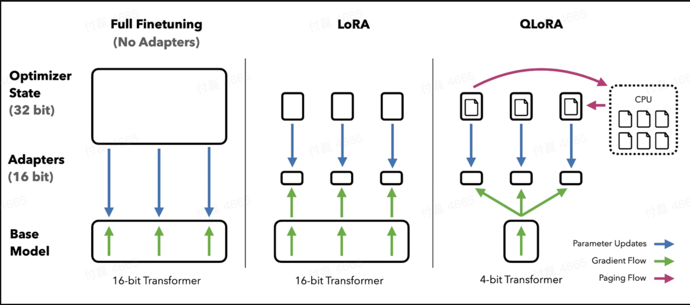
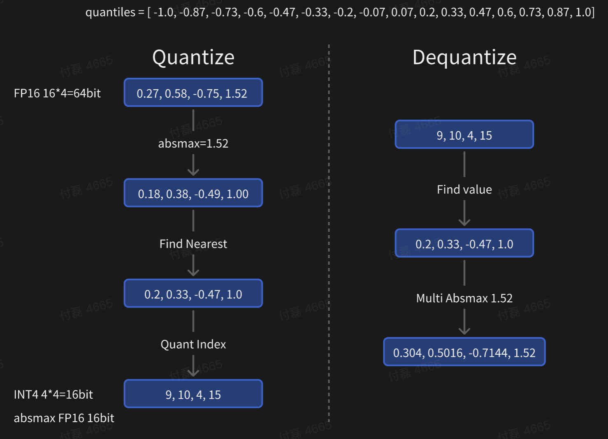
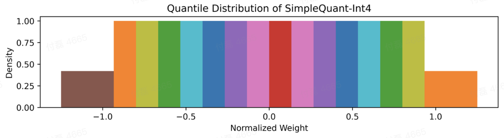
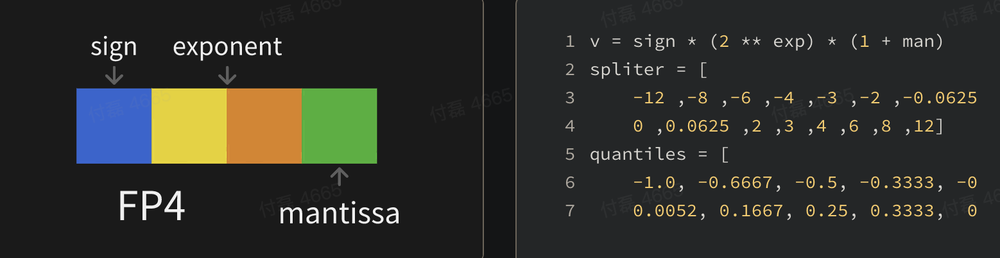
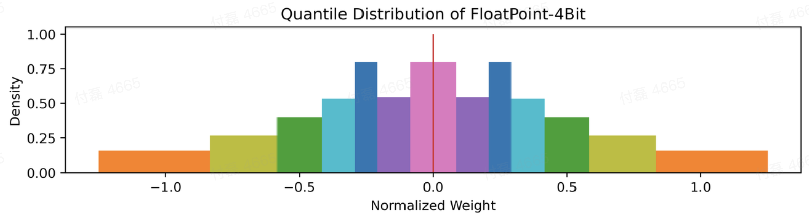
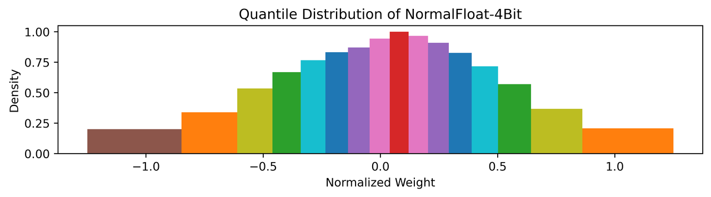

# QLoRA: 训练更大的 GPT



> https://readpaper.feishu.cn/docx/CrMGdSVPKow5d1x1XQMcJioRnQe
>
> Paper: https://arxiv.org/abs/2305.14314
>
> Blog: https://huggingface.co/blog/4bit-transformers-bitsandbytes
>
> Repo: https://github.com/artidoro/qlora

# 提出问题

在 NLP 领域，对于下游任务进行大型预训练语言模型的微调已经成为一种重要的做法。一般而言，我们会采用对原有的预训练模型进行全量微调的方法来适配下游任务。然而，对于大规模的模型，微调过程可能会消耗大量的内存和计算资源，使得对于模型的微调产生了一定的门槛。

# 核心要点

1. 💡✂️ $$\text{QLoRA}$$：通过 4-bit 量化的 BaseModel 在保持高性能的同时减少内存使用，使得模型微调的门槛大大降低。
   1. 核心方法是提出了 4-bit NormalFloat（NF4）数据类型进行量化，一种对于正态分布权重而言信息理论上最优的新数据类型。
   2. 双重量化，通过量化量化常数来减少平均内存占用。
   3. 分页优化器 Paged Optimizers，使用 NVIDIA 统一内存来避免在处理具有长序列长度的小批量时发生的梯度检查点内存峰值。
   4. 核心思想是通过量化降低基座模型的显存占用，使得 65B 模型在单 GPU 上可以完成训练。
2. 🆕🚀 $$\text{Guanaco}$$：新发布了基于 LLaMA 的模型家族，在 Vicuna 基准测试中的表现优于所有以前公开发布的模型。
   1. 如果有相同的存储预算，4bit 的 33B 的模型效果优于 8bit 的 13B 模型
3. 🔍📊 $$\text{Misc}$$：指出现有的评估方式存在一定问题；针对特定下游任务训练数据需要更加优质。
   1. 使用 GPT4 进行自动评估存在先入为主的情况，无法准确评估聊天机器人的性能。
   2. 针对特定任务，训练数据的适用性 (Suitability) 和质量 (Quality) 相比于数量更加重要。
4. 📈🎯 $$\text{Outlier Matters}$$: 大型语言模型权重中的离群值分布集中且对模型性能影响很大。
   1. 对于越大的模型，离群值对于模型性能的影响越大，模型对 outlier 的依赖更强
   2. 离群值很少，集中于确定的几列，并且在模型输出的 Prefix，可能存储了一些上下文无关的信息

# 解决方案

## Overview

$$\text{LoRA}$$

$$\begin{equation} \mathbf{Y}^{\mathrm{BF} 16}=\mathbf{X}^{\mathrm{BF} 16} \mathbf{W}^{\mathrm{BF} 16}+\mathbf{X}^{\mathrm{BF} 16} \mathbf{L}_1^{\mathrm{BF} 16} \mathbf{L}_2^{\mathrm{BF} 16} \end{equation}$$

$$\text{QLoRA}$$

$$\begin{equation} \mathbf{Y}^{\mathrm{BF} 16}=\mathbf{X}^{\mathrm{BF} 16} \text { doubleDequant }\left(c_1^{\mathrm{FP} 32}, c_2^{\mathrm{k} \text {-bit }}, \mathbf{W}^{\mathrm{NF} 4}\right)+\mathbf{X}^{\mathrm{BF} 16} \mathbf{L}_1^{\mathrm{BF} 16} \mathbf{L}_2^{\mathrm{BF} 16} \end{equation}$$

$$\begin{equation} \text { doubleDequant }\left(c_1^{\mathrm{FP} 32}, c_2^{\mathrm{k} \text {-bit }}, \mathbf{W}^{\mathrm{k}-\mathrm{bit}}\right)=\operatorname{dequant}\left(\operatorname{dequant}\left(c_1^{\mathrm{FP} 32}, c_2^{\mathrm{k}-\text { bit }}\right), \mathbf{W}^{4 \mathrm{bit}}\right)=\mathbf{W}^{\mathrm{BF} 16} \end{equation}$$

通过$$\text{QLoRA}$$，可以在保留完整的 16 位微调任务性能的同时，减少内存使用，以在单个 48GB GPU 上微调 65B 参数模型。最新模型 Guanaco 在 Vicuna 基准测试中的表现超过了所有以前公开发布的模型，达到了 ChatGPT 性能水平的 99.3%，而且只需要在单个 GPU 上微调 24 小时。

## 4-bit NormalFloat Quantization

### Quantize 和 Dequantize（量化和反量化）

量化是将输入从拥有更多信息的表示离散化为信息较少的表示的过程。

它通常意味着采用具有更多位的数据类型并将其转换为更少的位。为了确保使用整个低位数据类型范围，输入数据类型通常通过输入元素的绝对最大值进行归一化来重新调整到目标数据类型，这些元素通常构造为张量。



### SimpleQuant-Int4

- 量化分位数

```python
quantiles = [
    -1., -0.86666667, -0.73333333, -0.6, -0.46666667,
    -0.33333333, -0.2, -0.06666667, 0.06666667, 0.2,
    0.33333333, 0.46666667, 0.6, 0.73333333, 0.86666667, 1.
]
```

- 量化分布



### FP4-Quant

 https://huggingface.co/blog/4bit-transformers-bitsandbytes#fp4-precision-in-a-few-words

 https://github.com/TimDettmers/bitsandbytes/blob/main/csrc/kernels.cu#L75

 https://github.com/TimDettmers/bitsandbytes/blob/main/csrc/kernels.cu#L123



```C++
# 将8位的二进制转换为FP4格式
__device__ float d2DequantizeFP4(unsigned char val) 
{
  // 如果最高位（bit 3）为1，则将sign设置为-1.0f，否则设置为1.0f。
  float sign = (val & 0b1000) == 8 ? -1.0f : 1.0f;
  
  // 检查val的3-5位（bit 2-0）来确定浮点数的类型
  if((val & 0b0110) == 0)
  {
    // subnormal
    // 如果3-5位为0则表示这个浮点数是一个次标准值
    if((val & 0b0001) == 0)
      // 如果为0，则返回0.0f，表示次标准值为0
      return 0.0f;
    else
      // 如果为1，则返回sign*0.0625f，表示次标准值为0.0625f
      return sign*0.0625f;
  }
  else
  {
    // normal
    // 如果3-5位不全为0，则表示这个浮点数是一个正常值（normal）。代码首先根据第3位（bit 2）的值确定指数（exponent）
    float exponent = ((val & 0b0100) == 4 ? 2.0f : 8.0f) + ((val & 0b0010) == 2 ? 0.0f : 2.0f);
    // 第3位（bit 2）的值确定指数（exponent）如果为1，则指数为2.0f，如果为0，则指数为8.0f
    float fraction = (val & 0b0001) == 1 ? 1.5f : 1.0f;
    // 代码根据第2位（bit 1）的值确定分数（fraction），如果为1，则分数为1.5f，如果为0，则分数为1.0f
	
    // 将符号、指数和分数相乘，得到最终的浮点数值
    return sign*exponent*fraction;
  }
}
```



### NF4-Quant

$$\text{4-bit NormalFloat}$$是一种数据类型，它在量化过程中保留了零点，并使用所有$$2^k$$位来表示$$k$$位数据类型。

- 这种数据类型通过估计两个范围的分位数$$q^i$$来创建一个非对称的数据类型，这两个范围分别是负数部分$$[-1,0]$$的$$2^{k-1}$$和正数部分$$[0,1]$$的$$2^{k-1}+1$$。
- 然后，它统一了这两组分位数$$q^i$$，并从两组中都出现的两个零中移除一个。这种结果数据类型在每个量化 bin 中都有相等的期望值数量，因此被称为$$\text{k-bit NormalFloat}\space (\text{NF}_k)$$，这种数据类型对于以零为中心的正态分布数据在信息论上是最优的。

 $$\begin{equation} q_i=\frac{1}{2}\left(Q_X\left(\frac{i}{2^k+1}\right)+Q_X\left(\frac{i+1}{2^k+1}\right)\right) \end{equation}$$

$$\text { where } Q_X(\cdot) \text { is the quantile function of the standard normal distribution } N(0,1)$$

***标准正态分布量化函数把[-1, 0]分成 7 份，然后生成[-1, ..., 0]共 8 个分位数，把[0, 1]分成 8 份，然后生成[0, ..., 1]共 9 个分位数，两个合起来去掉一个 0 就生成全部的 16 个分位数了。***

#### 算法解释

对于这个函数的简要解释是：它创建了 NF4 数据类型的 16 个值，并用零填充，以便在 8 位量化函数中使用（256 个值，其中包括 256-16 个零）。该函数在 bitsandbytes 库中使用 8 位量化方法来“模拟”NF4。

我们的目标是找到等面积的量化区间，使得量化区间左右两侧的面积相等。这意味着我们不从正态分布的 0 和 1 量化区间开始，而是从一个偏移量量化区间开始。代码片段中称之为"offset"，其值为 1-1/(2*15)。如果我们有一个非对称的数据类型，其中一侧的间隔等于每个量化区间周围的 16 个“半个”，而另一侧只有 15 个“半个”。因此，平均偏移量为 (1-1/(2*15) + 1-1/(2*16))/2 = 0.9677083。

使用 norm.ppf 函数获取标准正态分布（N(0, 1)）的量化区间。然后，通过将这些量化区间的值除以绝对最大值来重新缩放它们。

### 2 * 具体代码

```python
def create_normal_map(offset=0.9677083, use_extra_value=True):

    if use_extra_value:
        # one more positive value, this is an asymmetric type
        v1 = norm.ppf(torch.linspace(offset, 0.5, 9)[:-1]).tolist()
        v2 = [0]*(256-15) ## we have 15 non-zero values in this data type
        v3 = (-norm.ppf(torch.linspace(offset, 0.5, 8)[:-1])).tolist()
        v = v1 + v2 + v3
    else:
        v1 = norm.ppf(torch.linspace(offset, 0.5, 8)[:-1]).tolist()
        v2 = [0]*(256-14) ## we have 14 non-zero values in this data type
        v3 = (-norm.ppf(torch.linspace(offset, 0.5, 8)[:-1])).tolist()
        v = v1 + v2 + v3

    values = torch.Tensor(v)
    values = values.sort().values
    values /= values.max()
    assert values.numel() == 256
    return values
```

```python
quantiles =  [
    -1.0, -0.6961928009986877, -0.5250730514526367, -0.39491748809814453,
    -0.28444138169288635, -0.18477343022823334, -0.09105003625154495, 0.0,
    0.07958029955625534, 0.16093020141124725, 0.24611230194568634,
    0.33791524171829224, 0.44070982933044434, 0.5626170039176941, 0.7229568362236023, 1.0
]
```



### Compare

[quant_compare.ipynb](https://github.com/cauyxy/bilivideos/blob/master/qlora/quant_compare.ipynb)

#### Layer error

)-20230625192025093.(null))

通过对于$$\text{opt-125m layer6}$$单层权重量化对于输入输出的量化误差的对比我们可以发现：

1. 当数据集数据不参与量化的情况下，量化效果 $$\text{NF4 > GPTQ-0 > FP4}$$
2. 当数据集数据参与量化的情况下，NF4 和测试数据占比$$10^{-5$$的 GPTQ 算法效果相当
3. `q_proj, k_proj, fc2`对量化更加敏感，量化误差明显高于`v_proj, out_proj, fc1`

#### c4(ppl)

https://github.com/qwopqwop200/GPTQ-for-LLaMa#gptq-vs-bitsandbytes

-20230625192312469.(null))

#### Infer latency

From Author of AutoGPTQ: [PanQiWei - Overview](https://github.com/PanQiWei)

-20230625192312461.(null))

## Double Quantization

具体来说就是每 64 个参数共享一个量化常数 (Absmax, 32bit)，这样的话相当于每一个参数的量化额外开销为$$32/64 = 0.5 \text{bit}$$。这个总体来说也是比较大的一个开销，所以为了进一步优化这个量化开销，我们对其进行二次量化 ($$\text{Double Quantization}$$)，对量化常数进行进一步的量化。我们采用 256 的块大小对量化常数进行$$\text{FP8}$$量化，这样的话，我们可以把每个参数的量化额外开销降低到$$8/64 + 32/(64 * 256) = 0.127 bit$$

## Paged Optimizers

在 GPU 偶尔内存不足的情况下，自动在 CPU 和 GPU 之间进行页面到页面的传输，以避免 GPU OOM。这个特性就像 CPU RAM 和磁盘之间的常规内存分页一样工作。我们使用这个特性为优化器状态分配分页内存，当 GPU 内存不足时，这些优化器状态会自动被驱逐到 CPU RAM，当在优化器更新步骤中需要内存时，它们会被分页回 GPU 内存。

# 实验验证

## 模型对比

Guanaco 取得了不错的成绩，自动评估系统存在一定问题。

### Elo Rating

-20230625192421615.(null))-20230625192421635.(null))

通过对比，我们可以发现 Guanaco 取得了不错的成绩，并且用了较少的存储空间。同时自动评估系统存在明显的偏见，系统对首次出现的结果给予更高的分数，并且 GPT-4 对其自身的输出给予的分数高于人类评分。

### Harmless

-20230625192421689.(null))

## Future Works

在更大的模型上 QLoRA 和 FullFinetuing 的的差别是什么样的？

目前只是用了 LoRA 作为训练的方式，其他的 PEFT 训练方式效果怎么样？

在不同的数据集上进行评估并不能确定在特定任务的表现。未来能否有更好的评估标准？

基准测试也包含不同语言的提示，多语言训练在何种程度上提高了对非英语指令的性能？

