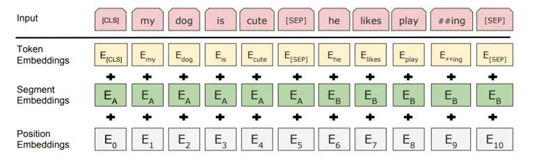
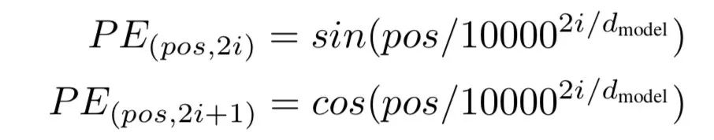
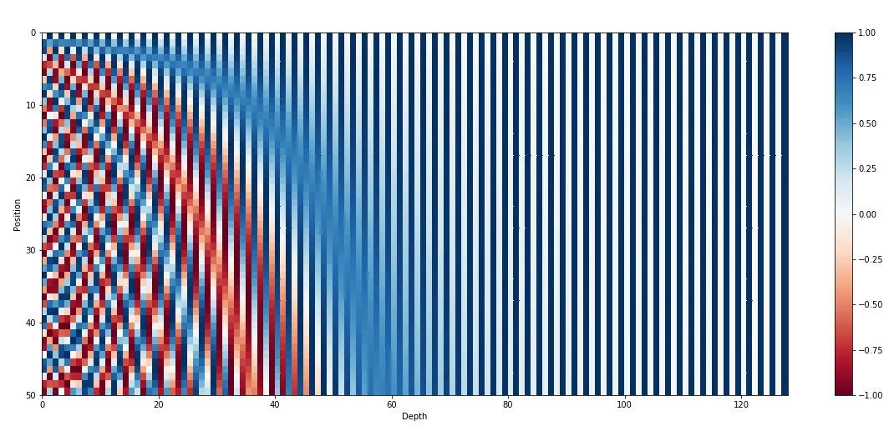
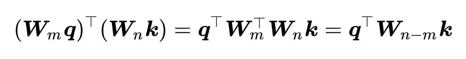
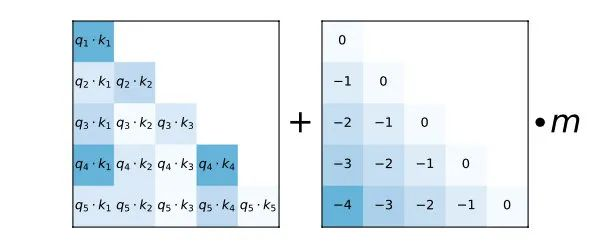
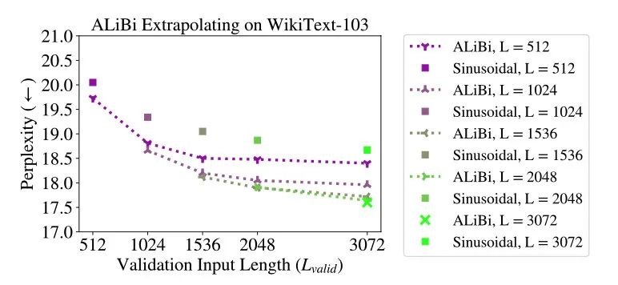
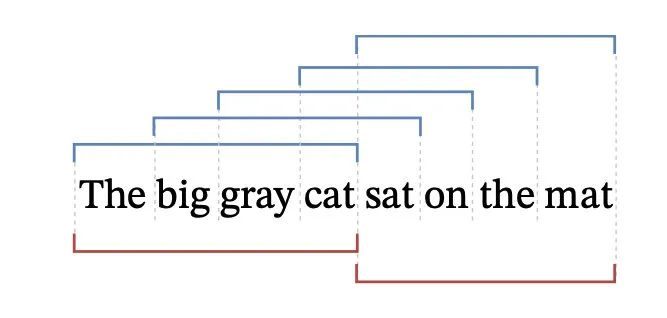
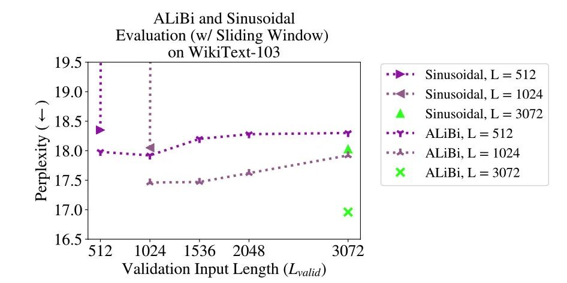

# ALiBi

> 论文：https://arxiv.org/pdf/2108.12409.pdf

Transformer 模型，因为不像 RNN 序列模型，无法天然就给位置信息加入模型中，这时候就需要我们手动将位置信息给注入到模型里去了。

最 Naive 的方法就是每个位置都当成一个特殊 token，比如位置 1 是一个 token 有自己 embedding，位置 2 也有一个... 之后进行学习。但这种方法最大的问题是，**无法外推（extrapolation）**，也就是训练时如果你最长只用到了 512 长度，那么推理时也就只能最长到 512 长度，再往上就位置向量余额不足了。

如果能外推，不光是使用时方便很多，而且也能让训练成本降低很多，因为经典的 Transformer 模型随长度的计算复杂度是 $O{N^2}$ 级别的，所以能降低训练长度对效率提升也很大。

## **Naive Learned Position Emebedding**

给每个位置当成是一个特殊的 token，从 lookup table 中取 embedding 加和起来。一点外推性都没有，即便代表更长长度的 token，比如训练最大到 512，但推理时扩展位置向量表到 1024，但对于模型来说 512 以上的位置向量没经过训练，所以扩展了也没用。

## **Sinusoidal Position Embedding**

不用训练，不过也是直接加和到 token embedding 上去。

首先提出一个好的位置向量的标准：

- 每个时间步都要有一个独特的 embedding
- 一句话里面任意两个相同距离时间步之间的向量距离也相同

于是 Transformer 论文作者提出的是下面这个公式

大概思路是通过正弦函数（Sinusoidal functions）来给每个位置向量一个独特编码，同时保留一定性质，和用 bit 表示数字类似。

比起需要学习的位置向量，正弦位置向量（Sinusoidal Position Embedding），如要扩展更长的位置向量也很简单，直接公式一套就行。

实际实验推理时的外推性，发现大概能比起训练时多推 50 个 token。

## **Rotary Position Embedding**

主要对正弦位置向量的改进，但主题思路还是通过绝对位置编码的方式实现相对位置编码。而之前正弦位置向量有些性质不够好，需要解决

- 正弦位置向量直接和 token embedding 相加，然后用于 attention 运算，不太能利用好它相对距离不变则相对位置向量计算结果也不变的性质；
- 同时正弦位置向量只在输入 embedding 层加上，高层网络不太能直接感知到位置（虽然有残差连接）

于是 Rotary Position Embedding 通过复数运算推导，将位置向量替换成了一个满足通过绝对编码实现相对位置性质的矩阵，去参与运算。

为什么叫 Rotary，因为里面用到了复数运算，而复数乘法在 2 维坐标轴表示，可看成在做旋转（Rotary）。

给绝对位置转换成相对编码：

实现上一个很大的区别是，不是在最下面层加上位置向量，***而是每一层都将这个位置信息注入一次，主要是通过影响 q 和 k 的运算。***

推理时比训练时大概能往外推 100 多个 token。

## **T5 Bias Position Embedding**

相比之前的方法 T5 bias 在注入位置信息更进一步了：直接在 Attention map 上进行操作。

大致方法为对不同距离 query 和 key 学习一个对应的标量值，然后将这个标量加在 attention score 上（过 softmax 操作之前）。同时不光学习一组这样关系，可以学习多组。

和 Rotary 相同的是，这也是在每层都进行了操作。此外还对长度有一定限制，当超过 128 长度的相对距离后，每个都分配相同的标量值。

对于该方法，论文作者发现它的可外推性就非常强了，在 512 上训练上可以往外额外推 600，在 1024 长度训练可以外推 800 而困惑度（ppl）不衰减。

但因为中间学习过程，T5 Bias 速度比较慢。

## ALiBi

而 AliBi 提出的 idea 很简单，特别是看完了 T5 Bias 之后，会发现其实也是直接对 Attention Score 进行操作。不同之处在于，它的 bias 不像 T5 那样靠学出来的，而是给了一个预设。

如图所示，只是给 attention score 加上一个预设好的偏置矩阵，相当于 q 和 k 相对位置差 1 就加上一个 -1 的偏置。其实相当于假设两个 token 距离越远那么相互贡献也就越低。

当然也不是就直接用这个矩阵一加就行，还是有借鉴 T5 Bias 里，加入了多组 bias。主要的偏置矩阵都是相同的，不同的只是旁边的 m 系数，可以给 m 当成是一个斜率 (Slope)。

论文中 m 系数也是预设好的，作者会根据 head 数来设置一组 m 系数，具体按照头的数量 n 从 $2^{-2^{-log_2n+3}}$ 到  $2^8$ 的指数差值来进行设置，比如说 8 个头，那么就设置为 $2^1$，$2^2$，…，$2^8$。

**M 也可以训练获得，但作者们发现，训练获得的并没有带了的更好的性质。**

## 实验结果

实验结果主要通过在 WikiText-103 数据集上进行的展示，主要对比对象是正弦位置向量。

发现相比起正弦位置向量，ALiBi 在外推性上更加有效，在更短长度文本上训练就能在更长文本上推理获得更好效果。而且不光在 WikiText 数据集，在其他数据集比如 Toronto Books 也能获得相同效果。

除了在多个数据集上的效果展现，作者们还在大模型（13 亿参数）大数据大计算量上加入 ALiBi 进行训练，发现同样有效，也证明了该方法的可用性。

实验方面比较遗憾的是，只给 Sinusoidal 方法拎出来对比了，没有对比 Rotary 和 T5 Bias 两个方法，虽然前面有提给两个分别做了些实验。

## 分析

对 ALiBi 做了一个实验分析，首先提出的是为什么它测试时外推性比较强能带来更好的效果，这里提到一个概念 Early Token Curse。

上图中涉及到两种模型对一句话进行推理计算 PPL 的方法，一种是上面蓝色滑窗（Sliding Window）式，还有一种是下面红色，不重叠（Nonoverlapping）式。

虽然滑窗式能提供更多的背景信息，但需要跑太多次，效率低；

不重叠式虽然不用跑太多次，但却会出现 Early Token Curse 问题，也就是这样切分后每一段前面的 token，看到的背景知识会比较少，比如切分后 sat 虽然前面的上下文信息”The big gray cat“肯定是有效的，但它看不到。

如果推理长度是 1000，那其中就有 10% 的 token 看到的上下文信息是少于 100 个 token 的，而如果用了 ALiBi 方法给推理长度拓展到 2000，那就只有 5% 的 token 看到的上下文信息是少于 100 个 token 的。

因此 ALiBi 是一定程度上能解决 Early Token Curse 的问题。

虽然看起来好像 ALiBi 只是加入一个简单的线性偏置，结果却能让模型像人一样，通过看短文本，就能在测试时自动扩展到长文本，那以后都不用考虑太长文本训练了。

## 问题点

当用滑窗式方法来进行推理，即使当推理时的长度变长，但 ppl 并没有显著提升，这和常识是违背的。

特别是和实际更大长度训练模型进行对比时，比如说在 512 长度训练的，即使推理长度 1024 可以做，但效果还是没实际在 1024 长度训练过的好。

作者给出的解释，ALiBi 看起来外推性非常好，好像能够在比训练时候长非常多的样本上进行推理，但现实是，一旦当推理长度大约训练长度时，还是只能用到训练长度的背景信息。

之所以比 Sinusoidal 好，同时为什么 Rotary 还有 T5 Bias 的外推性也比较好，感觉主要跟相对位置编码的性质有关。

所以其实这样看来其实 ALiBi 这些还是没有真正的外推性，还是训练多长，推理就多长，只是因为它用的相对位置向量，所以表面上看起来好像能用很长长度进行推理，但实际还是训练时的长度。
